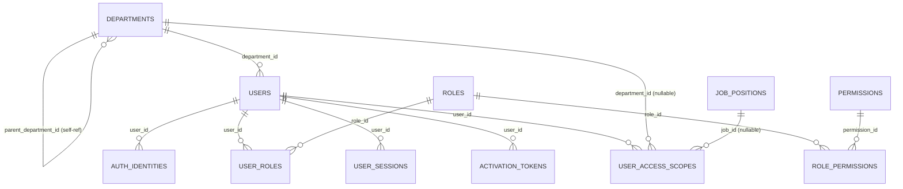
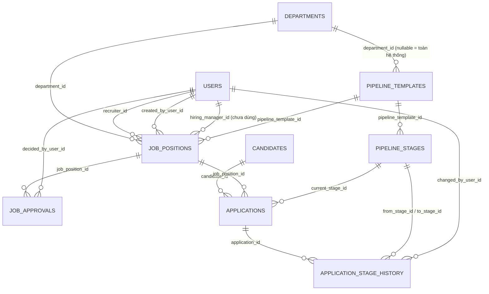
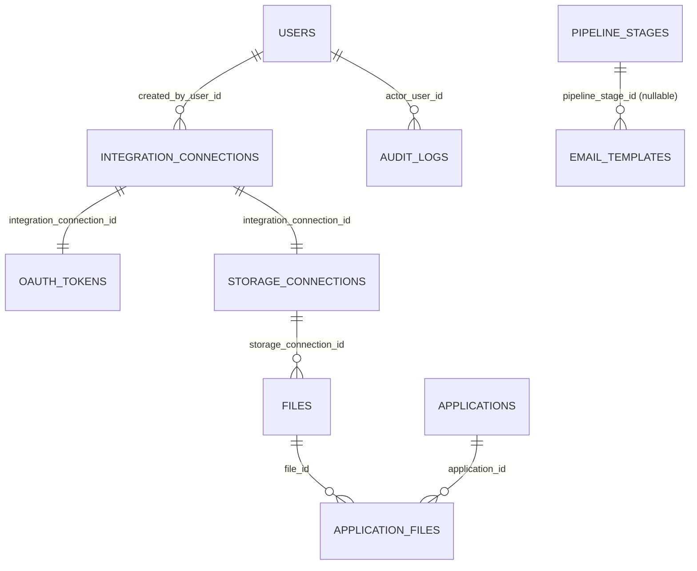
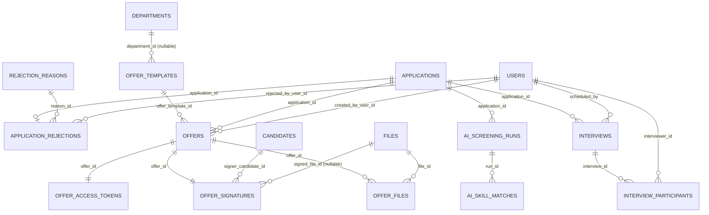
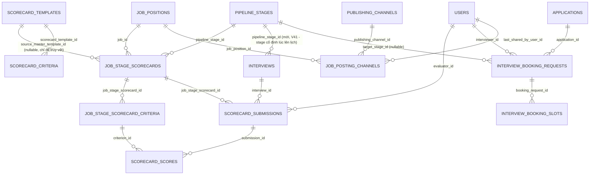

# Database Design - HireWise-BE (v4, cập nhật hết Sprint 4)

## Mục lục

1. [Quy ước thiết kế chung](#1-quy-ước-thiết-kế-chung)
2. [Sơ đồ ERD tổng quan](#2-sơ-đồ-erd-tổng-quan)
3. [Auth & RBAC](#3-auth--rbac)
4. [Pipeline Configuration](#4-pipeline-configuration)
5. [Job Position & Approval](#5-job-position--approval)
6. [Candidate & Kanban (Application)](#6-candidate--kanban-application)
7. [Cloud Storage Integration & Files](#7-cloud-storage-integration--files)
8. [Email Template](#8-email-template)
9. [Cross-cutting: Audit & Outbox](#9-cross-cutting-audit--outbox)
10. [Bảng enum tổng hợp](#10-bảng-enum-tổng-hợp)
11. [Interview Scheduling & Self-service Booking](#11-interview-scheduling--self-service-booking)
12. [Offer & e-Signature](#12-offer--e-signature)
13. [Structured Scorecard ](#13-structured-scorecard-sprint-4)
14. [SLA Monitoring ](#14-sla-monitoring-sprint-4)
15. [Multi-channel Job Posting & Publishing Channel ](#15-multi-channel-job-posting--publishing-channel-sprint-4)
16. [Reporting & Analytics ](#16-reporting--analytics-sprint-4)
17. [Business Rule đã encode vào schema](#17-business-rule-đã-encode-vào-schema)
18. [Mapping sang Frontend feature](#18-mapping-sang-frontend-feature)
19. [Ghi chú thiết kế / điều cần biết khi sửa](#19-ghi-chú-thiết-kế--điều-cần-biết-khi-sửa)
20. [Cách xem/cập nhật tài liệu này](#20-cách-xemcập-nhật-tài-liệu-này)

---

## 1. Quy ước thiết kế chung

| Quy ước | Áp dụng |
|---|---|
| **Khóa chính** | `BIGINT GENERATED ALWAYS AS IDENTITY` cho bảng cấu hình/quản trị nội bộ (department, user, role, pipeline...); `UUID` (do ứng dụng tự sinh qua `UUID.randomUUID()`, không có DB default) cho bảng nghiệp vụ tuyển dụng có thể lộ ra public API (`job_positions`, `candidates`, `applications`) - tránh lộ số thứ tự tăng dần ra ngoài |
| **Timestamp** | `created_at`/`updated_at` kiểu `TIMESTAMPTZ NOT NULL DEFAULT now()` trên hầu hết bảng nghiệp vụ; bảng thuần lịch sử/log (`application_stage_history`, `audit_logs`, `job_approvals`) chỉ có 1 mốc thời gian (`changed_at`/`created_at`) vì bản ghi bất biến, không update |
| **Enum** | Lưu dạng `VARCHAR` + `CHECK (... IN (...))` ở hầu hết bảng mới hơn (`pipeline_templates.status`, `applications.status`...); một số bảng cũ hơn (`users.status`, `job_positions.status`) chỉ có `DEFAULT` mà **không có** `CHECK` - validate hoàn toàn ở tầng Java enum, xem mục 10 |
| **Soft-delete** | Không `DELETE` cứng bản ghi nghiệp vụ đã có tham chiếu - dùng cờ `is_active` (`departments`, `pipeline_stages`) hoặc đổi `status` sang giá trị "đã tắt" (`files.status = 'DELETED'`, `email_templates.status = 'INACTIVE'`, `integration_connections.status = 'REVOKED'`) |
| **Junction table** | Composite PK, không có surrogate id riêng (`role_permissions (role_id, permission_id)`) |
| **Migration** | Additive-only sau khi đã "ship" - `V14`/`V24` chỉ `ALTER TABLE ... ADD COLUMN` vào `job_positions` (tạo ở `V8`), không sửa lại migration cũ |

---

## 2. Sơ đồ ERD tổng quan

Chia theo domain để dễ đọc, thay vì 1 sơ đồ khổng lồ.

### 2.1. Auth & RBAC

`JOB_POSITIONS` chỉ xuất hiện ở đây như 1 tham chiếu ngoài domain - chi
tiết đầy đủ ở mục 2.2.

### 2.2. Recruitment Core (Pipeline / Job / Candidate / Kanban)

### 2.3. Supporting / Cross-cutting

`OUTBOX_EVENTS` không có FK nào (bảng hàng đợi generic, payload là JSON
tự do) nên không vẽ trong sơ đồ - xem mục 9.

### 2.4. AI Matching / Interview / Offer 

`REJECTION_REASONS`/`APPLICATION_REJECTIONS` và `AI_SCREENING_RUNS`/
`AI_SKILL_MATCHES` mở rộng trực tiếp domain Candidate/Application - chi
tiết bảng ở mục 6. `INTERVIEWS`/`INTERVIEW_PARTICIPANTS` và
`OFFER_TEMPLATES`/`OFFERS`/`OFFER_ACCESS_TOKENS`/`OFFER_SIGNATURES`/
`OFFER_FILES`  chi tiết ở mục 11 và mục 12.

---

### 2.5. Sprint 4 — Scorecard / SLA / Multi-channel Posting / Booking

`SCORECARD_TEMPLATES`/`SCORECARD_CRITERIA` (thư viện mẫu dùng chung,
HR Admin quản lý) và `JOB_STAGE_SCORECARDS`/`JOB_STAGE_SCORECARD_CRITERIA`
(bản sao/khớp thật với 1 cặp Job+Stage, cái Interviewer thật sự chấm
điểm vào) là **2 khái niệm tách biệt** - xem giải thích đầy đủ ở mục 13.
`INTERVIEW_BOOKING_REQUESTS`/`INTERVIEW_BOOKING_SLOTS`,
`PUBLISHING_CHANNELS`/`JOB_POSTING_CHANNELS` chi tiết ở mục 11 và mục 15. SLA Monitoring (mục 14) và
Reporting & Analytics (mục 16) **không có ERD riêng** - cả hai đều chỉ
đọc/tổng hợp lại các bảng đã có ở trên (`pipeline_stages.sla_hours`,
`applications`, `application_stage_history`, `job_posting_channels`),
không có bảng riêng.

---

## 3. Auth & RBAC

### `departments`

| Cột | Kiểu | Ghi chú |
|---|---|---|
| `department_id` | BIGINT PK | |
| `name` | VARCHAR(255) NOT NULL | |
| `parent_department_id` | BIGINT FK → `departments` | tự tham chiếu - cây phòng ban (BR-RBAC-06), đọc đệ quy qua CTE trong `DepartmentRepository` |
| `is_active` | BOOLEAN DEFAULT true | soft-delete |
| `created_at`/`updated_at` | TIMESTAMPTZ | |

### `roles` / `permissions` / `role_permissions`

Mô hình RBAC layer 2 - **không hard-code permission theo role trong
Java**, toàn bộ nằm ở dữ liệu.

| Bảng | Cột đáng chú ý |
|---|---|
| `roles` | `code` UNIQUE (`HR_ADMIN`, `RECRUITER`, `HIRING_MANAGER`, `INTERVIEWER`, `CANDIDATE`) |
| `permissions` | `code` UNIQUE (28 permission, vd `JOB_CREATE`, `JOB_APPROVE`...); `is_write` phân biệt hành động đọc/ghi - dùng cùng với `user_access_scopes.can_write` (layer 3) |
| `role_permissions` | composite PK `(role_id, permission_id)`, `ON DELETE CASCADE` cả 2 chiều |

### `users`

| Cột | Kiểu | Ghi chú |
|---|---|---|
| `user_id` | BIGINT PK | |
| `email` | VARCHAR(255) NOT NULL | không có `UNIQUE` constraint ở DB - enforce ở tầng Service (`UserService`) trước khi insert |
| `department_id` | BIGINT FK → `departments`, nullable | phòng ban **tổ chức chính** (báo cáo/org chart) - **KHÔNG** phải phạm vi truy cập dữ liệu, xem `user_access_scopes` |
| `status` | VARCHAR(20) DEFAULT `'INVITED'` | `INVITED`\|`ACTIVE`\|`BLOCKED`\|`DISABLED` (Java enum `UserStatus`, không có DB `CHECK`) |
| `last_authenticated_at` | TIMESTAMPTZ nullable | |

### `auth_identities` 

1 dòng = 1 phương thức đăng nhập (`LOCAL` email/password hoặc `GOOGLE` SSO) - 1 user có thể có nhiều dòng cùng lúc.

| Cột | Ghi chú |
|---|---|
| `provider` | CHECK `IN ('LOCAL','GOOGLE')` |
| `provider_subject` | với `LOCAL` = chính email; với `GOOGLE` = Google `sub` claim |
| `password_hash` | nullable - `NULL` với provider `GOOGLE` |
| `failed_login_attempts`, `locked_until` | BR-AUTH: khóa 15 phút sau 5 lần sai |
| UNIQUE | `(provider, provider_subject)` |

### `user_roles`

Gán role có lịch sử hiệu lực (`valid_from`/`valid_to`), **không** phải 1
cột role cố định trên `users` - vì 1 user có thể giữ nhiều role đồng
thời (vd vừa Recruiter vừa Interviewer). `valid_to IS NULL` = đang hiệu
lực .

### `user_sessions` 

Registry session/refresh-token, PK là `UUID` (khớp claim `sid` trong JWT).
`revoked_at IS NULL` = session còn hiệu lực (index có điều kiện
`WHERE revoked_at IS NULL`) - dùng để logout / thu hồi hàng loạt khi tài
khoản bị khóa.

### `activation_tokens`

One-time token cho link kích hoạt (EM-01) và đặt lại mật khẩu - dùng
chung 1 bảng, phân biệt qua `purpose` (CHECK `'ACTIVATION'`\|`'PASSWORD_RESET'`).
`used_at` đánh dấu đã dùng (chống dùng lại link cũ).

### `user_access_scopes`

RBAC **layer 3** - phạm vi dữ liệu 1 user được truy cập, tách khỏi role
(layer 2 chỉ trả lời "được làm hành động gì", không trả lời "trên dữ
liệu nào").

| Cột | Ghi chú |
|---|---|
| `scope_type` | CHECK `'SYSTEM'`\|`'DEPARTMENT'`\|`'JOB'` |
| `department_id` | chỉ có giá trị khi `scope_type='DEPARTMENT'` |
| `job_id` | FK → `job_positions`, chỉ có giá trị khi `scope_type='JOB'` - **hiện chưa có UI nào gán loại scope này**, chỉ dùng được qua API admin trực tiếp |
| `include_sub_departments` | true = tính đệ quy cả phòng ban con (CTE) |
| `can_write` | false = chỉ đọc; true = được ghi - hành động nào cần ghi do `permissions.is_write` quyết định, scope này chỉ xác nhận "có được ghi ở phạm vi này không" |
| `valid_from`/`valid_to` | cùng mô hình lịch sử hiệu lực như `user_roles` |

---

## 4. Pipeline Configuration

### `pipeline_templates` 

| Cột | Ghi chú |
|---|---|
| `department_id` | nullable - `NULL` = dùng chung toàn hệ thống  |
| `status` | CHECK `'DRAFT'`\|`'ACTIVE'` - `DRAFT→ACTIVE`  |

### `pipeline_stages` 

| Cột | Ghi chú |
|---|---|
| `pipeline_template_id` | FK NOT NULL |
| `code` | UNIQUE **trong cùng template** (`uk_pipeline_stages_template_code`), không phải unique toàn hệ thống - khác `email_templates.code` |
| `stage_type` | CHECK 6 giá trị: `INTAKE`\|`SCREENING`\|`INTERVIEW`\|`OFFER`\|`TERMINAL_SUCCESS`\|`TERMINAL_REJECTED` |
| `position` | thứ tự hiển thị/chạy Kanban, backend tự re-index khi thêm/xóa/sắp xếp lại |
| `is_terminal` | cờ đánh dấu bước kết thúc - độc lập với `stage_type`, nhưng service luôn ép `true` nếu `stage_type` là 1 trong 2 loại `TERMINAL_*` |
| `is_active` | soft-delete - xóa Stage không xóa cứng vì có thể đã có `applications.current_stage_id` trỏ tới |

Index `(pipeline_template_id, position)` phục vụ load đúng thứ tự hiển
thị mỗi khi mở 1 Template.

---

## 5. Job Position & Approval

### `job_positions`

| Cột | Ghi chú |
|---|---|
| `id` | UUID PK, app tự sinh |
| `status` | `DRAFT`\|`PENDING_APPROVAL`\|`APPROVED`\|`REJECTED`\|`PUBLISHED`\|`PAUSED`\|`CLOSED` (Java enum `JobStatus`, không có DB `CHECK`) |
| `department_id`, `recruiter_id`, `created_by_user_id` |  |
| `hiring_manager_id` | FK → `users` |
| `pipeline_template_id` | FK → `pipeline_templates`, gán khi Submit  |
| `employment_type` | CHECK `'FULL_TIME'`\|`'PART_TIME'`\|`'INTERNSHIP'`\|`'CONTRACT'`, nullable (bắt buộc khi Submit, không bắt buộc khi Lưu nháp)|
| `salary_min`/`salary_max` | `NUMERIC(14,2)`, CHECK `salary_min <= salary_max` khi cả 2 có giá trị (BR-JOB-02); cả 2 `NULL` = "Thỏa thuận" |
| `openings` | `INT NOT NULL DEFAULT 1` -  bắt buộc ≥ 1 |
| `application_deadline` | `DATE` nullable |
| `location` | thêm ở V24, phục vụ UC-16 Job Board |

### `job_approvals` 

Lịch sử phê duyệt tách riêng bảng (không phải 1 cột trên `job_positions`)
để **không mất lịch sử resubmit** khi 1 Job bị từ chối rồi gửi lại nhiều
lần.

| Cột | Ghi chú |
|---|---|
| `decision` | CHECK `'APPROVED'`\|`'REJECTED'`, `NULL` khi đang chờ (tạo 1 dòng `decision=NULL` lúc Submit) |
| `reason` | CHECK bắt buộc NOT NULL khi `decision='REJECTED'`  |
| `decided_by_user_id`, `decided_at` | `NULL` cho tới khi Hiring Manager xử lý |

Index `(job_position_id, created_at)` phục vụ lấy đúng lần submit mới
nhất.

### Vòng đời `job_positions.status`

- **Bảng chuyển trạng thái hợp lệ** (`JobLifecycleService`, enforce
  bằng `EnumSet` trong Java, DB **không có** `CHECK`/trigger ràng buộc
  transition):

  | Hành động | Từ trạng thái | Sang | Ghi chú |
  |---|---|---|---|
  | `publish` | `APPROVED` | `PUBLISHED` | permission `JOB_PUBLISH` ; không cho publish lại từ `PUBLISHED` (phải qua pause/resume) |
  | `pause` | `PUBLISHED` | `PAUSED` | permission `JOB_CLOSE_PAUSE` (mới) |
  | `close` | `PUBLISHED` hoặc `PAUSED` | `CLOSED` | permission `JOB_CLOSE_PAUSE`; **`CLOSED` là trạng thái chung cuộc (BR-JOB-05)** - không có API "mở lại", muốn tuyển tiếp phải tạo Job Position mới|
  | `resume` | `PAUSED` | `PUBLISHED` | permission `JOB_CLOSE_PAUSE`; **không** tạo lại `job_approvals`/gửi lại email duyệt - phê duyệt cũ vẫn còn hiệu lực |

- `reason` (lý do pause/close) là text tự do, **chỉ lưu trong
  `audit_logs.after_json`** (action `JOB_PAUSED`/`JOB_CLOSED`) qua
  `JobLifecycleRequestDto` - **không có cột riêng trên `job_positions`**
  cho lý do này.
- Mỗi lần chuyển trạng thái đều ghi 1 dòng `audit_logs`
  (`JOB_PUBLISHED`/`JOB_PAUSED`/`JOB_CLOSED`/`JOB_RESUMED`) - xem mục 9.

---

## 6. Candidate & Kanban (Application)

### `candidates`

Hồ sơ ứng viên **độc lập với từng Job** - 1 candidate có thể ứng tuyển
nhiều Job khác nhau theo thời gian.

| Cột | Ghi chú |
|---|---|
| `primary_email` | UNIQUE - ứng viên nộp lại, tái sử dụng đúng dòng này thay vì tạo trùng |
| `status` | CHECK `'ACTIVE'`\|`'BLACKLISTED'` |

### `applications`

Chính là "thẻ Kanban" - 1 dòng = 1 cặp `(candidate, job)`.

| Cột | Ghi chú |
|---|---|
| UNIQUE | `(candidate_id, job_position_id)` - 1 candidate chỉ ứng tuyển 1 lần cho cùng 1 Job (BR-APPLY-02) |
| `current_stage_id` | FK → `pipeline_stages`, **giá trị đọc nhanh** cho UI Kanban - không phải nguồn sự thật cho lịch sử/SLA (xem `application_stage_history`) |
| `status` | CHECK 6 giá trị: `NEW`\|`IN_PROGRESS`\|`OFFER_SENT`\|`HIRED`\|`REFUSED`\|`WITHDRAWN` |
| `last_stage_changed_at` | dùng tính SLA theo Stage hiện tại |

Index `(job_position_id, current_stage_id, last_stage_changed_at)` phục
vụ trực tiếp truy vấn load Kanban board theo cột.

### `application_stage_history`

Log **bất biến**, không update - nguồn sự thật chuẩn để tính SLA/audit,
khác với `applications.current_stage_id` chỉ là cache tiện tra cứu
nhanh.

| Cột | Ghi chú |
|---|---|
| `from_stage_id` | nullable - `NULL` cho sự kiện đầu tiên (lúc tạo Application, UC-17) |
| `to_stage_id` | NOT NULL |
| `transition_type` | CHECK `'MANUAL'`\|`'SYSTEM'`\|`'ROLLBACK'` - phân biệt do người kéo-thả tay, hệ thống tự chuyển, hay Restore ngược |

>  

### `rejection_reasons` — danh mục lý do từ chối chuẩn hóa 

| Cột | Kiểu | Ghi chú |
|---|---|---|
| `reason_id` | BIGINT GENERATED ALWAYS AS IDENTITY PK | |
| `code` | VARCHAR(50) UNIQUE | vd `TECHNICAL_GAP`, `CULTURE_GAP`, `SALARY_GAP`, `DUPLICATE`, `WITHDRAWN`, `OTHER` |
| `label` | VARCHAR(150) | nhãn hiển thị tiếng Việt |
| `category` | VARCHAR(30) CHECK 6 giá trị (trùng với `code` ở data seed) | |
| `is_active` | BOOLEAN DEFAULT true | soft-delete, cùng quy ước với `pipeline_stages.is_active` |

### `application_rejections` — 1 bản ghi sự kiện / Application bị từ chối

| Cột | Kiểu | Ghi chú |
|---|---|---|
| `rejection_id` | BIGINT GENERATED ALWAYS AS IDENTITY PK | |
| `application_id` | UUID FK → `applications`, **UNIQUE** | **BR-REJ-03: Refused là trạng thái chung cuộc (terminal) - không revert, không reject lại; muốn xem xét lại ứng viên nghĩa là tạo Application mới** |
| `reason_id` | BIGINT FK → `rejection_reasons` | |
| `rejected_by_user_id` | BIGINT FK → `users`, nullable | |
| `custom_message` | TEXT nullable | ghi chú thêm ngoài lý do chuẩn |
| `rejected_at` | TIMESTAMPTZ DEFAULT now() | |

### `ai_screening_runs` — 1 dòng / lần chạy phân tích (mô hình run có thể retry, không phải cache 1-1 đơn giản)

Hệ thống AI dùng thực tế là **Anthropic Claude API**
(`app.ai.anthropic.model=claude-haiku-4-5`, xem
`ai/AnthropicMatchingEngine.java`), CV (PDF) được gửi thẳng cho Claude
như 1 document content block - không có bước tách text riêng trước khi
gọi AI.

| Cột | Kiểu | Ghi chú |
|---|---|---|
| `run_id` | BIGINT GENERATED ALWAYS AS IDENTITY PK | |
| `application_id` | UUID FK → `applications` | 1 Application có thể có **nhiều** run theo thời gian (chạy lại khi CV/JD đổi) |
| `model_name` | VARCHAR(50) nullable | vd `claude-haiku-4-5`; `NULL` khi đang `PENDING` hoặc `FAILED` trước khi gọi tới AI Engine |
| `prompt_version` | VARCHAR(20) nullable | bump khi đổi prompt/schema (BR-AI-02) |
| `match_score` | NUMERIC(5,2) nullable | không có `CHECK BETWEEN 0 AND 100` ở DB - validate ở tầng Java |
| `summary` | TEXT nullable | tóm tắt 2-3 câu tiếng Việt do AI trả về |
| `status` | VARCHAR(20) CHECK `'PENDING'`\|`'SUCCEEDED'`\|`'FAILED'` | mô hình giống Outbox - cho phép retry khi AI timeout/lỗi |
| `error_message` | TEXT nullable | |
| `created_at`/`completed_at` | TIMESTAMPTZ | |

Index `(application_id, created_at DESC)` để lấy run mới nhất; index
riêng `(status)` phục vụ `AiScreeningDispatcher` poll các run `PENDING`
(cùng pattern với `outbox_events`, xem mục 9).

### `ai_skill_matches`

| Cột | Ghi chú |
|---|---|
| `match_id` | PK |
| `run_id` | FK → `ai_screening_runs` |
| `skill_name` | VARCHAR(100) |
| `match_type` | CHECK `'MATCHED'`\|`'MISSING'` - chuẩn hóa thành bảng con thay vì JSON tự do, phục vụ thống kê/lọc theo từng kỹ năng sau này |

### Cột thêm vào bảng có sẵn (Sprint 3)

| Bảng | Cột mới | Ghi chú |
|---|---|---|
| `applications` | `ai_match_score` NUMERIC(5,2) nullable | **cache** của run `SUCCEEDED` mới nhất, đọc trực tiếp khi vẽ Badge trên Kanban Card (BR-AI-03) mà không cần join `ai_screening_runs` mỗi lần load board |

### Cột thêm vào bảng có sẵn (Sprint 4)

| Bảng | Cột mới | Migration | Ghi chú |
|---|---|---|---|
| `applications` | `source` VARCHAR(50) nullable | `V40` | UTM source dẫn ứng viên tới (khớp `publishing_channels.utm_source`); `NULL` = vào thẳng Job Board, không qua kênh chia sẻ nào. **Không phải FK** - chỉ so khớp giá trị string ở tầng ứng dụng (`JobShareService.getShareStats`), có chủ đích **không** cập nhật ngược khi `utm_source` của kênh đổi sau này (tránh "làm giả" lịch sử quy-kết nguồn). Index `idx_applications_job_source (job_position_id, source)`. |
| `applications` | `sla_alert_sent_at` TIMESTAMPTZ nullable | `V46` | Chống spam cảnh báo SLA - đặt lại **`NULL`** ở mọi điểm đổi Stage (Kanban, Interview, Rejection, Offer, Offer Signing) để lượt "ngâm" mới ở Stage kế tiếp được tính lại từ đầu; `SlaBreachWorker` chỉ gửi cảnh báo khi cột này đang `NULL` (mục 14). |
| `interviews` | `pipeline_stage_id` BIGINT FK → `pipeline_stages`, nullable | `V41` | Cố định **Stage nào** (loại `INTERVIEW`) mà buổi phỏng vấn này gắn với, dùng làm khoá tra `job_stage_scorecards` khi chấm điểm (mục 13) - **không** đổi theo nếu Application sau đó chuyển tiếp Stage khác. `NULL` cho các Interview tạo trước `V41` (lịch sử, chưa gắn Scorecard được). |

---

## 7. Cloud Storage Integration & Files

### `integration_connections` 

Metadata kết nối OAuth 3rd-party generic

| Cột | Ghi chú |
|---|---|
| `provider` | text tự do (hiện tại thực tế `GOOGLE_DRIVE`/`DROPBOX`/`GOOGLE_CALENDAR`/`OUTLOOK_CALENDAR`, enum Java `IntegrationProvider` - xem mục 10 và mục 11) |
| `purpose` | text tự do, chưa có CHECK vì sẽ mở rộng thêm giá trị |
| `status` | CHECK `'CONNECTED'`\|`'EXPIRED'`\|`'REVOKED'` |

### `oauth_tokens` 

Tách riêng khỏi `integration_connections` để code thường (không cần
token) không có lý do gì `SELECT` tới cột token.

| Cột | Ghi chú |
|---|---|
| `access_token_encrypted`, `refresh_token_encrypted` | mã hóa tại tầng ứng dụng trước khi lưu (BR-STORAGE-01) - **không API nào trả các cột này ra ngoài** |
| UNIQUE | `(integration_connection_id)` - quan hệ 1-1, Reconnect (UC-08 AF-01) thay thế tại chỗ chứ không thêm dòng mới |

### `storage_connections` 

1-1 với `integration_connections` (không lặp lại cột `status` - luôn đọc
qua quan hệ để 2 bảng không bao giờ lệch nhau).

| Cột | Ghi chú |
|---|---|
| `root_folder_id` | thư mục gốc tạo lúc connect; mỗi Application có subfolder riêng bên dưới lúc upload CV |

### `files` / `application_files` 

Chỉ lưu **metadata** - nội dung file nhị phân nằm trên Cloud Storage
thật (Google Drive/Dropbox). `files` cũng được tái sử dụng cho Offer PDF
đã ký ở Sprint 3 (xem `offer_files`, mục 12).

| Bảng | Cột đáng chú ý |
|---|---|
| `files` | `external_file_id` (id file trên storage ngoài), UNIQUE `(storage_connection_id, external_file_id)`, `status` CHECK `'ACTIVE'`\|`'ARCHIVED'`\|`'DELETED'` |
| `application_files` | `file_role` CHECK `'CV'`\|`'COVER_LETTER'`\|`'PORTFOLIO'`, `is_primary` - 1 Application có thể có nhiều file cùng role, đánh dấu file chính |

---

## 8. Email Template

### `email_templates` 

| Cột | Ghi chú |
|---|---|
| `code` | UNIQUE **toàn hệ thống** (khác `pipeline_stages.code` - chỉ unique trong template)|
| `pipeline_stage_id` | FK nullable - liên kết Stage nào tự động gửi template này khi Application chuyển tới (chưa bắt buộc mọi template phải gắn Stage) |
| `subject_template`/`body_template` | chứa placeholder dạng `{{Tag}}`, render lúc gửi thật |
| `version` | tăng dần mỗi lần sửa nội dung (chưa thấy logic tăng version trong code hiện tại - cột đã có sẵn cho UC-11 lịch sử phiên bản) |
| `status` | CHECK `'ACTIVE'`\|`'INACTIVE'` |

---

## 9. Cross-cutting: Audit & Outbox

### `audit_logs` 

Log chung, dùng cho mọi hành động cần lưu vết thay đổi.

| Cột | Ghi chú |
|---|---|
| `before_json`/`after_json` | snapshot trạng thái trước/sau dạng JSON text - không ràng buộc schema cứng, cho phép entity khác nhau ghi vào cùng 1 bảng |
| Index | `(entity_type, entity_id, created_at)` và `(actor_user_id, created_at)` |

### `outbox_events` 

**Transactional Outbox pattern** - ghi 1 dòng trong **cùng transaction**
với hành động nghiệp vụ gây ra nó (vd tạo user → cần gửi email kích
hoạt) - tách khỏi transaction chính để lỗi
SMTP không làm rollback nghiệp vụ.

| Cột | Ghi chú |
|---|---|
| `event_type` | vd `JOB_SUBMITTED_FOR_APPROVAL_EMAIL` - enum Java `OutboxEventType`, không có DB CHECK vì danh sách event type mở rộng thường xuyên |
| `payload` | JSON text tự do (`OutboxPayloads` factory), shape khác nhau theo `event_type` |
| `status` | CHECK `'PENDING'`\|`'SENT'`\|`'FAILED'` |
| `attempts`, `error_message` | phục vụ retry/debug khi gửi thất bại |

Không có bảng nào FK tới `outbox_events` - đây là hàng đợi 1 chiều, đọc
xong thì cập nhật `status`/`processed_at`, không tham chiếu ngược.

Sprint 3 áp dụng lại đúng mô hình poller này cho AI Screening
(`ai_screening_runs.status`, xem mục 6) qua `AiScreeningDispatcher`,
khác biệt duy nhất là **không tự động retry** khi `FAILED`.

---

## 10. Bảng enum tổng hợp

| Enum | Giá trị | DB column | Có `CHECK` constraint? |
|---|---|---|---|
| `UserStatus` | `INVITED, ACTIVE, BLOCKED, DISABLED` | `users.status` | Không |
| `AuthProvider` | `LOCAL, GOOGLE` | `auth_identities.provider` | Có |
| `ScopeType` | `SYSTEM, DEPARTMENT, JOB` | `user_access_scopes.scope_type` | Có |
| `PipelineTemplateStatus` | `DRAFT, ACTIVE` | `pipeline_templates.status` | Có |
| `StageType` | `INTAKE, SCREENING, INTERVIEW, OFFER, TERMINAL_SUCCESS, TERMINAL_REJECTED` | `pipeline_stages.stage_type` | Có |
| `JobStatus` | `DRAFT, PENDING_APPROVAL, APPROVED, REJECTED, PUBLISHED, PAUSED, CLOSED` | `job_positions.status` | Không |
| `EmploymentType` | `FULL_TIME, PART_TIME, INTERNSHIP, CONTRACT` | `job_positions.employment_type` | Có |
| `ApprovalDecision` | `APPROVED, REJECTED` | `job_approvals.decision` | Có |
| `CandidateStatus` | `ACTIVE, BLACKLISTED` | `candidates.status` | Có |
| `ApplicationStatus` | `NEW, IN_PROGRESS, OFFER_SENT, HIRED, REFUSED, WITHDRAWN` | `applications.status` | Có |
| `StageTransitionType` | `MANUAL, SYSTEM, ROLLBACK` | `application_stage_history.transition_type` | Có |
| `IntegrationProvider` | `GOOGLE_DRIVE, DROPBOX, GOOGLE_CALENDAR, OUTLOOK_CALENDAR` (mở rộng Sprint 3, xem mục 11) | `integration_connections.provider`, `storage_connections.provider` | Chỉ `storage_connections` có `CHECK` |
| `ConnectionStatus` | `CONNECTED, EXPIRED, REVOKED` | `integration_connections.status` | Có |
| `FileStatus` | `ACTIVE, ARCHIVED, DELETED` | `files.status` | Có |
| `ApplicationFileRole` | `CV, COVER_LETTER, PORTFOLIO` | `application_files.file_role` | Có |
| `EmailTemplateStatus` | `ACTIVE, INACTIVE` | `email_templates.status` | Có |
| `RejectionCategory` | `SKILL_GAP, CULTURE_GAP, SALARY_GAP, DUPLICATE, WITHDRAWN, OTHER` | `rejection_reasons.category` | Có |
| `AiScreeningStatus` | `PENDING, SUCCEEDED, FAILED` | `ai_screening_runs.status` | Có |
| `AiMatchType` | `MATCHED, MISSING` | `ai_skill_matches.match_type` | Có |
| `InterviewMode` | `ONLINE, ONSITE` | `interviews.mode` | Có |
| `InterviewStatus` | `SCHEDULED, COMPLETED, CANCELLED, NO_SHOW` | `interviews.status` | Có |
| `OfferTemplateStatus` | `ACTIVE, INACTIVE` | `offer_templates.status` | Có |
| `OfferStatus` | `DRAFT, SENT, SIGNED, DECLINED, EXPIRED, CANCELLED` | `offers.status` | Có |
| `SignatureMethod` | `DRAW, TYPE` | `offer_signatures.method` | Có |
| `OfferFileRole` | `OFFER_DRAFT, OFFER_SIGNED` | `offer_files.file_role` | Có |
| `ScorecardStatus` | `ACTIVE, ARCHIVED` | `scorecard_templates.status`, `job_stage_scorecards.status` | Có |
| `ScorecardSubmissionStatus` | `DRAFT, SUBMITTED` | `scorecard_submissions.status` | Có |
| `InterviewBookingRequestStatus` | Java: `OPEN, COMPLETED, EXPIRED, CANCELLED` — DB CHECK: 4 giá trị như Java | `interview_booking_requests.status` | Có (nhưng `EXPIRED` **không có code path nào set** - xem mục 19) |
| `InterviewBookingSlotStatus` | Java: `OPEN, HELD, CONFIRMED, BOOKED, BUSY` — DB CHECK: **chỉ 3** (`OPEN, HELD, CONFIRMED`) | `interview_booking_slots.status` | Có, nhưng **lệch tập giá trị** - `BOOKED`/`BUSY` chỉ dùng ở tầng hiển thị (derived, tính lúc đọc), **không bao giờ persist** xuống DB - xem mục 14/19 |
| `PublishingChannelCode` | `LINKEDIN, FACEBOOK, X, COPY_LINK` | `publishing_channels.code` | Có |

---

## 11. Interview Scheduling & Self-service Booking

### `interviews`

| Cột | Kiểu | Ghi chú |
|---|---|---|
| `interview_id` | UUID PK DEFAULT `gen_random_uuid()` | khác `offers.offer_id` (app tự sinh, không có DB default) - xem mục 19 |
| `application_id` | UUID FK → `applications` NOT NULL | |
| `scheduled_by` | BIGINT FK → `users` NOT NULL | Recruiter tạo lịch |
| `interview_date` | DATE NOT NULL | tách riêng ngày/giờ, không phải 1 cột TIMESTAMPTZ range |
| `interview_time` | TIME NOT NULL | |
| `mode` | VARCHAR(20) CHECK `'ONLINE'`\|`'ONSITE'` | |
| `location_or_link` | TEXT nullable | địa chỉ (ONSITE) hoặc **URL họp** (ONLINE) - khi `mode=ONLINE` và trường này để trống, `InterviewService` tự gọi `GoogleCalendarProviderClient.createMeetingEvent(...)` để sinh Google Meet link thật rồi ghi thẳng vào đây |
| `status` | VARCHAR(20) CHECK `'SCHEDULED'`\|`'COMPLETED'`\|`'CANCELLED'`\|`'NO_SHOW'` | |
| `notes` | TEXT nullable | |
| `created_at`/`updated_at` | TIMESTAMPTZ NOT NULL | |

**Xử lý lỗi Calendar API:** `GoogleCalendarProviderClient.createMeetingEvent()`
**bắt exception và trả về `null`** thay vì ném lỗi - nếu gọi Google
Calendar thất bại, buổi phỏng vấn **vẫn được tạo bình thường**, chỉ là
không có link Meet tự động (Recruiter tự điền tay sau), **không rollback
transaction**. 

### `interview_participants`

| Cột | Ghi chú |
|---|---|
| `id` | BIGSERIAL PK (không phải composite PK) |
| `interview_id`, `interviewer_id` | UNIQUE `(interview_id, interviewer_id)` - 1 interviewer/buổi phỏng vấn đúng 1 lần (BR-SCHED-02) |

### Cấu hình Calendar Integration (US-ADM-12)

Tái sử dụng khung OAuth Cloud Storage nhưng **rộng hơn dự đoán ban
đầu**: có **2 provider Calendar**, không cần bảng/cột mới nào - chỉ mở
rộng enum Java `IntegrationProvider` (`domain/IntegrationProvider.java`);
migration `V16` (`integration_connections`/`oauth_tokens`) không đổi:

| Provider mới | API thật | Ghi chú |
|---|---|---|
| `GOOGLE_CALENDAR` | Google Calendar API v3 (`GoogleCalendarProviderClient`) | scope OAuth: `calendar.events` + `calendar.readonly` |
| `OUTLOOK_CALENDAR` | Microsoft Graph API — routing/enum đã có (`resolveProvider` chấp nhận cả 2 provider), nhưng **chưa tìm thấy `CalendarProviderClient` implementation riêng cho Outlook** trong mã nguồn Sprint 4 - chỉ `GoogleCalendarProviderClient` thật sự tồn tại | **có thật trong code, không có trong backlog/SRS** - khả năng đây là phần team chủ động làm thêm ngoài đặc tả gốc; cần xác nhận lại với PO |

### Self-service Interview Booking 

#### `interview_booking_requests`

| Cột | Kiểu | Ghi chú |
|---|---|---|
| `id` | BIGINT GENERATED ALWAYS AS IDENTITY PK | |
| `application_id` | UUID FK → `applications` NOT NULL | |
| `interviewer_id` | BIGINT FK → `users` NOT NULL | phải đang `UserStatus.ACTIVE` |
| `date_range_start`/`date_range_end` | DATE NOT NULL | khung ngày Recruiter cho phép chọn |
| `booking_token` | UUID NOT NULL, **UNIQUE** | token công khai trên link gửi Candidate - cố ý dùng UUID để không đoán/liệt kê được; `updatable=false` |
| `expires_at` | TIMESTAMPTZ NOT NULL | **hardcode 7 ngày** kể từ lúc gửi (`now + 7 days`), không cấu hình được qua property |
| `status` | VARCHAR(20) DEFAULT `'OPEN'`, CHECK `'OPEN'`\|`'COMPLETED'`\|`'EXPIRED'`\|`'CANCELLED'` (`chk_booking_requests_status`) | **`EXPIRED` không có code path nào set** - hết hạn được kiểm tra "live" bằng so sánh `expires_at` mỗi lần đọc/confirm, không có job quét đổi status (xem mục 19) |
| `target_stage_id` | BIGINT FK → `pipeline_stages`, nullable | Stage đích nếu gửi link này kèm chuyển Stage luôn |
| `mode` | VARCHAR(20) nullable | `ONLINE`\|`ONSITE`, giống `interviews.mode` |
| `location_or_link` | TEXT nullable | |
| `created_by` | BIGINT FK → `users` NOT NULL | Recruiter tạo link |
| `created_at` | TIMESTAMPTZ NOT NULL DEFAULT now() | |

Index: `idx_booking_requests_token (booking_token)`,
`idx_booking_requests_app (application_id)`. Chỉ **1 link `OPEN` /
Application tại 1 thời điểm** - gửi link mới tự động `CANCELLED` link cũ
(enforce ở tầng Java, `sendBookingLink`, không phải constraint DB).

#### `interview_booking_slots`

| Cột | Kiểu | Ghi chú |
|---|---|---|
| `id` | BIGINT GENERATED ALWAYS AS IDENTITY PK | |
| `booking_request_id` | BIGINT FK → `interview_booking_requests`, **ON DELETE CASCADE** | |
| `slot_date` | DATE NOT NULL | |
| `slot_time` | TIME NOT NULL | |
| `duration_minutes` | INT NOT NULL DEFAULT 45 | |
| `status` | VARCHAR(20) DEFAULT `'OPEN'`, CHECK `'OPEN'`\|`'HELD'`\|`'CONFIRMED'` (`chk_booking_slots_status`) | **chỉ 3 giá trị ở DB** - Java enum `InterviewBookingSlotStatus` có thêm `BOOKED`/`BUSY` nhưng 2 giá trị này **chỉ tính lúc đọc** (derived - so khớp với `interview_participants` để phát hiện Interviewer đã bận lịch thật), không bao giờ ghi xuống cột này |
| `held_until` | TIMESTAMPTZ nullable | dự kiến cho cơ chế "giữ chỗ tạm" (BR-SCHED-02) - xem mục 19 về khoảng hở giữa Javadoc và code thật |
| `selected_at` | TIMESTAMPTZ nullable | set khi Candidate confirm |

Index: `idx_booking_slots_request (booking_request_id)`. **Không có**
UNIQUE `(booking_request_id, slot_date, slot_time)` - về lý thuyết
Recruiter có thể tạo trùng 2 dòng cùng 1 khung giờ, code không chặn.

**Xác nhận chọn slot (`POST /api/public/booking/{token}/confirm`,
public, không auth):** lock ghi kiểu pessimistic
(`findByIdWithDetailsForUpdate`, `SELECT ... FOR UPDATE`) trên đúng dòng
slot trước khi chuyển `OPEN→CONFIRMED`, đồng thời re-check chéo với
`interview_participants` (Interviewer có buổi phỏng vấn thật trùng giờ
không) để tránh 2 Candidate cùng chọn 1 giờ hoặc chọn giờ Interviewer
đã có lịch khác. Xác nhận thành công tạo thẳng 1 dòng `interviews`
(`status='SCHEDULED'`) + `interview_participants`, y hệt luồng UC-24 -
không có bảng trung gian nào khác.

---

## 12. Offer & e-Signature

### `offer_templates` (`V32`)

| Cột | Kiểu | Ghi chú |
|---|---|---|
| `offer_template_id` | BIGINT GENERATED ALWAYS AS IDENTITY PK | |
| `department_id` | FK → `departments`, nullable | `NULL` = dùng chung toàn công ty |
| `name`, `body_template` | | `body_template` chứa placeholder `{{Var}}` giống `email_templates` |
| `version` | INT DEFAULT 1 | UNIQUE `(name, version)` - sửa nội dung tạo **version mới**, không ghi đè, để Offer đã render trước đó (`offers.rendered_body`) không bao giờ bị đổi nghĩa ngược |
| `status` | CHECK `'ACTIVE'`\|`'INACTIVE'` | |

### `offers` 

| Cột | Kiểu | Ghi chú |
|---|---|---|
| `offer_id` | UUID PK | **app tự sinh, không có DB default** |
| `application_id`, `offer_template_id`, `created_by_user_id` | FK | |
| `salary` | NUMERIC(15,2) CHECK `> 0` | |
| `probation_rate` | NUMERIC(5,2) nullable, CHECK `0 < x <= 100` | mặc định 85% ở tầng ứng dụng nếu bỏ trống |
| `start_date` | DATE NOT NULL | |
| `expires_at` | TIMESTAMPTZ NOT NULL | **BR-OFFER-02: bắt buộc mọi Offer đều có hạn trả lời** |
| `status` | CHECK 6 giá trị: `'DRAFT'`\|`'SENT'`\|`'SIGNED'`\|`'DECLINED'`\|`'EXPIRED'`\|`'CANCELLED'` | **không có `VIEWED`** - "đã xem" được ghi nhận riêng qua `offer_access_tokens.otp_verified_at` |
| `rendered_body` | TEXT NOT NULL | snapshot nội dung đã render tại thời điểm tạo Offer |
| `sent_at`/`signed_at` | TIMESTAMPTZ nullable | |

Unique **partial index** `(application_id) WHERE status IN ('DRAFT','SENT')`
- chặn 2 Recruiter cùng tạo 2 Offer hoạt động song song cho 1
Application (BR-OFFER-01, xử lý ở tầng DB để tránh race condition).

### `offer_access_tokens` 

Cơ chế "xác thực" cho Candidate (không có tài khoản trong hệ thống)
truy cập link Offer:

| Cột | Ghi chú |
|---|---|
| `token_id` | UUID PK - nửa "id" của token dạng `<token_id>:<secret>`, tra cứu O(1) |
| `offer_id` | FK → `offers`, UNIQUE - 1 Offer chỉ có 1 link sống tại 1 thời điểm |
| `token_hash` | hash của nửa "secret", cùng PasswordEncoder với `activation_tokens` (V7) |
| `expires_at` | đồng bộ với `offers.expires_at` |
| `otp_code_hash`, `otp_expires_at`, `otp_attempts`, `otp_sent_count`, `otp_last_sent_at`, `otp_verified_at` | **luồng OTP qua email (`EM-OTP-OFFER`, seed ở `V34`)** |
| `used_at` | đánh dấu khi đã ký xong, link ngừng hoạt động |

### `offer_signatures` 

| Cột | Ghi chú |
|---|---|
| `offer_id` | FK, UNIQUE - BR-OFFER-04: đã ký thì khóa, sửa nghĩa là phải tạo Offer mới |
| `signer_candidate_id` | FK → `candidates` |
| `signed_file_id` | FK → `files`, **nullable** - theo BR-STORAGE-02 (cho phép queue upload cục bộ khi Cloud Storage down) |
| `method` | CHECK `'DRAW'`\|`'TYPE'` (vẽ tay hoặc gõ tên) |
| `signer_name`, `otp_verified_at`, `signed_at` | |
| `ip_address` | **VARCHAR(45)**  |

### `offer_files` (`V35`)

| Cột | Ghi chú |
|---|---|
| `offer_file_id`, `offer_id`, `file_id` (FK → `files`) | tái dùng đúng hạ tầng Cloud Storage của CV (mục 7) |
| `file_role` | CHECK `'OFFER_DRAFT'`\|`'OFFER_SIGNED'` - cùng mô hình `application_files.file_role` |

---

## 13. Structured Scorecard (Sprint 4)

**Điểm quan trọng nhất cần hiểu trước khi đọc bảng: có 2 khái niệm
"Scorecard" tách biệt hoàn toàn**, dễ nhầm nếu chỉ đọc lướt tên bảng:

| | `scorecard_templates` (thư viện mẫu) | `job_stage_scorecards` (bản dùng thật) |
|---|---|---|
| Ai quản lý | HR Admin, dùng chung toàn công ty | Recruiter/HR Admin, gắn đúng 1 cặp (Job, Stage) |
| Có bị chấm điểm trực tiếp không | **Không bao giờ** | **Có** - `scorecard_submissions` trỏ thẳng vào đây |
| Có version hoá không | Không - sửa là ghi đè tại chỗ | **Có** (`version`, AF-01) vì đã có người chấm |
| Quan hệ giữa 2 bảng | — | `source_master_template_id` **chỉ để truy vết nguồn gốc** - sửa Template gốc sau đó **không** ảnh hưởng ngược lại bản đã tạo ra từ nó |

### `scorecard_templates`

| Cột | Kiểu | Ghi chú |
|---|---|---|
| `scorecard_template_id` | UUID PK DEFAULT `gen_random_uuid()` | |
| `name` | VARCHAR(255) NOT NULL | |
| `status` | VARCHAR(20) DEFAULT `'ACTIVE'`, CHECK `'ACTIVE'`\|`'ARCHIVED'` | |
| `created_by_user_id` | BIGINT FK → `users` | |
| `created_at`/`updated_at` | TIMESTAMPTZ | |

### `scorecard_criteria`

| Cột | Kiểu | Ghi chú |
|---|---|---|
| `criterion_id` | UUID PK | |
| `scorecard_template_id` | UUID FK NOT NULL | |
| `name`, `description` | | |
| `weight` | NUMERIC(5,2) NOT NULL | tổng trọng số toàn bộ tiêu chí phải > 0 (EX-01), validate ở Java, **không** CHECK ở DB |
| `max_score` | NUMERIC(5,2) NOT NULL | |
| `position` | INT NOT NULL | thứ tự hiển thị |
| `is_required` | BOOLEAN DEFAULT true | |

Index `idx_scorecard_criteria_template_id (scorecard_template_id)`.

### `job_stage_scorecards`

| Cột | Kiểu | Ghi chú |
|---|---|---|
| `job_stage_scorecard_id` | UUID PK | |
| `job_id` | UUID FK → `job_positions` NOT NULL | |
| `pipeline_stage_id` | BIGINT FK → `pipeline_stages` NOT NULL | bắt buộc `stage_type='INTERVIEW'` và thuộc đúng Pipeline Template của Job (validate ở Java) |
| `name` | VARCHAR(255) NOT NULL | |
| `version` | INT DEFAULT 1 | tăng theo AF-01 (xem dưới) |
| `status` | VARCHAR(20) DEFAULT `'ACTIVE'`, CHECK `'ACTIVE'`\|`'ARCHIVED'` | |
| `source_master_template_id` | UUID FK → `scorecard_templates`, nullable | chỉ để truy vết, không có logic đọc lại |
| `created_by_user_id`, `created_at`/`updated_at` | | |

Index `idx_job_stage_scorecards_job_stage (job_id, pipeline_stage_id)` -
**không unique**, vì nhiều bản ghi version khác nhau cùng tồn tại; ứng
dụng luôn lấy dòng `status='ACTIVE'` mới nhất theo `version`.

**AF-01 - quy tắc version hoá khi Recruiter/HR Admin sửa lại Scorecard
của 1 (Job, Stage)** (`JobStageScorecardService.saveForJobStage`, `PUT`):

1. Chưa có Scorecard `ACTIVE` nào cho cặp (Job, Stage) → tạo mới
   `version=1`.
2. Đã có, nhưng **chưa ai chấm điểm** (`scorecard_submissions` rỗng) →
   sửa tại chỗ (xoá tiêu chí cũ, chèn tiêu chí mới), **giữ nguyên
   `version`**.
3. Đã có **≥ 1 lượt chấm** → dòng hiện tại chuyển `status='ARCHIVED'`,
   tạo dòng mới `version = version_cũ + 1`, `status='ACTIVE'` - đảm bảo
   điểm đã chấm trước đó vẫn tra cứu đúng đúng bộ tiêu chí lúc chấm,
   không bị "sửa ngược lịch sử".

### `job_stage_scorecard_criteria`

Giống hệt cấu trúc `scorecard_criteria` nhưng trỏ vào
`job_stage_scorecards` thay vì `scorecard_templates`.

| Cột | Kiểu |
|---|---|
| `criterion_id` | UUID PK |
| `job_stage_scorecard_id` | UUID FK NOT NULL |
| `name`, `description`, `weight` NUMERIC(5,2), `max_score` NUMERIC(5,2), `position` INT, `is_required` BOOLEAN DEFAULT true | |

Index `idx_job_stage_scorecard_criteria_parent (job_stage_scorecard_id)`.

### `scorecard_submissions`

| Cột | Kiểu | Ghi chú |
|---|---|---|
| `submission_id` | UUID PK | |
| `interview_id` | UUID FK → `interviews` NOT NULL | tra `job_stage_scorecard` cần chấm qua `interviews.pipeline_stage_id` (mục 11) - **không** theo Stage hiện tại của Application, vì Application có thể đã đi tiếp |
| `evaluator_id` | BIGINT FK → `users` NOT NULL | |
| `job_stage_scorecard_id` | UUID FK NOT NULL | |
| `overall_comment` | TEXT nullable | bắt buộc khi Submit (BR-SCORE-01) |
| `weighted_score` | NUMERIC(5,2) nullable | công thức ở BR-SCORE-02, mục 17 |
| `status` | VARCHAR(20) DEFAULT `'DRAFT'`, CHECK `'DRAFT'`\|`'SUBMITTED'` | |
| `submitted_at`, `locked_at` | TIMESTAMPTZ nullable | `locked_at` khác NULL → chặn sửa tiếp (BR-SCORE-03) |
| `created_at`/`updated_at` | | |

**UNIQUE `(interview_id, evaluator_id)`** - 1 Interviewer chỉ chấm 1
Interview đúng 1 lần. Index `idx_scorecard_submissions_interview_id`,
`idx_scorecard_submissions_jss_id`.

Quyền chấm điểm (`checkEvaluatorEligible`, ngoài permission
`SCORECARD_SUBMIT` scoped theo Access Scope): phải là 1 trong
`interview_participants` của Interview đó, **hoặc** giữ role
`HIRING_MANAGER` - **không** dùng cột `job_positions.hiring_manager_id`
(cột này không ai ghi vào - xem mục 19).

### `scorecard_scores`

| Cột | Kiểu | Ghi chú |
|---|---|---|
| `score_id` | UUID PK | |
| `submission_id` | UUID FK NOT NULL | |
| `criterion_id` | UUID FK → `job_stage_scorecard_criteria` NOT NULL | |
| `score` | NUMERIC(5,2) nullable | không được vượt `criterion.max_score` (validate ở Java) |
| `comment` | TEXT nullable | |
| `created_at`/`updated_at` | | |

**UNIQUE `(submission_id, criterion_id)`**. Index
`idx_scorecard_scores_submission_id`.

**Cơ chế khoá tự động (`ScorecardLockWorker`):** `@Scheduled` fixed-delay
5 phút (`app.scorecard.lock-poll-interval-ms`, mặc định 300000ms - **không
phải cron**), khoá (`locked_at=now`) mọi `scorecard_submissions` (cả
`DRAFT` lẫn `SUBMITTED`) mà buổi phỏng vấn tương ứng đã diễn ra **quá 24
giờ**. Chỉ `SCORECARD_UNLOCK` (permission mới, `V41`, seed riêng cho
`HR_ADMIN`) mới mở khoá lại được - mọi lần mở khoá đều ghi
`audit_logs` (`SCORECARD_SUBMISSION_UNLOCKED`).

---

## 14. SLA Monitoring 

**Không có bảng riêng.** SLA Monitoring hoàn toàn là 1 lớp đọc/tổng hợp
lại 3 bảng đã có: `pipeline_stages.sla_hours` (ngưỡng, theo Stage - dùng
chung cho mọi Job có Pipeline Template chứa Stage đó, **không** có
override theo từng Job riêng), `applications.last_stage_changed_at`
(thời điểm vào Stage hiện tại) và `applications.sla_alert_sent_at` (cột
mới `V46`, chống spam).

**Cách tính vi phạm** (`SlaMonitoringService.findAllCurrentBreaches`):
`hoursOverdue = now - applications.last_stage_changed_at`, vi phạm khi
`hoursOverdue >= pipeline_stages.sla_hours` của Stage hiện tại.

**`SlaBreachWorker`:** `@Scheduled` fixed-delay 5 phút
(`app.sla.breach-poll-interval-ms`, mặc định 300000ms). Lọc các vi phạm
mà `sla_alert_sent_at IS NULL`, **gộp theo `(job_id, stage_id)`** - 1
email duy nhất liệt kê mọi ứng viên vi phạm trong cùng 1 Stage của cùng
1 Job, gửi tới **Recruiter phụ trách Job** (`job_positions.recruiter_id`
- **không** gửi Hiring Manager, Hiring Manager chỉ xem qua Dashboard
widget). Sau khi gửi, set `sla_alert_sent_at=now` cho mọi Application
trong lượt gộp đó - đảm bảo 1 lượt "ngâm" chỉ cảnh báo đúng 1 lần
(idempotent), miễn là mọi điểm chuyển Stage khác trong hệ thống đều đặt
lại cột này về `NULL` (xem mục 6).

### Lịch sử RBAC của SLA Monitoring qua các migration (`V42`→`V47`)

Đáng chú ý vì đây là 1 chuỗi chỉnh sửa quyền qua lại thật, không phải
lỗi - cần đọc đúng thứ tự thời gian:

| Migration | Thay đổi | Vì sao |
|---|---|---|
| `V42` | Tạo permission mới `PIPELINE_VIEW` (đọc Pipeline Template/Stage), cấp cho `HR_ADMIN` và `RECRUITER` | Recruiter cần xem read-only Pipeline lúc nộp duyệt Job, trước đó chỉ có `PIPELINE_MANAGE` (ghi, HR Admin) |
| `V45` | Cấp thêm `PIPELINE_VIEW` cho `HIRING_MANAGER` | Hiring Manager cần liệt kê Stage để biết cấu hình SLA cho Stage nào (UC-40) - nhưng chưa từng có quyền đọc Pipeline trước đó |
| `V47` | **Thu hồi lại** cả `PIPELINE_VIEW` lẫn `SLA_CONFIGURE` khỏi `HIRING_MANAGER` | **Quyết định thiết kế lại**: cấu hình SLA chuyển sang dùng chung permission `PIPELINE_MANAGE` (vốn chỉ `HR_ADMIN` có) thay vì `SLA_CONFIGURE` riêng - endpoint `updateStageSla` (`PipelineController`/`PipelineService`) đổi sang check `PIPELINE_MANAGE` |

Xem được** Pipeline Template/Stage và **cấu hình được** SLA  -
2 việc này giờ chỉ `HR_ADMIN` làm được (qua `PIPELINE_MANAGE`).

---

## 15. Multi-channel Job Posting & Publishing Channel 

### `publishing_channels` (`V39`)

Danh mục kênh - chỉ 4 dòng seed sẵn, **không có API tạo/xoá kênh**
(thêm kênh mới = thêm giá trị enum + migration mới).

| Cột | Kiểu | Ghi chú |
|---|---|---|
| `publishing_channel_id` | BIGINT GENERATED ALWAYS AS IDENTITY PK | |
| `code` | VARCHAR(30) UNIQUE, CHECK `IN ('LINKEDIN','FACEBOOK','X','COPY_LINK')` | |
| `name` | VARCHAR(100) NOT NULL | |
| `share_intent_url_template` | TEXT nullable | placeholder duy nhất `{url}`; `NULL` với `COPY_LINK` (chỉ copy vào clipboard, không mở popup) |
| `utm_source` | VARCHAR(50) NOT NULL | khớp với `applications.source` |
| `is_enabled` | BOOLEAN DEFAULT true | HR Admin bật/tắt qua `PATCH /api/settings/publishing-channels/{code}` |
| `display_order` | INT DEFAULT 0 | |
| `created_at`/`updated_at` | | |

Dữ liệu seed (`ON CONFLICT DO NOTHING`): `LINKEDIN` (order 1),
`FACEBOOK` (order 2), `X` (order 3, ghi chú "Formerly Twitter, share
intent host vẫn là `twitter.com`"), `COPY_LINK` (order 4, template
`NULL`, utm_source `direct`) - `COPY_LINK` được model như 1 "kênh" đầy
đủ chỉ để hành vi copy tay cũng được gắn UTM giống các kênh mạng xã hội
thật.

### `job_posting_channels` 

**Không phải bảng trạng thái đăng bài**  chỉ là bảng
**đếm số liệu tương tác** theo từng cặp (Job, Channel).

| Cột | Kiểu | Ghi chú |
|---|---|---|
| `job_posting_channel_id` | BIGINT GENERATED ALWAYS AS IDENTITY PK | |
| `job_position_id` | UUID FK → `job_positions` NOT NULL | |
| `publishing_channel_id` | BIGINT FK → `publishing_channels` NOT NULL | |
| `share_count` | INT DEFAULT 0 | tăng khi Recruiter bấm nút "Chia sẻ" - **không** biết được có thật sự đăng xong trên nền tảng hay không (mở popup rồi đóng lại vẫn tính) |
| `click_count` | INT DEFAULT 0 | tăng khi có người thật (không phải bot/crawler) bấm vào link `/j/{jobId}` |
| `first_shared_at`/`last_shared_at`, `last_shared_by_user_id` | | |
| `created_at`/`updated_at` | | |

**UNIQUE `(job_position_id, publishing_channel_id)`** (BR-POST-02) - 1
dòng gộp duy nhất / cặp (Job, Channel), chia sẻ lại chỉ tăng counter
trên đúng dòng này chứ không tạo dòng mới. Index
`idx_job_posting_channels_job (job_position_id)`.

**Trang đích công khai `GET /j/{jobId}?ch={code}`** (`PublicJobShareController`,
ngoài `/api`, trả về HTML dựng tay có Open Graph meta tag để
Facebook/LinkedIn bot đọc được preview) - lọc User-Agent bot phổ biến
trước khi tính `click_count`, redirect người dùng thật sang trang Apply
thật kèm UTM. Dùng lại đúng điều kiện hiển thị `status='PUBLISHED'` của
Public Job Board (mục 5) - Job `PAUSED`/`CLOSED` cũng làm chết link chia
sẻ.

Quy-kết nguồn ứng viên (`applications.source`, xem mục 6) và số liệu
kênh (`job_posting_channels`) chỉ nối với nhau bằng **so khớp giá trị
`utm_source`** ở tầng ứng dụng, không có FK - xem cảnh báo ở mục 19.

---

## 16. Reporting & Analytics (Sprint 4)

**Không có bảng mới.** Cả 2 dashboard đều là **read-model** tổng hợp lại
dữ liệu đã có sẵn: `applications` (cohort theo `applied_at`, `source`),
`application_stage_history` (thời gian mỗi Stage), `job_positions`
(lọc theo phòng ban/Job), `job_posting_channels`/`publishing_channels`
(số liệu chia sẻ/click). `V44` chỉ thêm 3 **index** phục vụ đúng các
truy vấn tổng hợp này:

| Index | Bảng | Phục vụ |
|---|---|---|
| `idx_applications_applied_at` | `applications(applied_at)` | lọc theo khoảng ngày (mặc định 90 ngày gần nhất) |
| `idx_ash_stage_changed_at` | `application_stage_history(to_stage_id, changed_at)` | tính thời gian trung bình/trung vị/P90 mỗi Stage (Pipeline Velocity) |
| `idx_job_positions_department_status` | `job_positions(department_id, status)` | lọc theo phòng ban |

**Phạm vi truy cập dữ liệu (BR-RPT-02, tái dùng cho cả SLA Monitoring
mục 14):** Hiring Manager chỉ thấy phòng ban mình, Recruiter chỉ thấy
Job mình phụ trách, HR Admin thấy toàn hệ thống - lọc bằng
`ReportScopeResolver`, tách biệt với permission `REPORT_VIEW` (permission
= "được xem tính năng", scope = "xem tới đâu").

**2 điểm thiết kế nên biết khi đọc số liệu:**

1. **Source ROI trộn 2 khung thời gian khác nhau trong cùng 1 báo cáo:**
   số đơn ứng tuyển/tỷ lệ trúng tuyển tính theo khoảng ngày đã chọn, còn
   `share_count`/`click_count` (từ `job_posting_channels`) là **số liệu
   trọn đời (lifetime), không lọc theo ngày** - export Excel cố tình ghi
   rõ "(trọn đời)" ở tiêu đề cột để tránh hiểu nhầm 2 cột đó cùng 1
   khung thời gian với các cột còn lại.
2. **Tỷ lệ có mẫu số 0 luôn trả về `null`, không phải `0`** - để giao
   diện phân biệt được "0%" thật với "chưa có dữ liệu".

**Xuất báo cáo (`ReportExportService`):** chỉ hỗ trợ **Excel (.xlsx)**
qua Apache POI, dựng lại **toàn bộ báo cáo từ query param phía server**
(không nhận báo cáo JSON gửi lên từ trình duyệt) - đảm bảo file export
không bao giờ lộ dữ liệu ngoài phạm vi truy cập của người gọi.

---

## 17. Business Rule đã encode vào schema

| Business Rule | Mô tả | Encode ở đâu | Mức độ ở DB |
|---|---|---|---|
| BR-RBAC-06 | Cây phòng ban tự tham chiếu, đọc đệ quy qua CTE | `departments.parent_department_id` (FK tự tham chiếu) | Chỉ đảm bảo FK hợp lệ; đệ quy xử lý ở Java (`DepartmentRepository`) |
| (không có mã BR chính thức) | Khóa tài khoản 15 phút sau 5 lần đăng nhập sai | `auth_identities.failed_login_attempts`, `locked_until` | Hoàn toàn ở tầng Java (`AuthService`); DB chỉ lưu trạng thái |
| BR-STORAGE-01 | Mã hoá access/refresh token trước khi lưu DB | `oauth_tokens.access_token_encrypted`/`refresh_token_encrypted` | Mã hoá ở tầng Java; DB chỉ lưu ciphertext |
| BR-JOB-02 | `salary_min <= salary_max` khi cả 2 có giá trị | `job_positions` CHECK | Có CHECK ở DB |
| BR-APPLY-02 | 1 candidate chỉ ứng tuyển 1 lần / Job | `applications` UNIQUE `(candidate_id, job_position_id)` | Có UNIQUE ở DB |
| BR-REJ-01 | Danh mục lý do từ chối chuẩn hoá, seed sẵn 6 lý do | `rejection_reasons` (seed trong `V28`) | Seed data + CHECK `category` |
| BR-REJ-03 | Refused là trạng thái chung cuộc, không revert/reject lại | `application_rejections` UNIQUE `(application_id)` | Có UNIQUE ở DB |
| BR-AI-02 | Bump `prompt_version` khi đổi prompt/schema AI | `ai_screening_runs.prompt_version` | Chỉ là cột lưu vết; logic bump ở Java |
| BR-AI-03 | Cache match score mới nhất để vẽ Badge Kanban không cần join | `applications.ai_match_score` | Đồng bộ ở tầng Java khi run `SUCCEEDED` |
| BR-SCHED-02 | 1 interviewer / 1 buổi phỏng vấn đúng 1 lần | `interview_participants` UNIQUE `(interview_id, interviewer_id)` | Có UNIQUE ở DB |
| BR-OFFER-01 | Chỉ 1 Offer đang hoạt động / Application tại 1 thời điểm | `offers` partial UNIQUE INDEX `(application_id) WHERE status IN ('DRAFT','SENT')` | Có ở DB, tránh race condition |
| BR-OFFER-02 | Mọi Offer bắt buộc có hạn trả lời | `offers.expires_at` NOT NULL | Có NOT NULL ở DB |
| BR-OFFER-04 | Offer đã ký thì khoá, sửa nghĩa là tạo Offer mới | `offer_signatures` UNIQUE `(offer_id)` | Có UNIQUE ở DB |
| BR-STORAGE-02 | Cho phép hàng đợi upload cục bộ khi Cloud Storage lỗi/chưa kết nối, không chặn nghiệp vụ chính (nộp CV, ký Offer) | `application_files`/`offer_signatures.signed_file_id` nullable | DB chỉ cho phép NULL; logic hàng đợi ở Java |
| BR-APR-02 | Từ chối duyệt Job bắt buộc nêu lý do | `job_approvals.reason` NOT NULL khi `decision='REJECTED'` | Chỉ NOT NULL ở DB; ràng buộc "≥ 10 ký tự" (nêu trong `HLD.md`) chỉ validate ở tầng Java, DB không có CHECK LENGTH |
| EX-01 (Scorecard) | Tổng trọng số tiêu chí phải > 0 | `scorecard_criteria.weight`/`job_stage_scorecard_criteria.weight` | Chỉ validate ở Java, DB không CHECK tổng |
| BR-SCORE-01 | Mọi tiêu chí bắt buộc phải có điểm + nhận xét tổng quan không rỗng trước khi Submit | `scorecard_submissions.overall_comment`, `scorecard_scores.score` | Không CHECK ở DB - validate hoàn toàn ở Java lúc gọi `submit` |
| BR-SCORE-02 | Điểm tổng = trung bình có trọng số, chỉ tính trên tiêu chí đã có điểm | `scorecard_submissions.weighted_score` | Tính và ghi ở Java, làm tròn HALF_UP 2 chữ số |
| BR-SCORE-03 | Khoá Submission ~24h sau buổi phỏng vấn, chỉ HR Admin mở lại được | `scorecard_submissions.locked_at`, permission `SCORECARD_UNLOCK` | `locked_at` chỉ là cột lưu vết; job khoá chạy ở `ScorecardLockWorker` (Java) |
| AF-01 (Scorecard) | Sửa bộ tiêu chí đã có người chấm → tạo version mới, không sửa đè | `job_stage_scorecards.version`/`status` | Không CHECK; logic version hoá hoàn toàn ở Java |
| BR-JOB-05 | `CLOSED` là trạng thái chung cuộc của Job Position, không có API mở lại | `job_positions.status`, `JobLifecycleService` | Không CHECK/trigger transition ở DB - enforce bằng `EnumSet` trong Java |
| BR-POST-01 | Chỉ Job đã `PUBLISHED` mới chia sẻ được ra ngoài | `JobShareService.loadShareableJob` | Không CHECK ở DB, chặn ở Service |
| BR-POST-02 | 1 dòng gộp duy nhất / cặp (Job, Channel), chia sẻ lại chỉ tăng counter | `job_posting_channels` UNIQUE `(job_position_id, publishing_channel_id)` | Có UNIQUE ở DB |
| BR-RPT-02 | Phạm vi xem báo cáo/cảnh báo SLA theo role (Recruiter: Job mình; Hiring Manager: phòng ban mình; HR Admin: toàn hệ thống) | `ReportScopeResolver` (không có bảng riêng) | Hoàn toàn ở tầng Java, tách biệt khỏi permission `REPORT_VIEW`/`SLA_VIEW_ALERT` |

---

## 18. Mapping sang Frontend feature

| Bảng / nhóm bảng (BE) | FE feature | Trang/component chính | Ghi chú |
|---|---|---|---|
| `users`, `departments`, `roles`, `permissions`, `user_roles`, `user_access_scopes` | `users` | `UserManagementPage.tsx` | Quản trị tài khoản/role/scope; chưa thấy trang CRUD `departments` riêng |
| `auth_identities`, `user_sessions`, `activation_tokens` | `auth` | `LoginPage.tsx`, `ActivatePage.tsx` | Đăng nhập, Google SSO, kích hoạt tài khoản |
| `pipeline_templates`, `pipeline_stages` | `pipelines` | `PipelineManagementPage.tsx` | |
| `job_positions` | `jobs` | `JobListPage.tsx`, `JobFormPage.tsx`, `JobDetailPage.tsx` | |
| `job_approvals` | `jobs` | `ApprovalListPage.tsx`, `ApprovalDetailPage.tsx`, `SubmitForApprovalModal.tsx` | |
| `candidates`, `applications` (tạo mới), `files`/`application_files` | `jobs` | `JobBoardPage.tsx`, `ApplyPage.tsx`, `CvDropzone.tsx` | Public Job Board & Applicant Intake - route `/api/public/jobs/**`, anonymous |
| `applications` (Kanban), `application_stage_history` | `kanban` | `KanbanBoardView.tsx`, `KanbanColumn.tsx`, `ApplicationCard.tsx` | |
| `rejection_reasons`, `application_rejections` | `applications` | `ApplicantCardPage.tsx`, `RejectApplicationModal.tsx` | |
| `ai_screening_runs`, `ai_skill_matches`, `applications.ai_match_score` | `applications` | `ApplicantCardPage.tsx`, `AiMatchAnalysisSection.tsx` | |
| `interviews`, `interview_participants` | `kanban` | `ScheduleInterviewModal.tsx`, `InterviewCalendarPage.tsx` | |
| `integration_connections`/`oauth_tokens` (Calendar) | `integrations` | `CalendarIntegrationPage.tsx` | |
| `integration_connections`/`oauth_tokens`/`storage_connections` (Cloud Storage) | `integrations` | `CloudStorageIntegrationPage.tsx` | |
| `offer_templates`, `offers` | `offers` | `CreateOfferModal.tsx`, `OfferReviewPanel.tsx` | |
| `offer_access_tokens` (OTP) | `offers` | `OtpInput.tsx` | |
| `offer_signatures`, `offer_files` | `offers` | `SignaturePad.tsx`, `PublicOfferPage.tsx` | route public, Candidate không đăng nhập |
| `email_templates` | `email-templates` | (trang CRUD trong feature này) | |
| `scorecard_templates`, `scorecard_criteria` | `scorecards` (Sprint 4) | trang cấu hình thư viện Scorecard Template (HR Admin) | |
| `job_stage_scorecards`, `job_stage_scorecard_criteria` | `jobs`/`scorecards` (Sprint 4) | cấu hình tiêu chí theo từng (Job, Stage) | |
| `scorecard_submissions`, `scorecard_scores` | `kanban`/`applications` (Sprint 4) | form nhập điểm trên Applicant Card / trong buổi phỏng vấn | |
| `interview_booking_requests`, `interview_booking_slots` | `kanban` (gửi link) + trang public riêng (Candidate chọn slot, Sprint 4) | | route public `/api/public/booking/{token}`, tương tự Public Job Board |
| `publishing_channels`, `job_posting_channels`, `applications.source` | `jobs` (Sprint 4) | tab "Chia sẻ" trên Job Detail, trang cấu hình kênh (HR Admin) | route public `/j/{jobId}` (landing + Open Graph) |
| (không bảng riêng) `pipeline_stages.sla_hours`, `applications.sla_alert_sent_at` | `dashboard`/`pipelines` (Sprint 4) | cấu hình SLA theo Stage, widget cảnh báo vi phạm SLA | |
| (không bảng riêng) `applications`, `application_stage_history`, `job_posting_channels` | `dashboard` (Sprint 4) | 2 Dashboard Source ROI / Pipeline Velocity + nút Export Excel | |
| `audit_logs`, `outbox_events` | — | — | Nội bộ backend, không có UI trực tiếp |

> Feature `dashboard` (tổng hợp số liệu) và `showcase` (demo UI
> component) không map trực tiếp tới bảng DB nào. Danh sách trang xác
> nhận bằng `grep`/`ls` thật trên `HireWise-FE/src/features/` ngày
> 06/09/2026.

---

## 19. Ghi chú thiết kế / điều cần biết khi sửa

### Những điểm dễ nhầm khi đọc/sửa tài liệu

| Điểm dễ nhầm | Giải thích |
|---|---|
| Chiến lược sinh khóa chính **không đồng nhất** | `interviews.interview_id` có DB default `gen_random_uuid()`, nhưng `offers.offer_id`, `job_positions.id`, `candidates.id`, `applications.id` là UUID **app tự sinh, không có DB default** - đừng giả định cả hệ thống dùng 1 kiểu |
| `IntegrationProvider` là enum dùng chung | Cloud Storage (`GOOGLE_DRIVE`, `DROPBOX`) và Calendar (`GOOGLE_CALENDAR`, `OUTLOOK_CALENDAR`) cùng nằm trong 1 bảng `integration_connections`/1 enum Java - thêm provider mới cho domain nào cũng phải rà soát cả 2 domain |
| Permission được seed trước cả năm so với lúc tính năng thật được xây | `SCORECARD_TEMPLATE_MANAGE`, `SCORECARD_SUBMIT`, `SLA_CONFIGURE`, `SLA_VIEW_ALERT`, `REPORT_VIEW`, `INTERVIEW_BOOK` đều đã có sẵn từ `V2` (Sprint 1) - đừng suy luận "tính năng X mới có ở Sprint N" chỉ từ ngày seed permission, phải đối chiếu đúng migration tạo **bảng** (V37+) |

---
