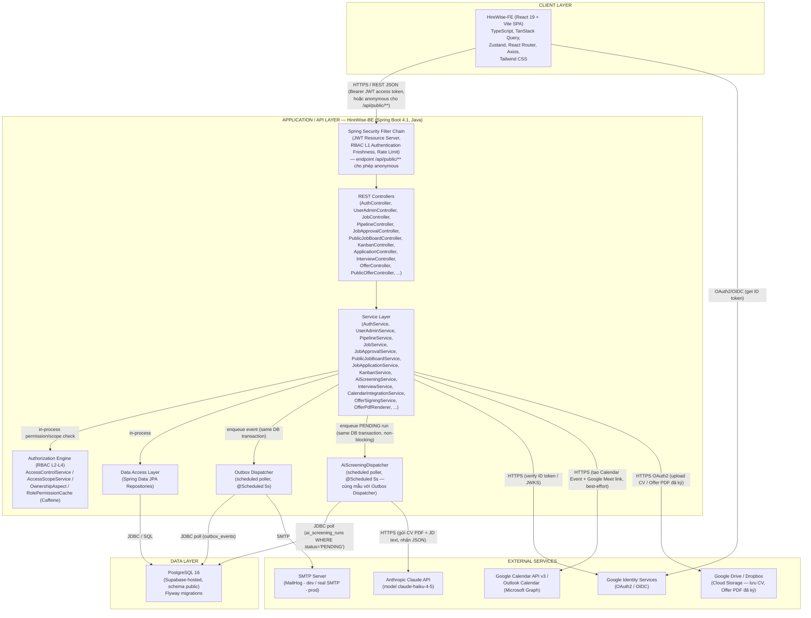
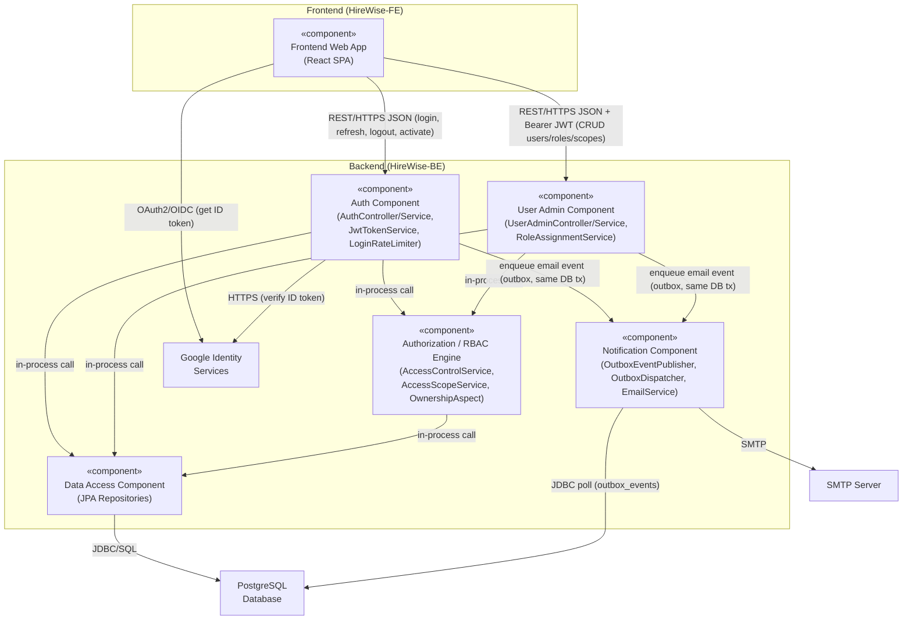
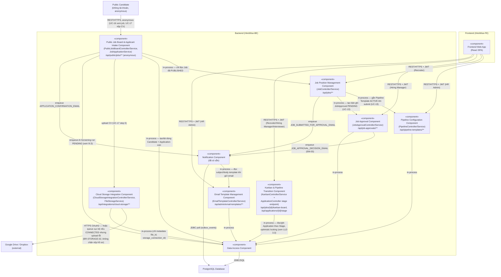
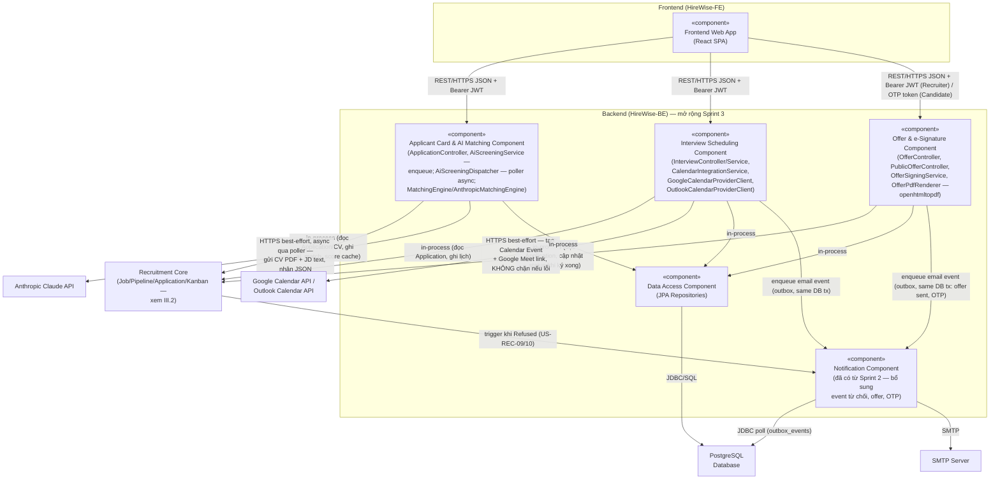

**HIGH-LEVEL DESIGN**

**HỆ THỐNG TUYỂN DỤNG & QUẢN LÝ ỨNG VIÊN**

## II. Overall Architecture

HireWise áp dụng kiến trúc Client-Server 3 lớp (3-tier): Frontend SPA (client) – REST API backend theo mô hình phân lớp (Controller – Service – Repository, Spring Boot) – CSDL PostgreSQL, kết hợp mô hình Transactional Outbox để gửi email bất đồng bộ — Sprint 3 áp dụng lại đúng mô hình poller này cho AI Screening (xem mục III.3).

*Hình 2: Sơ đồ kiến trúc tổng thể hệ thống HireWise*

## III. Main component/modules

### III.1 Auth & Admin Components (Sprint 1, không đổi)

*Hình 3a: UML Component Diagram – nhóm Auth/Admin*

### III.2 Recruitment Core Components (Sprint 2 — bổ sung mới, đã verify với mã nguồn)

*Hình 3b: UML Component Diagram – 7 component nghiệp vụ tuyển dụng cốt lõi*

### III.3 Recruitment Extension Components

*Hình 3c: UML Component Diagram*

### III.4 Recruitment Extension Components II (Sprint 4, đã verify với mã nguồn)

```mermaid
flowchart TB
    subgraph N1["Frontend (HireWise-FE)"]
        N2["«component»<br/>Frontend Web App<br/>(React SPA)"]
    end
    N0G["Guest / Candidate<br/>(không tài khoản, anonymous)"]
    subgraph N3["Backend (HireWise-BE) — mở rộng Sprint 4"]
        N4["«component»<br/>Structured Scorecard Component<br/>(ScorecardTemplateController/Service,<br/>JobStageScorecardController/Service,<br/>ScorecardController, ScorecardSubmissionService,<br/>ScorecardLockWorker — poller @Scheduled 5 phút)"]
        N5["«component»<br/>SLA Monitoring Component<br/>(SlaAlertController, SlaMonitoringService,<br/>SlaBreachWorker — poller @Scheduled 5 phút)"]
        N6["«component»<br/>Self-service Interview Booking Component<br/>(PublicBookingController — anonymous,<br/>InterviewService.sendBookingLink/confirmBookingSlot)"]
        N7["«component»<br/>Multi-channel Job Posting Component<br/>(PublishingChannelController/Service,<br/>JobShareController/Service, ShareLinkFactory,<br/>PublicJobShareController — anonymous)"]
        N8["«component»<br/>Reporting & Analytics Component<br/>(ReportController, ReportService,<br/>ReportExportService — xuất Excel)"]
        N9["«component»<br/>Notification Component<br/>(đã có từ Sprint 2 — bổ sung<br/>event booking, SLA breach)"]
        N10["«component»<br/>Data Access Component<br/>(JPA Repositories)"]
    end
    N11["Recruitment Core<br/>(Job/Pipeline/Application/Kanban —<br/>xem III.2)"]
    N12["Interview Scheduling<br/>(xem III.3)"]
    N13["PostgreSQL<br/>Database"]
    N14["LinkedIn / Facebook / X<br/>(mở popup share-intent do trình duyệt tự gọi —<br/>KHÔNG phải HTTPS call từ backend)"]

    N2 -->|"REST/HTTPS JSON + Bearer JWT (HR Admin/Hiring Manager)"| N4
    N2 -->|"REST/HTTPS JSON + Bearer JWT (Interviewer)"| N4
    N2 -->|"REST/HTTPS JSON + Bearer JWT (HR Admin/Recruiter/Hiring Manager)"| N5
    N2 -->|"REST/HTTPS JSON + Bearer JWT (Recruiter, gửi link)"| N6
    N0G -->|"REST/HTTPS, anonymous — xem slot + xác nhận đặt lịch"| N6
    N2 -->|"REST/HTTPS JSON + Bearer JWT (HR Admin/Recruiter)"| N7
    N0G -->|"REST/HTTPS, anonymous — click link chia sẻ"| N7
    N7 -.->|"KHÔNG gọi API — chỉ build URL popup,<br/>trình duyệt Recruiter tự mở"| N14
    N2 -->|"REST/HTTPS JSON + Bearer JWT (Recruiter/Hiring Manager/HR Admin)"| N8
    N4 -->|"in-process (đọc Interview/pipeline_stage_id)"| N12
    N6 -->|"in-process (tạo Interview + participant khi confirm)"| N12
    N5 -->|"in-process (đọc sla_hours, last_stage_changed_at)"| N11
    N7 -->|"in-process (đọc Job PUBLISHED, ghi applications.source)"| N11
    N8 -->|"in-process (đọc applications/application_stage_history/job_posting_channels, chỉ SELECT)"| N11
    N5 -->|"enqueue SLA_BREACH_ALERT_EMAIL (gộp theo Job+Stage)"| N9
    N6 -->|"enqueue BOOKING_LINK_EMAIL / BOOKING_CONFIRMED_EMAIL / INTERVIEWER_ASSIGNED_EMAIL"| N9
    N4 -->|"in-process"| N10
    N5 -->|"in-process"| N10
    N6 -->|"in-process"| N10
    N7 -->|"in-process"| N10
    N8 -->|"in-process (chỉ đọc)"| N10
    N10 -->|"JDBC/SQL"| N13
    N9 -->|"JDBC poll (outbox_events)"| N13
```

*Hình 3d: UML Component Diagram*

| **Component** | **Functionality** | **Interacts with** |
|---|---|---|
| Frontend Web App (HireWise-FE) | React 19 SPA cung cấp giao diện đăng nhập và các trang nghiệp vụ nội bộ (Dashboard...) cho HR Admin/Recruiter/Hiring Manager/Interviewer. | Auth Component, User Admin Component (qua REST/HTTPS JSON), Google Identity Services (OAuth2/OIDC) |
| Auth Component (AuthController, AuthService, JwtTokenService, LoginRateLimiter, GoogleIdTokenVerifier) | Xác thực người dùng: đăng nhập email/mật khẩu và Google SSO, cấp/làm mới JWT access token, quản lý refresh token & session, khóa tài khoản sau nhiều lần đăng nhập sai, kích hoạt tài khoản mới. | Frontend Web App, Authorization/RBAC Engine, Data Access Component, Notification Component, Google Identity Services |
| User Admin Component (UserAdminController, UserAdminService, RoleAssignmentService) | Quản trị tài khoản nội bộ: tạo/tra cứu/khóa-mở tài khoản, gán hoặc thu hồi role và access scope cho user. | Frontend Web App, Authorization/RBAC Engine, Data Access Component, Notification Component |
| Authorization / RBAC Engine (AccessControlService, AccessScopeService, RolePermissionCache, OwnershipAspect, AuthenticationFreshnessFilter) | Thực thi 4 lớp kiểm soát truy cập: (1) Authentication Freshness, (2) Role-Permission, (3) Access Scope (SYSTEM/DEPARTMENT/JOB), (4) Ownership. Cache bằng Caffeine để giảm tải truy vấn CSDL. | Auth Component, User Admin Component, Data Access Component |
| **Pipeline Configuration Component** (`PipelineController`/`PipelineService`, `/api/pipeline-templates/**`) — *Sprint 2, mới bổ sung vào HLD* | Quản lý Pipeline Template và Stage: tạo Template, tạo/sắp xếp lại (`reorderStages`)/xóa Stage (chặn xóa nếu đang có Application, xem `PipelineStage.isActive`), chuyển Template `DRAFT→ACTIVE` (`activateTemplate`) trước khi Job Position có thể gắn vào (US-ADM-04/05/06). | Frontend Web App, Job Position Management Component, Data Access Component |
| **Job Position Management Component** (`JobController`/`JobService`, `/api/jobs/**`) — *Sprint 2, mới bổ sung vào HLD* | Soạn/sửa Job Position (JD), gắn Pipeline Template `ACTIVE` và nộp duyệt (`submitForApproval` — tạo bản ghi `JobApproval` `PENDING`, gửi email `JOB_SUBMITTED_FOR_APPROVAL_EMAIL`) (US-REC-01/02). Cũng là điểm vào tab JD chi tiết và tab Kanban Board trên UI. | Frontend Web App, Pipeline Configuration Component, Job Approval Component, Notification Component, Data Access Component |
| **Job Approval Component** (`JobApprovalController`/`JobApprovalService`, `/api/job-approvals/**`) — *Sprint 2, mới bổ sung vào HLD* | Hiring Manager xem danh sách Job đang chờ duyệt (scoped theo phòng ban), phê duyệt/từ chối (từ chối bắt buộc lý do ≥ 10 ký tự — BR-APR-02), gửi email `JOB_APPROVAL_DECISION_EMAIL` (EM-03) báo kết quả cho Recruiter (US-MGR-01/02). | Frontend Web App, Job Position Management Component, Notification Component, Data Access Component |
| **Public Job Board & Applicant Intake Component** (`PublicJobBoardController`/`PublicJobBoardService`, `JobApplicationService`, `/api/public/jobs/**`, **anonymous, không cần JWT**) — *Sprint 2, mới bổ sung vào HLD* | Candidate (không có tài khoản) xem danh sách/chi tiết Job đã `PUBLISHED` (UC-16), nộp form ứng tuyển kèm CV (UC-17): tạo/tái dùng `Candidate` (theo `primary_email` UNIQUE), tạo `Application`, upload CV lên Cloud Storage, **enqueue 1 AI Screening run** (xem III.3) và gửi email xác nhận đã nộp hồ sơ. | Public Candidate, Job Position Management Component, Cloud Storage Integration Component, Applicant Card & AI Matching Component (enqueue), Notification Component, Data Access Component |
| **Kanban & Pipeline Transition Component** (`KanbanController`/`KanbanService` + endpoint chuyển Stage trên `ApplicationController`) — *Sprint 2, mới bổ sung vào HLD* | Hiển thị board theo từng Stage của Pipeline Template (`getBoard`, US-REC-05); kéo-thả đổi Stage với state-machine + optimistic locking (`moveStage`, US-REC-06) — xem chi tiết thuật toán ở `LLD` mục 3.3. | Frontend Web App, Data Access Component |
| **Cloud Storage Integration Component** (`CloudStorageIntegrationController`/`CloudStorageIntegrationService`, `FileStorageService`, `/api/integrations/cloud-storage/**`) — *Sprint 2, mới bổ sung vào HLD* | Cấu hình OAuth 2.0 với Google Drive/Dropbox (US-ADM-07), quản lý/gia hạn token (US-ADM-08, có `CloudStorageTokenRefreshWorker` chạy nền), lưu CV (UC-17) và **PDF Offer đã ký (UC-39, tái sử dụng lại đúng component này ở Sprint 3)**. Nếu kết nối `EXPIRED`/`REVOKED` hoặc upload lỗi, file được giữ ở hàng đợi cục bộ (BR-STORAGE-02) — **không chặn** việc Candidate nộp hồ sơ hay Candidate ký Offer. | Frontend Web App, Public Job Board Component, Offer & e-Signature Component (Sprint 3), Google Drive/Dropbox, Data Access Component |
| **Email Template Management Component** (`EmailTemplateController`/`EmailTemplateService`, `/api/admin/email-templates/**`) — *Sprint 2, mới bổ sung vào HLD* | HR Admin tạo/sửa/xóa Email Template, soạn nội dung với biến động `{{Var}}`, xem trước định dạng (US-ADM-09/10/11). Notification Component đọc `subject_template`/`body_template` từ đây khi gửi email theo `event_type` tương ứng. | Frontend Web App, Notification Component, Data Access Component |
| **Applicant Card & AI Matching Component** (`AiScreeningService` — enqueue non-blocking; `AiScreeningDispatcher` — poller `@Scheduled` 5s, cùng mẫu `OutboxDispatcher`; `MatchingEngine`/`AnthropicMatchingEngine`) — *Sprint 3, đã verify* | UC-17 (nộp CV) hoặc Recruiter bấm "Phân tích lại" → ghi 1 dòng `ai_screening_runs` (`PENDING`), **không chặn request**. Dispatcher poll mỗi 5s, gửi thẳng file CV (PDF) làm document content block + JD text cho **Anthropic Claude** (`claude-haiku-4-5`), nhận về Match Score + danh sách kỹ năng khớp/thiếu + tóm tắt, cache `applications.ai_match_score` cho Kanban Badge (US-REC-03, US-REC-04). Lỗi → đánh dấu `FAILED`, **không tự động retry** (khác Outbox) — Recruiter bấm phân tích lại thủ công. | Frontend Web App, Public Job Board Component (enqueue), Kanban & Pipeline Transition Component, Anthropic Claude API, Data Access Component |
| **Interview Scheduling Component** (`InterviewController/Service`, `CalendarIntegrationService`, `GoogleCalendarProviderClient`, `OutlookCalendarProviderClient`) — *Sprint 3, đã verify* | Lên lịch phỏng vấn cố định do Recruiter set (US-REC-07). Khi `mode=ONLINE` và chưa có link, tự gọi Google Calendar API tạo event kèm Google Meet, ghi link vào `interviews.location_or_link`. **Không lưu id sự kiện Calendar** trong DB; **nếu gọi Calendar API lỗi, buổi phỏng vấn vẫn được tạo bình thường** (không rollback), chỉ thiếu link tự động. US-ADM-12 hỗ trợ **2 provider**: Google Calendar và Outlook Calendar (Microsoft Graph) qua cùng interface `CalendarProviderClient`. | Frontend Web App, Kanban & Pipeline Transition Component, Google Calendar API / Outlook Calendar API, Data Access Component, Notification Component |
| **Offer & e-Signature Component** (`OfferController`, `PublicOfferController`, `OfferSigningService`, `OfferPdfRenderer` — thư viện **openhtmltopdf**) — *Sprint 3, đã verify* | Sinh Offer Letter từ `offer_templates` (US-REC-13), gửi liên kết cho Candidate qua `offer_access_tokens` **có bảo vệ bằng mã OTP gửi email** (US-REC-14) — Candidate không có tài khoản trong hệ thống nên OTP + token chính là cơ chế xác thực (US-CAN-05). Ký điện tử (vẽ tay hoặc gõ tên, US-CAN-06) ghi vào `offer_signatures`, render lại PDF đã ký bằng openhtmltopdf, lưu qua Cloud Storage Integration Component vào `offer_files`. | Frontend Web App, Kanban & Pipeline Transition Component, Cloud Storage Integration Component, Data Access Component, Notification Component |
| **Structured Scorecard Component** (`ScorecardTemplateController/Service`, `JobStageScorecardController/Service`, `ScorecardController`, `ScorecardSubmissionService`, `ScorecardLockWorker`) — *Sprint 4, đã verify* | HR Admin quản lý thư viện `scorecard_templates` dùng chung; Recruiter/HR Admin gắn bộ tiêu chí thật cho từng cặp (Job, Stage phỏng vấn) — sửa sau khi đã có người chấm tự tạo version mới (AF-01), không sửa đè. Interviewer chấm điểm (US-INT-02), Submission tự khoá ~24h sau buổi phỏng vấn (`ScorecardLockWorker`, poller 5 phút), chỉ HR Admin mở lại được. | Frontend Web App, Interview Scheduling Component (đọc `interviews.pipeline_stage_id`), Data Access Component |
| **SLA Monitoring Component** (`SlaAlertController`, `SlaMonitoringService`, `SlaBreachWorker`) — *Sprint 4, đã verify* | Đọc lại ngưỡng `pipeline_stages.sla_hours` (đã có từ Sprint 2) và `applications.last_stage_changed_at` để phát hiện hồ sơ "ngâm" quá hạn ở 1 Stage; poller nền (5 phút) gộp cảnh báo theo (Job, Stage) gửi Recruiter phụ trách, chống trùng lặp qua cột `sla_alert_sent_at`. Sau `V47`, chỉ HR Admin cấu hình SLA được (Hiring Manager đã bị thu hồi quyền `PIPELINE_VIEW`/`SLA_CONFIGURE`). | Frontend Web App, Recruitment Core (đọc), Notification Component, Data Access Component |
| **Self-service Interview Booking Component** (`PublicBookingController` — anonymous, mở rộng `InterviewService`) — *Sprint 4, đã verify* | Recruiter liệt kê thủ công khung giờ rảnh và gửi 1 link công khai (`booking_token`, hết hạn 7 ngày, US-REC-08); Candidate ẩn danh tự chọn slot (US-CAN-03/04) — xử lý race condition bằng pessimistic lock trên slot + re-check chéo với lịch thật của Interviewer. Xác nhận thành công tạo thẳng `interviews`/`interview_participants`, tái dùng cơ chế Google Meet best-effort đã có ở Interview Scheduling (III.3). | Guest/Candidate (anonymous), Frontend Web App, Interview Scheduling Component (III.3), Notification Component, Data Access Component |
| **Multi-channel Job Posting Component** (`PublishingChannelController/Service`, `JobShareController/Service`, `ShareLinkFactory`, `PublicJobShareController` — anonymous) — *Sprint 4, đã verify — đính chính kiến trúc* | HR Admin cấu hình danh sách kênh (`publishing_channels`, 4 kênh: LinkedIn/Facebook/X/Copy Link); Recruiter chia sẻ Job đã `PUBLISHED` (US-REC-11) bằng link **share-intent** do trình duyệt tự mở popup của nền tảng — **backend không gọi API mạng xã hội nào**, không OAuth. Đếm `share_count`/`click_count` theo từng kênh (US-REC-12), quy kết nguồn ứng viên qua UTM (`applications.source`, so khớp giá trị, không FK). Trang đích công khai `/j/{jobId}` phục vụ Open Graph preview cho crawler mạng xã hội. | Guest (anonymous, click link chia sẻ), Frontend Web App, Recruitment Core (đọc Job/ghi `applications.source`), Data Access Component |
| **Reporting & Analytics Component** (`ReportController`, `ReportService`, `ReportExportService`) — *Sprint 4, đã verify* | 2 Dashboard read-model, không có bảng riêng: Source ROI (US-REC-15, trộn số liệu theo khoảng ngày với số liệu trọn đời từ `job_posting_channels`) và Pipeline Velocity (US-REC-16, thời gian trung bình/trung vị/P90 mỗi Stage từ `application_stage_history`). Phạm vi dữ liệu theo role (BR-RPT-02). Xuất Excel (Apache POI) bằng cách dựng lại báo cáo từ tham số phía server, không nhận dữ liệu client gửi lên. | Frontend Web App, Recruitment Core (chỉ đọc), Data Access Component |
| Notification Component (OutboxEventPublisher, OutboxDispatcher, EmailService) | Gửi email theo mô hình Transactional Outbox. Sprint 2 dùng cho: kích hoạt tài khoản, cảnh báo bảo mật, nộp duyệt Job (`JOB_SUBMITTED_FOR_APPROVAL_EMAIL`), kết quả duyệt (`JOB_APPROVAL_DECISION_EMAIL`), xác nhận nộp hồ sơ (`APPLICATION_CONFIRMATION_EMAIL`). Sprint 3 bổ sung: mời phỏng vấn (`EM-05`/`EM-08`), từ chối ứng viên (nhắc "Talent Pool" — xem `DatabaseDesign_v3.md` mục 6), gửi Offer, mã OTP xem Offer (`EM-OTP-OFFER`). Sprint 4 bổ sung: link Self-service Booking (`EM-06`), xác nhận đặt lịch cho Candidate + Interviewer (`EM-07`/EM-08 tái dùng), cảnh báo vi phạm SLA gộp theo (Job, Stage) (`SLA_BREACH_ALERT_EMAIL`), tổng hợp lượt chia sẻ Job (`EM-10`, no-op im lặng nếu chưa từng chia sẻ). | Auth/User Admin/Job Position/Job Approval/Public Job Board/Interview Scheduling/Offer & e-Signature Component, Email Template Management Component (đọc nội dung), Data Access Component, SMTP Server |
| Data Access Component (Spring Data JPA Repositories) | Truy vấn/ghi dữ liệu nghiệp vụ và bảo mật xuống PostgreSQL. | Tất cả các component nghiệp vụ ở trên, PostgreSQL Database |
| Google Identity Services (external) | Dịch vụ OAuth2/OpenID Connect của Google, cấp ID token cho luồng đăng nhập SSO trên trình duyệt. | Frontend Web App (lấy ID token), Auth Component (xác minh ID token) |
| **Google Drive / Dropbox** (external) — *Sprint 2, mới bổ sung vào HLD* | Lưu file thật (CV, Offer PDF đã ký) — DB chỉ lưu metadata (`files.external_file_id`). | Cloud Storage Integration Component |
| **Google Calendar API / Outlook Calendar API** (external) — *Sprint 3, đã verify* | Tạo event lịch phỏng vấn + sinh Google Meet link (best-effort, không chặn nghiệp vụ nếu lỗi). | Interview Scheduling Component |
| **Anthropic Claude API** (external, model `claude-haiku-4-5`) — *Sprint 3, đã verify* | Nhận trực tiếp file CV (PDF, không qua bước tách text riêng) + JD text, trả về JSON có cấu trúc: Match Score, matched/missing skills, tóm tắt. | Applicant Card & AI Matching Component |
| SMTP Server (MailHog – dev, SMTP thật – prod) | Gửi email thực tế thay mặt hệ thống. | Notification Component |

## IV. Component Interactions

| **Source** | **Target** | **Phương thức / Giao thức** | **Mục đích** |
|---|---|---|---|
| Frontend Web App | Auth Component | REST/HTTPS + JSON | Đăng nhập (email/password, Google SSO), làm mới token, đăng xuất, kích hoạt tài khoản (POST /api/auth/*) |
| Frontend Web App | User Admin Component | REST/HTTPS + JSON (Bearer JWT) | Tạo/tra cứu/khóa-mở tài khoản, gán role & access scope (CRUD /api/admin/users/*) |
| Frontend Web App | Google Identity Services | OAuth2 / OpenID Connect (trình duyệt) | Lấy Google ID token để đăng nhập SSO |
| Auth Component | Google Identity Services | HTTPS (xác minh qua JWKS) | Xác minh chữ ký và claim của Google ID token do FE gửi lên |
| Auth Component / User Admin Component | Authorization/RBAC Engine | Gọi hàm nội bộ (in-process) | Kiểm tra quyền (permission) và phạm vi truy cập (access scope) trước khi thực hiện thao tác |
| Auth Component / User Admin Component | Data Access Component | Gọi hàm nội bộ (in-process, JPA) | Đọc/ghi dữ liệu users, auth_identities, roles, user_roles, user_access_scopes, user_sessions... |
| Authorization/RBAC Engine | Data Access Component | Gọi hàm nội bộ (in-process, JPA) | Truy vấn role-permission, access scope và cây phòng ban (recursive CTE) để tính quyền |
| Data Access Component | PostgreSQL Database | JDBC / SQL | Thực thi các truy vấn đọc/ghi dữ liệu |
| Auth Component / User Admin Component | Notification Component | Gọi hàm nội bộ (in-process) | Ghi bản ghi outbox_events (ACTIVATION_EMAIL, SECURITY_ALERT_EMAIL) trong cùng transaction DB |
| Notification Component | PostgreSQL Database | JDBC (poll định kỳ 5s) | Đọc các bản ghi outbox_events đang PENDING để xử lý |
| Notification Component | SMTP Server | SMTP | Gửi email kích hoạt tài khoản / cảnh báo bảo mật / từ chối / offer / OTP tới người dùng |
| **Frontend Web App** | **Pipeline Configuration Component** | REST/HTTPS + JSON (Bearer JWT, HR Admin) | Tạo Pipeline Template, tạo/sắp xếp/xóa Stage, kích hoạt Template |
| **Job Position Management Component** | **Pipeline Configuration Component** | Gọi hàm nội bộ (in-process) | Kiểm tra Pipeline Template đang `ACTIVE` trước khi gắn vào Job (UC-13) |
| **Job Position Management Component** | **Job Approval Component** | Gọi hàm nội bộ (in-process) | Tạo bản ghi `job_approvals` (`decision=NULL`) khi Recruiter nộp duyệt |
| **Job Position / Job Approval Component** | **Notification Component** | Gọi hàm nội bộ (in-process) | Ghi outbox `JOB_SUBMITTED_FOR_APPROVAL_EMAIL` (nộp duyệt) / `JOB_APPROVAL_DECISION_EMAIL` (kết quả duyệt, EM-03) |
| **Public Candidate** | **Public Job Board & Applicant Intake Component** | REST/HTTPS, anonymous (permitAll) | Xem Job đã `PUBLISHED` (UC-16), nộp form + CV (UC-17) |
| **Public Job Board & Applicant Intake Component** | **Cloud Storage Integration Component** | Gọi hàm nội bộ → HTTPS OAuth2 ra ngoài | Upload CV lên Google Drive/Dropbox đã kết nối; queue cục bộ nếu lỗi (BR-STORAGE-02) |
| **Public Job Board & Applicant Intake Component** | **Applicant Card & AI Matching Component** | Gọi hàm nội bộ (`AiScreeningService.enqueueRun`) | Xếp hàng 1 lượt phân tích AI ngay sau khi Application được tạo, không chặn response |
| **Frontend Web App** | **Kanban & Pipeline Transition Component** | REST/HTTPS + JSON (Bearer JWT) | Xem board theo Stage (GET), kéo-thả đổi Stage (PATCH, optimistic locking) |
| **Frontend Web App** | **Cloud Storage Integration Component** | REST/HTTPS + JSON (Bearer JWT, HR Admin) | Kết nối/ngắt/kiểm tra token OAuth với Google Drive/Dropbox |
| **Frontend Web App** | **Email Template Management Component** | REST/HTTPS + JSON (Bearer JWT, HR Admin) | CRUD Email Template, soạn nội dung, xem trước |
| **Notification Component** | **Email Template Management Component** | Gọi hàm nội bộ (in-process) | Lấy `subject_template`/`body_template` tương ứng `event_type` trước khi render email thật |
| **Frontend Web App** | **Applicant Card & AI Matching Component** | REST/HTTPS + JSON (Bearer JWT) | Xem chi tiết Applicant Card, xem kết quả AI Screening mới nhất, bấm "Phân tích lại" |
| **AiScreeningDispatcher** | **Anthropic Claude API** | HTTPS (REST, JSON), poll mỗi 5s, batch 10 | Gửi CV PDF + JD text, nhận Match Score/Skills/Summary |
| **Frontend Web App** | **Interview Scheduling Component** | REST/HTTPS + JSON (Bearer JWT) | Tạo lịch phỏng vấn cố định (POST /api/v1/interviews) |
| **Interview Scheduling Component** | **Google/Outlook Calendar API** | HTTPS (REST, OAuth2 Bearer token của HR Admin đã kết nối) | Tạo event, sinh Google Meet link — best-effort, lỗi không chặn tạo lịch |
| **Frontend Web App** | **Offer & e-Signature Component** | REST/HTTPS + JSON (Bearer JWT cho Recruiter; token + OTP cho Candidate) | Sinh Offer Letter, gửi liên kết + OTP, đọc hợp đồng, thực hiện ký điện tử |
| **Offer & e-Signature Component** | **Cloud Storage Integration Component** | Gọi hàm nội bộ | Lưu PDF Offer đã ký (`offer_files`, role `OFFER_SIGNED`) — tái dùng đúng hạ tầng CV Sprint 2 |
| **Recruitment Core (Candidate Rejection, US-REC-09/10)** | **Notification Component** | Gọi hàm nội bộ (in-process) | Ghi outbox_events khi Application chuyển sang `REFUSED`, email có nhắc "Talent Pool" (xem `DatabaseDesign_v3.md` mục 6) |
| **Frontend Web App** | **Structured Scorecard Component** | REST/HTTPS + JSON (Bearer JWT) | Cấu hình tiêu chí theo (Job, Stage); Interviewer mở form và nhập điểm |
| **Structured Scorecard Component** | **Interview Scheduling Component** | Gọi hàm nội bộ (in-process) | Tra `interviews.pipeline_stage_id` để xác định đúng bộ tiêu chí cần chấm cho 1 buổi phỏng vấn |
| **Frontend Web App** | **SLA Monitoring Component** | REST/HTTPS + JSON (Bearer JWT) | Xem widget Dashboard "Vi phạm SLA" (GET /api/sla-alerts) |
| **SlaBreachWorker** | **Notification Component** | Gọi hàm nội bộ (in-process) | Ghi outbox `SLA_BREACH_ALERT_EMAIL` gộp theo (Job, Stage), gửi Recruiter phụ trách |
| **Guest/Candidate (anonymous)** | **Self-service Interview Booking Component** | REST/HTTPS, anonymous (permitAll) | Xem slot trống (GET /api/public/booking/{token}), xác nhận chọn slot (POST .../confirm) |
| **Self-service Interview Booking Component** | **Interview Scheduling Component** | Gọi hàm nội bộ (in-process) | Tạo `interviews`/`interview_participants` khi Candidate xác nhận slot; tái dùng Google Meet best-effort |
| **Frontend Web App** | **Multi-channel Job Posting Component** | REST/HTTPS + JSON (Bearer JWT, HR Admin/Recruiter) | Cấu hình kênh, lấy link share-intent, xem số liệu chia sẻ |
| **Guest (anonymous)** | **Multi-channel Job Posting Component** | REST/HTTPS, anonymous | Click link chia sẻ `/j/{jobId}` — nhận HTML Open Graph + redirect kèm UTM |
| **Multi-channel Job Posting Component** | **LinkedIn/Facebook/X (external)** | **Không có** — trình duyệt Recruiter tự mở popup share-intent, backend không gọi API nào | Điểm khác biệt kiến trúc quan trọng nhất của Sprint 4, xem `common/LLD.md` mục 3.12 |
| **Frontend Web App** | **Reporting & Analytics Component** | REST/HTTPS + JSON (Bearer JWT) | Xem 2 Dashboard (Source ROI, Pipeline Velocity), xuất Excel |
