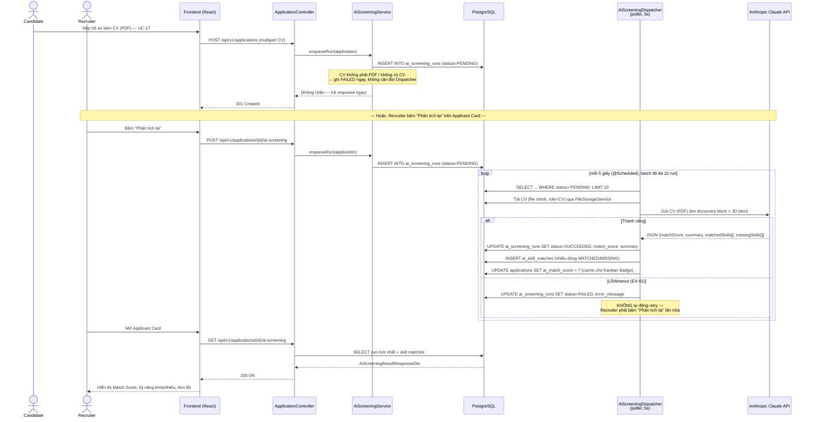
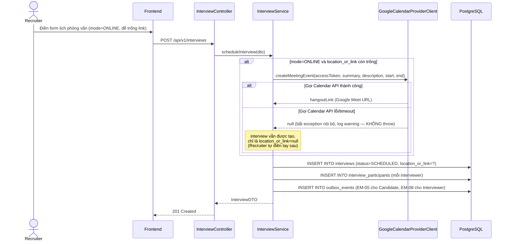
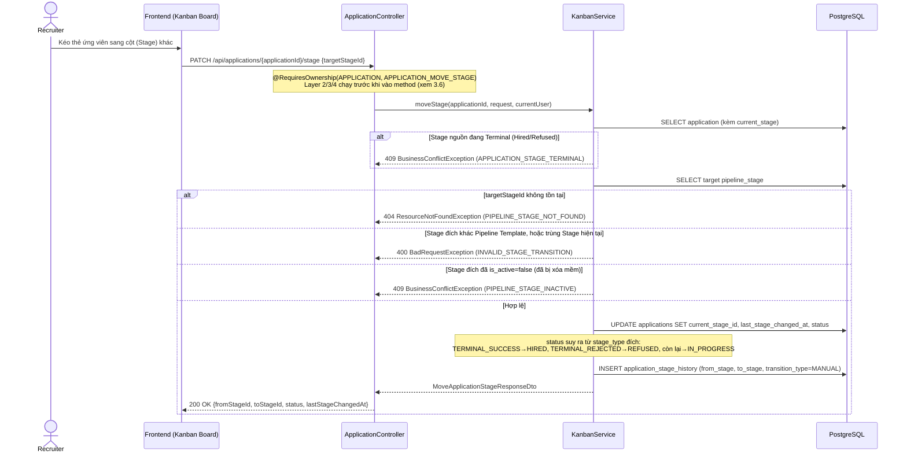
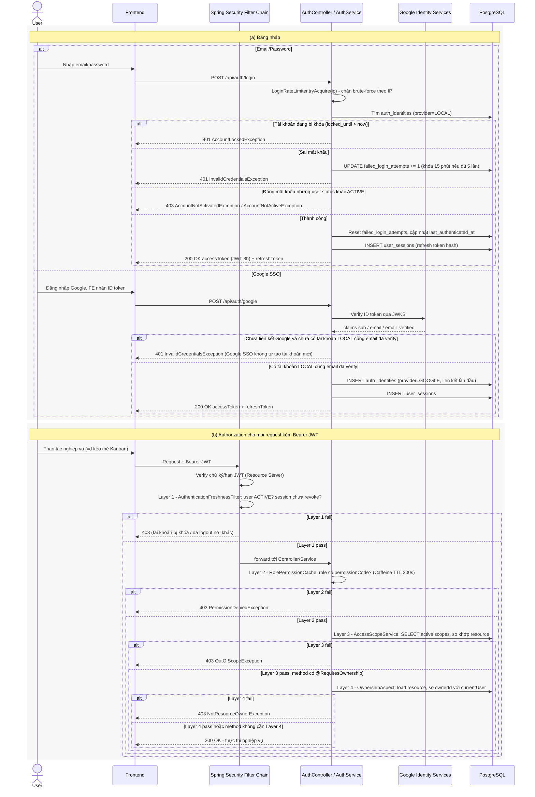
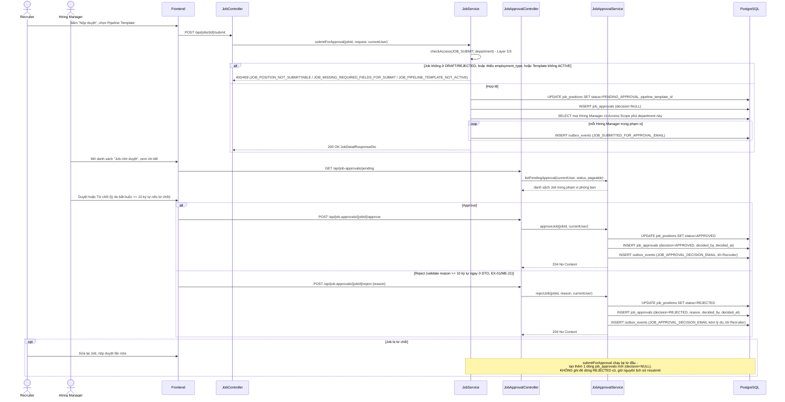
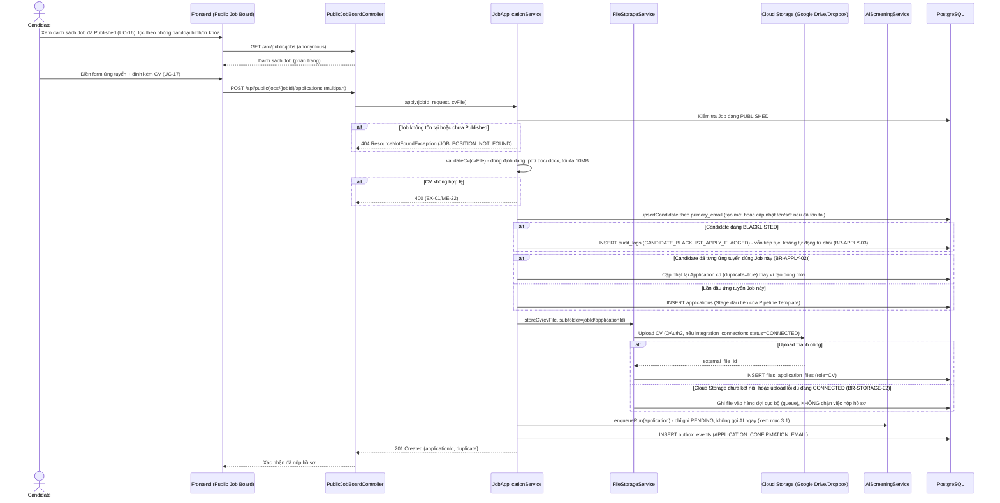
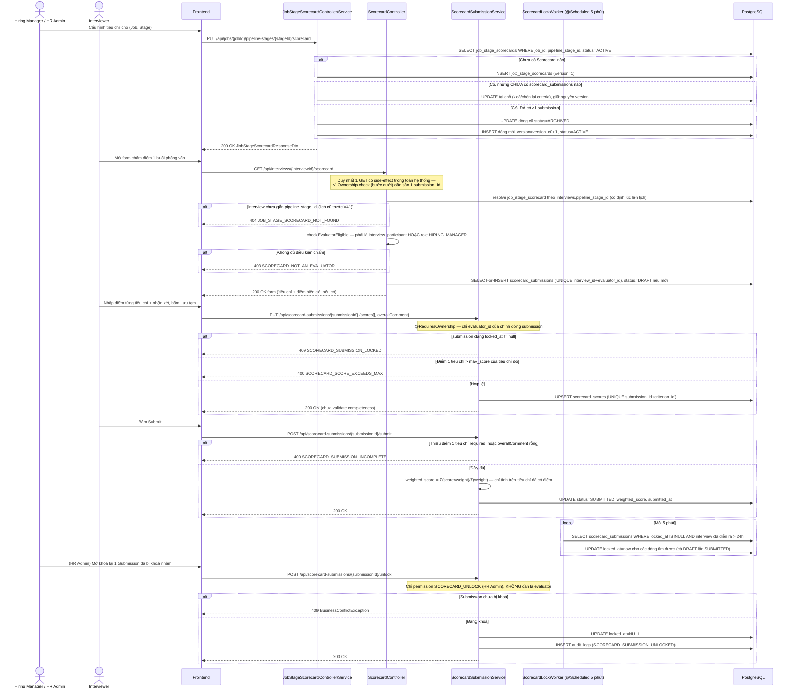
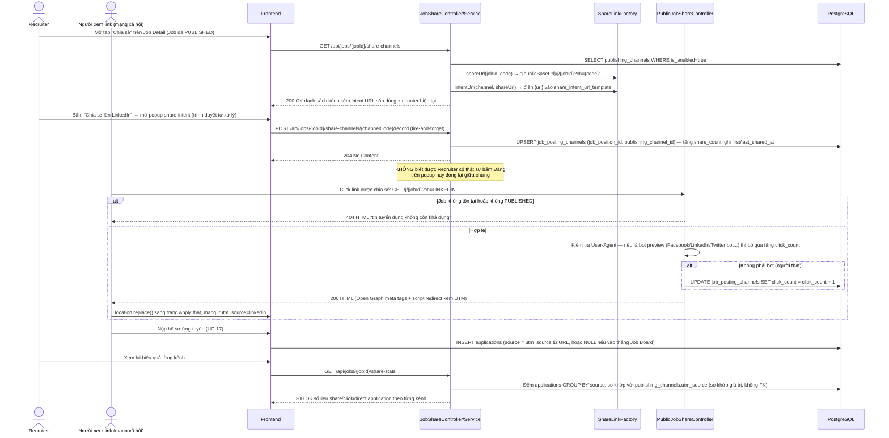

# LOW-LEVEL DESIGN
## HỆ THỐNG TUYỂN DỤNG & QUẢN LÝ ỨNG VIÊN (HireWise ATS)

## II. Critical Flows Catalog 
*Danh sách các luồng được chọn để thiết kế chi tiết do có rủi ro kỹ thuật cao, logic phức tạp hoặc tích hợp bên ngoài.*

| Flow Name | Phân loại | Description |
| :--- | :--- | :--- |
| 3.1 AI Screening: Match Score & Skill Analysis | AI / Complex / Async | CV đính kèm khi ứng tuyển (hoặc bấm "Phân tích lại") được xếp hàng và xử lý bất đồng bộ bởi 1 poller riêng, gọi Anthropic Claude để tính Match Score + kỹ năng khớp/thiếu. |
| 3.2 Interview Calendar Sync | 3rd-Party / Best-effort | Tạo lịch phỏng vấn, gọi Google/Outlook Calendar API để sinh link họp — lỗi không chặn nghiệp vụ. |
| 3.3 Kanban Pipeline Transition | Complex / Risk | Kéo thả ứng viên qua các vòng (Stage); chặn khi Stage nguồn đã Terminal hoặc Stage đích khác Pipeline Template/đã tắt — không dùng optimistic locking (đối chiếu lại mã nguồn, khác bản trước). |
| **3.4 Offer Letter Generation & e-Signature** | **PDF / 3rd-Party / Risk** | Sinh Offer Letter PDF (openhtmltopdf) từ Template, gửi liên kết + OTP qua email, ghi nhận chữ ký và render lại PDF đã ký — 2 bug thật đã tìm ra nguyên nhân, đã có fix chờ merge. |
| 3.6 Authentication & RBAC Authorization | Security / Complex / 3rd-Party | Đăng nhập Local + Google SSO sinh JWT; mọi request có JWT đi qua 4 lớp kiểm soát truy cập (Authentication Freshness, Role-Permission, Access Scope, Ownership) trước khi tới nghiệp vụ. |
| 3.7 Job Position Submission & Approval Workflow | Business Workflow / Notification | Recruiter nộp duyệt Job, hệ thống thông báo mọi Hiring Manager trong phạm vi phòng ban; Hiring Manager duyệt/từ chối, lịch sử approval được giữ nguyên qua nhiều lần nộp lại. |
| 3.8 Public Job Board & Applicant Intake | Public / Anonymous / 3rd-Party | Candidate ẩn danh xem Job đã Published và nộp hồ sơ kèm CV — tái sử dụng/tạo Candidate, tạo Application, upload CV lên Cloud Storage (có fallback BR-STORAGE-02), enqueue AI Screening. |
| 3.9 Structured Scorecard Evaluation | Complex / Versioning | Interviewer chấm điểm theo bộ tiêu chí cố định tại thời điểm phỏng vấn; sửa tiêu chí sau khi đã có người chấm sẽ tạo version mới (AF-01) thay vì sửa đè; Submission tự khoá ~24h sau buổi phỏng vấn (BR-SCORE-03), chỉ HR Admin mở lại được. |
| 3.10 Self-service Interview Booking | Public / Anonymous / Concurrency | Candidate tự chọn 1 khung giờ rảnh qua link công khai; xử lý race condition khi 2 Candidate cùng chọn 1 slot bằng pessimistic lock + re-check chéo với lịch phỏng vấn thật của Interviewer. |
| 3.11 SLA Monitoring Worker | Background Job / Notification | Poller định kỳ quét Application đang "ngâm" quá ngưỡng SLA của Stage, gộp cảnh báo theo (Job, Stage) thành 1 email, đảm bảo idempotent qua cột đánh dấu đã cảnh báo. |
| 3.12 Multi-channel Job Posting (Share-Intent) | 3rd-Party (không OAuth) / Pivot kiến trúc | Chia sẻ tin tuyển dụng ra LinkedIn/Facebook/X bằng link share-intent do trình duyệt tự mở — backend không gọi API mạng xã hội nào; đếm lượt chia sẻ/click và quy kết nguồn ứng viên qua UTM. |

---

## III. Detail Flow

### 3.1 Flow: AI Screening — Match Score & Skill Analysis (viết lại hoàn toàn theo mã nguồn thật)

#### 3.1.1 Mô tả tổng quan

**Lưu ý:** bản LLD trước đây mô tả 1 flow "AI-Powered CV Parsing" (upload CV rời, gọi AI để tự điền form tạo candidate qua endpoint `/api/v1/candidates/parse-cv`). Sau khi rà lại mã nguồn `HireWise-BE`, **flow đó không tồn tại** — không có `ResumeParserService`, không có endpoint `parse-cv`. Flow thật cho US-REC-03/04 là **AI Screening bất đồng bộ**: ngay khi Candidate nộp hồ sơ kèm CV (UC-17) — hoặc khi Recruiter bấm "Phân tích lại" trên Applicant Card — hệ thống chỉ ghi 1 dòng `ai_screening_runs` trạng thái `PENDING` rồi trả lời ngay (không chờ AI). Một poller riêng (`AiScreeningDispatcher`, `@Scheduled` 5s, cùng khuôn mẫu với `OutboxDispatcher`) quét các dòng `PENDING`, gửi file CV (PDF) trực tiếp cho **Anthropic Claude API** (model `claude-haiku-4-5`) làm 1 document content block kèm JD dạng text — Claude đọc PDF gốc, không cần bước tách text riêng bằng thư viện nào ở tầng ứng dụng.

#### 3.1.2 Sequence Diagram



#### 3.1.3 Step-by-step processing
| Bước | Actor/Component | Hành động | Input | Output |
| :--- | :--- | :--- | :--- | :--- |
| 1 | ApplicationController | Sau khi Application được tạo với CV đính kèm (UC-17), gọi `AiScreeningService.enqueueRun` | `Application` | — |
| 2 | AiScreeningService | Ghi 1 dòng `ai_screening_runs` (`status=PENDING`); nếu CV không phải PDF hoặc không có CV → ghi thẳng `FAILED` (EX-01), không tạo `PENDING` vô ích | `Application` | Bản ghi `ai_screening_runs` |
| 3 | AiScreeningDispatcher | Poll mỗi 5s (`app.ai.poll-interval-ms`), lấy tối đa 10 run `PENDING`/lần (`app.ai.batch-size`) | — | Danh sách `AiScreeningRun` |
| 4 | AiScreeningDispatcher | Tải file CV chính (`ApplicationFile` role `CV`, `is_primary=true`) qua `FileStorageService`, build JD text từ `JobPosition` | `application_id` | CV bytes, JD text |
| 5 | AnthropicMatchingEngine | Gửi CV PDF (document content block) + JD text cho Claude (`claude-haiku-4-5`), parse kết quả JSON có cấu trúc | CV bytes, JD text | `MatchAnalysisResult` |
| 6 | AiScreeningDispatcher | Thành công: cập nhật `ai_screening_runs` (`SUCCEEDED`, `match_score`, `summary`), ghi từng dòng `ai_skill_matches`, cache `applications.ai_match_score`. Lỗi: cập nhật `FAILED` + `error_message`, **không retry tự động** | `MatchAnalysisResult` hoặc Exception | Bản ghi cập nhật |
| 7 | Recruiter | Mở Applicant Card, xem kết quả run mới nhất (hoặc bấm "Phân tích lại" để tạo run mới nếu muốn) | `applicationId` | `AiScreeningResultResponseDto` |

#### 3.1.4 API Specification
| Endpoint | Method | Request | Response |
| :--- | :--- | :--- | :--- |
| `/api/v1/applications/{id}/ai-screening` | POST | — | `202 Accepted` (ghi `PENDING`, xử lý bất đồng bộ) |
| `/api/v1/applications/{id}/ai-screening` | GET | — | `200 OK`: `{ "status": "SUCCEEDED", "matchScore": 82, "summary": "...", "matchedSkills": ["Java","Spring Boot"], "missingSkills": ["Kubernetes"] }` |

#### 3.1.5 Error Handling
| Exception | Cách xử lý |
| :--- | :--- |
| CV không phải PDF, hoặc Application chưa có CV | `AiScreeningService.enqueueRun` ghi thẳng `ai_screening_runs.status=FAILED`, không gọi AI Engine (EX-01) — tránh 1 lệnh gọi Claude chắc chắn thất bại. |
| Claude API lỗi/timeout | `AiScreeningDispatcher` bắt exception, đánh dấu `FAILED` + `error_message`, **không retry tự động** (khác Outbox — 1 lần "Phân tích lại" mới rẻ hơn retry ngầm tốn token AI). Không chặn luồng tuyển dụng (BR-AI-01: AI chỉ hỗ trợ). |
| Run "biến mất" giữa lúc poll và lúc dispatch (`dispatchOne`) | Log cảnh báo, bỏ qua, không throw — vòng poll kế tiếp không còn thấy row đó nữa. |

---

### 3.2 Flow: Interview Scheduling & Calendar Sync (sửa lại theo mã nguồn thật)

#### 3.2.1 Mô tả tổng quan
Recruiter setup một lịch phỏng vấn cố định cho Candidate (US-REC-07). Hệ thống lưu vào bảng `interviews`; nếu `mode=ONLINE` và chưa có link, **cố gắng** gọi Google Calendar API (hoặc Outlook, tùy provider đã kết nối ở US-ADM-12) để tạo event + sinh Google Meet link, rồi ghi thẳng link đó vào `interviews.location_or_link`. Ghi outbox event gửi email mời phỏng vấn (`EM-05` cho Candidate, `EM-08` cho Interviewer).

#### 3.2.2 Sequence Diagram



#### 3.2.3 Step-by-step processing
| Bước | Actor/Component | Hành động | Input | Output |
| :--- | :--- | :--- | :--- | :--- |
| 1 | Frontend | Submit form tạo lịch phỏng vấn | `applicationId`, `interviewerIds`, `interviewDate`, `interviewTime`, `mode`, `locationOrLink` (có thể để trống nếu ONLINE) | API Request |
| 2 | InterviewService | Nếu `mode=ONLINE` và `locationOrLink` trống → gọi `GoogleCalendarProviderClient.createMeetingEvent` | HR Admin OAuth access token (đã kết nối ở US-ADM-12), thời gian phỏng vấn | Meet link hoặc `null` |
| 3 | InterviewService | Lưu `interviews` với `location_or_link` = link vừa tạo (hoặc giữ nguyên giá trị Recruiter nhập, hoặc `null` nếu Calendar lỗi và Recruiter cũng để trống) | `InterviewEntity` | DB record |
| 4 | InterviewService | Lưu `interview_participants` cho từng interviewer, ghi outbox event gửi email mời (`EM-05`/`EM-08`) | `interviewId`, `interviewerIds` | outbox_events records |

#### 3.2.4 API Specification
| Endpoint | Method | Request | Response |
| :--- | :--- | :--- | :--- |
| `/api/v1/interviews` | POST | `{ "applicationId": "uuid", "interviewerIds": [2,3], "interviewDate": "2026-09-10", "interviewTime": "10:00", "mode": "ONLINE", "locationOrLink": null }` | `201 Created`: `{ "interviewId": "uuid", "locationOrLink": "https://meet.google.com/..." }` |

#### 3.2.5 Error Handling
| Tình huống | Cách xử lý thật (đã verify — khác bản trước) |
| :--- | :--- |
| Google/Outlook Calendar API lỗi, timeout, hoặc chưa kết nối | `createMeetingEvent` bắt mọi exception, log `warn`, **trả về `null`** — **KHÔNG throw, KHÔNG rollback**. Buổi phỏng vấn vẫn được tạo thành công, chỉ thiếu link tự động; Recruiter tự điền `locationOrLink` thủ công sau. |
| HR Admin chưa cấu hình/kết nối Calendar (US-ADM-12) | Tương tự — `createMeetingEvent` không được gọi hoặc thất bại sớm, interview vẫn tạo bình thường ở chế độ "tự điền tay". |


---

### 3.3 Flow: Kanban Pipeline State Transition (viết lại hoàn toàn theo mã nguồn thật)

#### 3.3.1 Mô tả tổng quan

endpoint thật nằm trên `ApplicationController` (`PATCH /api/applications/{applicationId}/stage`), xử lý bởi `KanbanService.moveStage`, và bảng lịch sử thật là `application_stage_history` (xem `DatabaseDesign_v3.md` mục 6). Hệ thống **không dùng optimistic locking/cột `version`** — request xử lý sau cùng thắng (last-write-wins); tính đúng đắn dựa vào 2 điều kiện chặn: Stage nguồn không được là Terminal (BR-KANBAN-03 — "Restore" ngược từ Hired/Refused chưa được xây, đánh dấu `// todo` ngay trong code), và Stage đích phải thuộc cùng Pipeline Template, khác Stage hiện tại, và đang `is_active=true`.

#### 3.3.2 Sequence Diagram



#### 3.3.3 Step-by-step processing
| Bước | Actor/Component | Hành động | Input | Output |
| :--- | :--- | :--- | :--- | :--- |
| 1 | Frontend | Bắt sự kiện Drop thẻ trên Kanban | `applicationId`, `targetStageId` | API Request |
| 2 | OwnershipAspect | Chạy Layer 2 (`APPLICATION_MOVE_STAGE`) → Layer 3 (Access Scope) → Layer 4 (phải là Recruiter sở hữu Job cha của Application, trừ khi có scope SYSTEM `can_write`) trước khi controller method chạy | `applicationId`, `currentUser` | Cho phép/từ chối |
| 3 | KanbanService | Chặn nếu Stage hiện tại (`fromStage`) đã Terminal (BR-KANBAN-03) | `application.currentStage` | Exception hoặc tiếp tục |
| 4 | KanbanService | Validate Stage đích: tồn tại, cùng `pipeline_template_id`, khác Stage hiện tại, `is_active=true` | `targetStageId` | Exception hoặc `PipelineStage` hợp lệ |
| 5 | KanbanService | Cập nhật `applications.current_stage_id`/`last_stage_changed_at`, suy ra lại `status` theo `stage_type` đích | `toStage` | Bản ghi `applications` đã cập nhật |
| 6 | KanbanService | Ghi `application_stage_history` (`transition_type=MANUAL`) — log bất biến phục vụ audit/SLA (BR-KANBAN-01) | `fromStage`, `toStage`, `currentUser` | Bản ghi lịch sử |

#### 3.3.4 API Specification
| Endpoint | Method | Request | Response |
| :--- | :--- | :--- | :--- |
| `/api/applications/{applicationId}/stage` | PATCH | `{ "targetStageId": 4 }` | `200 OK`: `{ "applicationId": "uuid", "fromStageId": 2, "toStageId": 4, "status": "IN_PROGRESS", "lastStageChangedAt": "..." }` |

#### 3.3.5 Error Handling (đã sửa lại theo mã nguồn thật)
| Exception | Cách xử lý |
| :--- | :--- |
| `BusinessConflictException` (`APPLICATION_STAGE_TERMINAL`) | Trả `409 Conflict` khi Stage hiện tại đã Terminal (Hired/Refused) — chưa có chức năng "Restore" (đánh dấu `// todo BR-KANBAN-03` ngay trong code). |
| `ResourceNotFoundException` (`PIPELINE_STAGE_NOT_FOUND`) | Trả `404`, FE báo Stage không tồn tại. |
| `BadRequestException` (`INVALID_STAGE_TRANSITION`) | Trả `400` khi Stage đích thuộc Pipeline Template khác hoặc trùng Stage hiện tại. |
| `BusinessConflictException` (`PIPELINE_STAGE_INACTIVE`) | Trả `409` khi Stage đích đã bị xóa mềm (`is_active=false`). |
| Thao tác đồng thời (2 Recruiter cùng kéo 1 thẻ gần như cùng lúc) | **Khác bản nháp trước:** KHÔNG có `ConcurrentModificationException`/optimistic locking (không có cột `version` trên `applications`) — xử lý theo kiểu last-write-wins, request sau ghi đè request trước mà không báo lỗi riêng. Rủi ro chấp nhận được do tần suất trùng thao tác trong thực tế rất thấp — ghi nhận như 1 hạn chế đã biết thay vì mô tả sai là "đã có optimistic locking". |

---

### 3.4 Flow: Offer Letter Generation & e-Signature (sửa lại theo mã nguồn thật)

#### 3.4.1 Mô tả tổng quan
Sau khi ứng viên qua vòng cuối, Recruiter sinh Offer từ `offer_templates` có sẵn (US-REC-13), hệ thống render `rendered_body` (HTML) và lưu snapshot vào `offers`. Gửi cho Candidate 1 liên kết bảo mật (`offer_access_tokens`) **kèm mã OTP gửi qua email** — vì Candidate không có tài khoản trong hệ thống, cặp token + OTP chính là cơ chế xác thực (US-REC-14, US-CAN-05). Candidate xác thực OTP để đọc hợp đồng rồi ký điện tử — vẽ tay hoặc gõ tên (US-CAN-06). PDF được render bằng **openhtmltopdf** (HTML → PDF, parse nghiêm ngặt theo chuẩn XML).


#### 3.4.2 Sequence Diagram

```mermaid
sequenceDiagram
    actor Recruiter
    actor Candidate
    participant FE as Frontend
    participant API as OfferController / PublicOfferController
    participant SVC as OfferSigningService
    participant PDF as OfferPdfRenderer (openhtmltopdf)
    participant DB as PostgreSQL

    Recruiter->>FE: Chọn Offer Template, nhập salary/probation/start date
    FE->>API: POST /api/v1/offers
    API->>DB: INSERT INTO offers (status=DRAFT, rendered_body=render(template, data))
    API-->>FE: 201 Created

    Recruiter->>FE: Gửi Offer cho Candidate
    FE->>API: POST /api/v1/offers/{id}/send
    API->>DB: INSERT INTO offer_access_tokens (token_hash, expires_at)
    API->>DB: UPDATE offers SET status=SENT, sent_at=now()
    API->>DB: INSERT INTO outbox_events (gửi email chứa link + token)
    API-->>FE: 200 OK

    Candidate->>FE: Mở secure link
    FE->>API: GET /api/v1/offers/public/{tokenId}
    API->>DB: Kiểm tra token còn hạn
    API->>DB: INSERT INTO outbox_events (EM-OTP-OFFER, sinh + gửi mã OTP)
    API-->>FE: Yêu cầu nhập OTP

    Candidate->>FE: Nhập mã OTP
    FE->>API: POST /api/v1/offers/public/{tokenId}/verify-otp
    API->>DB: So khớp otp_code_hash, ghi otp_verified_at
    API-->>FE: 200 OK — trả nội dung offer (rendered_body)
    FE-->>Candidate: Hiển thị hợp đồng để đọc & ký

    Candidate->>FE: Vẽ / gõ tên ký điện tử
    FE->>API: POST /api/v1/offers/public/{tokenId}/sign (method, signatureData)
    API->>SVC: signOffer(token, signatureData)
    SVC->>DB: INSERT INTO offer_signatures (method, signer_name, ip_address, otp_verified_at)
    SVC->>PDF: render(offer.renderedBody + khung chữ ký) → PDF bytes
    Note over PDF: 2 bug đã sửa (xem 3.4.5):<br/>named HTML entity trong khung chữ ký / rendered_body;<br/>ip_address INET vs VARCHAR type mismatch
    PDF-->>SVC: signed PDF bytes
    SVC->>DB: Lưu file (files), INSERT offer_files (role=OFFER_SIGNED)
    SVC->>DB: UPDATE offers SET status=SIGNED, signed_at=now()
    SVC->>DB: UPDATE offer_access_tokens SET used_at=now()
    SVC->>DB: INSERT INTO application_stage_history / cập nhật Application (chuyển stage khi ký xong)
    SVC-->>API: 200 OK
    API-->>FE: Xác nhận đã ký
    FE-->>Candidate: Hiển thị "Ký thành công"
```

#### 3.4.3 Step-by-step processing
| Bước | Actor/Component | Hành động | Input | Output |
| :--- | :--- | :--- | :--- | :--- |
| 1 | Recruiter | Chọn `offer_templates` đang `ACTIVE`, nhập salary/probation_rate/start_date/expires_at | `applicationId`, `offerTemplateId`, form data | API Request |
| 2 | OfferController | Render `rendered_body` từ template + dữ liệu ngay lúc tạo (snapshot, không phụ thuộc template bị sửa sau), lưu `offers` (`DRAFT`) | Template, form data | Bản ghi `offers` |
| 3 | OfferController | Recruiter bấm gửi → sinh `offer_access_tokens` (token_hash + expiry), cập nhật `status=SENT`, ghi outbox gửi email chứa link | `offerId` | `offer_access_tokens`, outbox_events |
| 4 | PublicOfferController | Candidate mở link → hệ thống gửi OTP qua email (`EM-OTP-OFFER`), Candidate nhập lại để xác thực (`otp_verified_at`) | `tokenId`, OTP | Nội dung offer (nếu OTP đúng) |
| 5 | Candidate | Thực hiện ký (vẽ tay `DRAW` hoặc gõ tên `TYPE`) | `tokenId`, method, dữ liệu chữ ký | API Request |
| 6 | OfferSigningService | Ghi `offer_signatures` (bao gồm `ip_address` lấy qua `ClientIpResolver` từ header `X-Forwarded-For`), gọi `OfferPdfRenderer` render PDF đã ký bằng openhtmltopdf | `offerId`, signature data | Signed PDF bytes |
| 7 | OfferSigningService | Lưu file (`files`), ghi `offer_files` (role `OFFER_SIGNED`), cập nhật `offers.status=SIGNED`, đánh dấu token `used_at`, chuyển Stage của Application | Signed PDF | Các bản ghi cập nhật |

#### 3.4.4 API Specification
| Endpoint | Method | Request | Response |
| :--- | :--- | :--- | :--- |
| `/api/v1/offers` | POST | `{ "applicationId": "uuid", "offerTemplateId": 1, "salary": 25000000, "startDate": "2026-10-01", "expiresAt": "..." }` | `201 Created`: `{ "offerId": "uuid", "status": "DRAFT" }` |
| `/api/v1/offers/{id}/send` | POST | — | `200 OK`: `{ "status": "SENT" }` |
| `/api/v1/offers/public/{tokenId}` | GET | — (không JWT, xác thực bằng token) | `200 OK` hoặc yêu cầu OTP |
| `/api/v1/offers/public/{tokenId}/verify-otp` | POST | `{ "otpCode": "123456" }` | `200 OK`: nội dung offer |
| `/api/v1/offers/public/{tokenId}/sign` | POST | `{ "method": "DRAW", "signatureData": "..." }` | `200 OK`: `{ "status": "SIGNED" }` |

#### 3.4.5 Error Handling

| Vấn đề | Nguyên nhân thật | Trạng thái fix |
| :--- | :--- | :--- |
| **Mọi lần ký đều fail, transaction rollback** | openhtmltopdf parse HTML theo chuẩn XML nghiêm ngặt (chỉ nhận named entity `amp/lt/gt/quot/apos`); khung chữ ký chèn 1 named entity khác (vd `&nbsp;`) làm parse XML fail toàn bộ | **Đã fix, commit `d11de32` (04/09/2026):** đổi sang numeric character reference; áp dụng luôn cho `offer_templates.body_template` (nội dung HR tự soạn có thể chứa named entity bất kỳ). Nhánh `bugfix/offer-pdf-named-entity-parse`, **chưa merge `dev`**. |
| **Lỗi tiếp theo sau khi fix (1): insert `offer_signatures` fail** | `ip_address` khai `INET` ở migration `V35`, Hibernate bind kiểu String → Postgres từ chối (không tự cast varchar→inet) | **Đã fix, commit `4bb1d39` (05/09/2026, hôm nay):** migration `V36` đổi cột sang `VARCHAR(45)`; thêm `ClientIpResolver` validate IPv4/IPv6 trước khi lưu, tránh header giả mạo làm hỏng transaction ký. Cùng nhánh, **chưa merge `dev`**. |
| Token/OTP hết hạn hoặc sai quá số lần | Trả lỗi tương ứng (410 Gone / 429), yêu cầu Recruiter gửi lại Offer hoặc Candidate xin OTP mới (`otp_sent_count`/`otp_attempts` giới hạn số lần thử/gửi lại). | Đã có theo thiết kế cột trong `offer_access_tokens`. |


---

### 3.5 Ghi chú: Candidate Rejection  không tách thành critical flow riêng

Luồng Candidate Rejection (chuyển Application sang `REFUSED`, ghi `application_rejections`, gửi email tự động) không được thêm thành 1 mục 3.x riêng vì tái sử dụng nguyên vẹn pattern đã có: cập nhật trạng thái Application (giống 3.3 Kanban, nhưng đơn giản hơn vì `REFUSED` là trạng thái chung cuộc — BR-REJ-03: không revert) và Transactional Outbox để gửi email. Về "Talent Pool" nhắc tới trong email từ chối (`V23`, `EM` từ chối): **không phải tính năng còn thiếu về schema** — `candidates` đã độc lập với Job từ thiết kế Sprint 2, một candidate bị từ chối vẫn có thể ứng tuyển Job khác qua Application mới. Phần thật sự còn thiếu là 1 tính năng tìm/lọc candidate đã từng bị từ chối cho Recruiter — nên làm rõ lại yêu cầu này ở Sprint 4 thay vì tưởng là thiếu 1 cột `in_talent_pool`.

### 3.6 Flow: Authentication & RBAC Authorization

#### 3.6.1 Mô tả tổng quan

Kết hợp 2 nửa của cùng 1 flow bảo mật: **(a) Đăng nhập** (Local email/password hoặc Google SSO) sinh JWT access token (8 giờ) + refresh token gắn với 1 `user_sessions` row; và **(b) Authorization** — mọi request kèm Bearer JWT tới 1 endpoint có bảo vệ đi qua đúng 4 lớp kiểm soát truy cập theo thứ tự: **Layer 1** Authentication Freshness (`AuthenticationFreshnessFilter`, kiểm tra `users.status=ACTIVE` + session chưa bị revoke, chạy ngay sau khi chữ ký JWT hợp lệ), **Layer 2** Role-Permission (`RolePermissionCache`, cache Caffeine TTL 300s theo `roleCode`), **Layer 3** Access Scope (`AccessScopeService`, SYSTEM/DEPARTMENT đệ quy phòng ban con qua CTE/JOB), **Layer 4** Ownership (`OwnershipAspect`, chỉ chạy trên method có `@RequiresOwnership`, ví dụ `APPLICATION_MOVE_STAGE` bắt buộc phải là Recruiter sở hữu Job cha, trừ khi user có scope SYSTEM với `can_write=true`).

#### 3.6.2 Sequence Diagram



#### 3.6.3 Step-by-step processing
| Bước | Actor/Component | Hành động | Input | Output |
| :--- | :--- | :--- | :--- | :--- |
| 1 | AuthController/AuthService | Xác thực Local (so khớp `password_hash`) hoặc Google (verify ID token qua `GoogleIdTokenVerifier`, JWKS) | `LoginRequestDto` hoặc `idToken` | `User` hợp lệ hoặc exception |
| 2 | AuthService | Thất bại: tăng `failed_login_attempts`, khóa 15 phút nếu đủ 5 lần trong cửa sổ 15 phút (`app.auth.lockout-*`) | `AuthIdentity` | Cập nhật `locked_until` |
| 3 | AuthService | Thành công: reset bộ đếm, tạo `user_sessions`, `JwtTokenService.issueAccessToken` sinh JWT (claim `sub=userId`, `sid=sessionId`) | `User` | `LoginResponseDto` (access + refresh token) |
| 4 | AuthenticationFreshnessFilter | Layer 1 — chạy trên MỌI request có JWT hợp lệ về chữ ký, trước khi vào Controller: kiểm tra `users.status=ACTIVE` (cache ngắn hạn qua `UserDirectoryService`) và session chưa bị revoke (`SessionRegistryService`) | JWT claims | Cho qua hoặc 403 ngay tại filter |
| 5 | AccessControlService | Layer 2 (`RolePermissionCache.permissionsOf(role)`) rồi Layer 3 (`AccessScopeService.isWithinScope`) — gọi trực tiếp từ Service ngay khi biết `permissionCode`/`resource` | `CurrentUser`, `permissionCode`, `ResourceContext` | Cho qua hoặc `PermissionDeniedException`/`OutOfScopeException` |
| 6 | OwnershipAspect | Với method có `@RequiresOwnership`: load resource 1 lần, chạy lại Layer 2+3 rồi Layer 4 (so `ownerId` với `currentUser`, trừ khi có scope SYSTEM `can_write=true` hoặc resource không có owner) | `resourceId`, `CurrentUser` | Cho qua hoặc `NotResourceOwnerException` |

#### 3.6.4 API Specification
| Endpoint | Method | Request | Response |
| :--- | :--- | :--- | :--- |
| `/api/auth/login` | POST | `{ "email": "...", "password": "..." }` | `200 OK`: `{ "accessToken": "...", "refreshToken": "...", "expiresIn": 28800 }` |
| `/api/auth/google` | POST | `{ "idToken": "..." }` | `200 OK`: cùng shape với `/login` |
| `/api/auth/refresh` | POST | `{ "refreshToken": "..." }` | `200 OK`: `{ "accessToken": "...", "expiresIn": 28800, "tokenType": "Bearer" }` |
| `/api/auth/logout` | POST | — (Bearer JWT) | `204 No Content` — revoke session theo claim `sid` |
| `/api/auth/activate` | POST | `{ "token": "...", "password": "..." }` | `204 No Content` |

#### 3.6.5 Error Handling
| Exception | Cách xử lý |
| :--- | :--- |
| `InvalidCredentialsException` | `401` — dùng **chung 1 thông báo** cho cả "email không tồn tại" lẫn "sai mật khẩu" để không lộ email nào đã đăng ký trong hệ thống. |
| `AccountLockedException` | `401` khi `locked_until` còn hiệu lực (khóa 15 phút sau 5 lần sai liên tiếp). |
| `AccountNotActivatedException` / `AccountNotActiveException` | `403` khi tài khoản còn `INVITED` (chưa kích hoạt) hoặc đã `BLOCKED`/`DISABLED`. |
| `TooManyRequestsException` | `429` khi `LoginRateLimiter` (giới hạn theo IP) chặn trước cả khi vào `AuthService` — chống brute-force ở tầng ngoài cùng. |
| `PermissionDeniedException` (Layer 2) | `403` — role hiện có của user không được cấp `permissionCode` này. |
| `OutOfScopeException` (Layer 3) | `403` — user có quyền nhưng resource nằm ngoài phạm vi phòng ban/Job được gán. |
| `NotResourceOwnerException` (Layer 4) | `403` — user có quyền + trong phạm vi nhưng không phải chủ sở hữu resource (và không có scope SYSTEM `can_write`). |

---

### 3.7 Flow: Job Position Submission & Approval Workflow

#### 3.7.1 Mô tả tổng quan

Recruiter nộp duyệt 1 Job Position đang `DRAFT`/`REJECTED` (US-REC-01/02, UC-13) — bắt buộc đã gán Pipeline Template `ACTIVE` và điền `employment_type`. Hệ thống chuyển `status=PENDING_APPROVAL`, tạo 1 dòng `job_approvals` (`decision=NULL`), rồi thông báo **mọi** Hiring Manager có Access Scope phủ đúng phòng ban của Job (không phải 1 người phụ trách cố định — `job_positions.hiring_manager_id` không được dùng ở bước này). Hiring Manager duyệt hoặc từ chối kèm lý do bắt buộc ≥ 10 ký tự (BR-APR-02, UC-14/15); mỗi lần nộp lại sau khi bị từ chối tạo thêm **1 dòng `job_approvals` mới**, giữ nguyên lịch sử các lần trước.

#### 3.7.2 Sequence Diagram



#### 3.7.3 Step-by-step processing
| Bước | Actor/Component | Hành động | Input | Output |
| :--- | :--- | :--- | :--- | :--- |
| 1 | JobService | Kiểm tra quyền `JOB_SUBMIT` theo phòng ban (Layer 2/3), Job đang `DRAFT`/`REJECTED`, có `employment_type`, Pipeline Template đang `ACTIVE` | `jobId`, `pipelineTemplateId`, `currentUser` | Exception hoặc tiếp tục |
| 2 | JobService | Chuyển `status=PENDING_APPROVAL`, gán `pipeline_template_id`, tạo `job_approvals` (`decision=NULL`) | `JobPosition` | Bản ghi cập nhật |
| 3 | JobService | `notifyHiringManagers`: lọc mọi user có role `HIRING_MANAGER` **và** Access Scope (write) phủ đúng department — không phải 1 người cố định | `departmentId` | Danh sách Hiring Manager hợp lệ |
| 4 | JobService | Ghi 1 dòng `outbox_events` (`JOB_SUBMITTED_FOR_APPROVAL_EMAIL`) cho từng Hiring Manager ở bước 3 | Danh sách Hiring Manager | `outbox_events` records |
| 5 | JobApprovalService | Hiring Manager duyệt (`approveJob`) hoặc từ chối kèm lý do (`rejectJob`, BR-APR-02 ≥ 10 ký tự) — cả 2 đều load lại Job qua `loadJobForDecision` (kiểm tra quyền `JOB_APPROVE` + scope) | `jobId`, `reason?`, `currentUser` | `job_positions.status` cập nhật |
| 6 | JobApprovalService | Ghi thêm 1 dòng `job_approvals` mới (không update dòng cũ) với `decision`/`reason`/`decided_by`/`decided_at`, ghi outbox `JOB_APPROVAL_DECISION_EMAIL` cho Recruiter | `JobApproval` | Lịch sử approval đầy đủ |

#### 3.7.4 API Specification
| Endpoint | Method | Request | Response |
| :--- | :--- | :--- | :--- |
| `/api/jobs/{id}/submit` | POST | `{ "pipelineTemplateId": 3 }` | `200 OK`: `JobDetailResponseDto` (status=PENDING_APPROVAL) |
| `/api/job-approvals/pending` | GET | query `status`, `page`, `size` | `200 OK`: `PagedResponseDto<PendingApprovalJobSummaryResponseDto>` |
| `/api/job-approvals/{jobId}` | GET | — | `200 OK`: `JobApprovalDetailResponseDto` |
| `/api/job-approvals/{jobId}/approve` | POST | — | `204 No Content` |
| `/api/job-approvals/{jobId}/reject` | POST | `{ "reason": "Ngân sách phòng ban đã hết quý này" }` | `204 No Content` |

#### 3.7.5 Error Handling
| Exception | Cách xử lý |
| :--- | :--- |
| `BusinessConflictException` (`JOB_POSITION_NOT_SUBMITTABLE`) | `409` khi Job không ở trạng thái `DRAFT`/`REJECTED` lúc nộp duyệt. |
| `BadRequestException` (`JOB_MISSING_REQUIRED_FIELDS_FOR_SUBMIT`) | `400` khi thiếu `employment_type` (trường duy nhất còn tùy chọn tới tận bước Submit). |
| `BadRequestException` (`JOB_PIPELINE_TEMPLATE_NOT_ACTIVE`) | `400` khi Template được chọn không ở trạng thái `ACTIVE`. |
| Validation `@Size(min=10)` trên `RejectJobRequestDto.reason` (ME-21) | `400` ngay ở tầng DTO trước khi vào `JobApprovalService` — DB chỉ có `NOT NULL`, không có `CHECK LENGTH` (xem `DatabaseDesign_v3.md` mục 13). |
| Không có Hiring Manager nào trong phạm vi phòng ban | Chỉ log cảnh báo (`UC-13: no active Hiring Manager account exists`), Job vẫn chuyển `PENDING_APPROVAL` bình thường — không throw lỗi, tránh chặn nghiệp vụ vì thiếu cấu hình nhân sự. |

---

### 3.8 Flow: Public Job Board & Applicant Intake 

#### 3.8.1 Mô tả tổng quan

Candidate không có tài khoản (UC-16 xem Job, UC-17 nộp hồ sơ) truy cập `/api/public/jobs/**` hoàn toàn ẩn danh. Nộp hồ sơ tạo/tái sử dụng `Candidate` theo `primary_email` UNIQUE (BR-APPLY-02), tạo `Application` ở Stage đầu Pipeline Template của Job, lưu CV qua `FileStorageService` (dùng lại đúng hạ tầng Cloud Storage của Sprint 2, có fallback hàng đợi cục bộ BR-STORAGE-02 nếu chưa kết nối/lỗi), rồi **enqueue 1 lượt AI Screening** (chi tiết xử lý bất đồng bộ xem mục 3.1) và gửi email xác nhận.

#### 3.8.2 Sequence Diagram



#### 3.8.3 Step-by-step processing
| Bước | Actor/Component | Hành động | Input | Output |
| :--- | :--- | :--- | :--- | :--- |
| 1 | Candidate | Xem/lọc Job đã `PUBLISHED` trên Job Board công khai, không cần đăng nhập | filter query | Danh sách Job |
| 2 | JobApplicationService | Kiểm tra Job tồn tại **và** đang `PUBLISHED`; validate CV (định dạng, dung lượng ≤ 10MB) | `jobId`, `cvFile` | Exception hoặc tiếp tục |
| 3 | JobApplicationService | `upsertCandidate` theo `primary_email` (UNIQUE) — tái sử dụng candidate cũ nếu đã tồn tại, chỉ cập nhật tên/số điện thoại | `SubmitApplicationRequestDto` | `Candidate` |
| 4 | JobApplicationService | Nếu candidate `BLACKLISTED`: chỉ ghi `audit_logs` để Recruiter chú ý, **không** tự động chặn (BR-APPLY-03) | `Candidate.status` | `audit_logs` record |
| 5 | JobApplicationService | Nếu candidate đã ứng tuyển đúng Job này trước đó (UNIQUE `candidate_id`+`job_position_id`): cập nhật lại Application cũ thay vì tạo dòng trùng (BR-APPLY-02) | `candidateId`, `jobId` | `Application` (mới hoặc cập nhật) |
| 6 | FileStorageService | Upload CV lên Cloud Storage đã kết nối gần nhất; nếu chưa `CONNECTED` hoặc upload lỗi, đưa vào hàng đợi cục bộ (BR-STORAGE-02) — **không bao giờ chặn** việc nộp hồ sơ | CV bytes | `files`/`application_files` (hoặc hàng đợi) |
| 7 | AiScreeningService | `enqueueRun(application)` — chỉ ghi `ai_screening_runs` (`PENDING`), xử lý AI thật diễn ra bất đồng bộ (mục 3.1) | `Application` | Bản ghi `ai_screening_runs` |
| 8 | JobApplicationService | Ghi outbox `APPLICATION_CONFIRMATION_EMAIL` gửi Candidate | `candidate.primaryEmail` | `outbox_events` record |

#### 3.8.4 API Specification
| Endpoint | Method | Request | Response |
| :--- | :--- | :--- | :--- |
| `/api/public/jobs` | GET | query `departmentId`, `employmentType`, `keyword`, `page`, `size` (≤ 50) | `200 OK`: `PagedResponseDto<JobBoardSummaryResponseDto>` |
| `/api/public/jobs/filter-options` | GET | — | `200 OK`: `JobBoardFilterOptionsResponseDto` |
| `/api/public/jobs/{jobId}` | GET | — | `200 OK`: `JobBoardDetailResponseDto` (404 nếu không `PUBLISHED`) |
| `/api/public/jobs/{jobId}/applications` | POST (multipart) | fields (`fullName`, `email`, `phone`, ...) + `cvFile` | `201 Created`: `{ "applicationId": "uuid", "duplicate": false }` |

#### 3.8.5 Error Handling
| Exception | Cách xử lý |
| :--- | :--- |
| `ResourceNotFoundException` (`JOB_POSITION_NOT_FOUND`) | `404` khi Job không tồn tại hoặc không còn `PUBLISHED` — Candidate không phân biệt được 2 trường hợp này (không lộ Job đã đóng). |
| CV sai định dạng/quá dung lượng (EX-01/ME-22) | `400`, validate riêng ở `JobApplicationService.validateCv` (không dùng Bean Validation vì cần thông báo lỗi khác với lỗi field text). |
| `BusinessConflictException` (`PIPELINE_NOT_CONFIGURED`) | Phòng vệ: throw nếu 1 Job `PUBLISHED` lại không có Pipeline Template gắn kèm — về lý thuyết không xảy ra vì UC-13 bắt buộc gán Template trước khi có thể Approve/Publish. |
| Cloud Storage `IntegrationConnectException` khi đang upload | Không trả lỗi cho Candidate — `FileStorageService` tự động `queueLocally`, ứng viên vẫn nhận được xác nhận nộp hồ sơ thành công (BR-STORAGE-02). |
| Candidate `BLACKLISTED` nộp hồ sơ | Không chặn — vẫn tạo Application bình thường, chỉ gắn cờ `audit_logs` để Recruiter tự quyết định (BR-APPLY-03). |


### 3.9 Flow: Structured Scorecard Evaluation 

#### 3.9.1 Mô tả tổng quan

HR Admin/Hiring Manager cấu hình bộ tiêu chí đánh giá cho từng cặp (Job,
Stage phỏng vấn) — `job_stage_scorecards`/`job_stage_scorecard_criteria`
(US-MGR-03). Interviewer chấm điểm theo đúng bộ tiêu chí đã cố định tại
thời điểm buổi phỏng vấn được lên lịch (US-INT-02). Điểm phức tạp nhất
của flow này không phải lúc chấm điểm, mà là **giữ cho lịch sử điểm đã
chấm không bao giờ bị diễn giải lại** khi bộ tiêu chí thay đổi sau đó
(AF-01 — versioning), và **tự động khoá** Submission sau một khoảng
thời gian để tránh sửa điểm ngược sau khi hội đồng đã họp xong
(BR-SCORE-03).

#### 3.9.2 Sequence Diagram



#### 3.9.3 Step-by-step processing

| Bước | Actor/Component | Hành động | Input | Output |
| :--- | :--- | :--- | :--- | :--- |
| 1 | JobStageScorecardService | Validate Stage đích thuộc đúng Pipeline Template của Job và `stage_type=INTERVIEW`, tổng `weight` các tiêu chí > 0 (EX-01) | `jobId`, `pipelineStageId`, danh sách tiêu chí | Exception hoặc tiếp tục |
| 2 | JobStageScorecardService | Áp dụng AF-01: tạo mới / sửa tại chỗ / archive+version mới tuỳ đã có submission hay chưa | `job_stage_scorecards` hiện có | Bản ghi mới hoặc đã cập nhật |
| 3 | ScorecardController | `getOrCreateForm` — resolve đúng `job_stage_scorecard` theo `interviews.pipeline_stage_id` (cố định lúc lên lịch, không đổi theo Stage hiện tại của Application) | `interviewId` | `JobStageScorecard` hoặc 404 |
| 4 | ScorecardController | Kiểm tra quyền chấm (`checkEvaluatorEligible`): là 1 trong `interview_participants` HOẶC role `HIRING_MANAGER` — **không** dùng `job.hiringManager` (cột chết) | `currentUser`, `interview` | Cho phép/từ chối |
| 5 | ScorecardSubmissionService | `saveProgress` — ghi điểm từng tiêu chí, chặn nếu `locked_at != null`, chặn nếu điểm > `max_score` | `scores[]` | `scorecard_scores` cập nhật |
| 6 | ScorecardSubmissionService | `submit` — validate BR-SCORE-01 (đủ tiêu chí required + có nhận xét), tính `weighted_score` theo BR-SCORE-02, set `status=SUBMITTED` | `submissionId` | `scorecard_submissions` cập nhật |
| 7 | ScorecardLockWorker | Quét định kỳ 5 phút, khoá mọi Submission (DRAFT lẫn SUBMITTED) có buổi phỏng vấn đã qua > 24h và chưa khoá | — | `locked_at` được set |
| 8 | ScorecardSubmissionService | `unlock` — chỉ HR Admin (`SCORECARD_UNLOCK`), ghi `audit_logs` mỗi lần dùng | `submissionId` | `locked_at=NULL` + audit log |

#### 3.9.4 API Specification

| Endpoint | Method | Request | Response |
| :--- | :--- | :--- | :--- |
| `/api/jobs/{jobId}/pipeline-stages/{pipelineStageId}/scorecard` | PUT | `{ "name": "...", "criteria": [{"name","weight","maxScore","position","isRequired"}] }` | `200 OK`: `JobStageScorecardResponseDto` (kèm `version`) |
| `/api/interviews/{interviewId}/scorecard` | GET | — | `200 OK`: form chấm điểm (tạo `DRAFT` submission nếu chưa có) |
| `/api/scorecard-submissions/{submissionId}` | GET | — | `200 OK`: chi tiết (chỉ cần `APPLICATION_VIEW`, không cần là evaluator) |
| `/api/scorecard-submissions/{submissionId}` | PUT | `{ "scores": [{"criterionId","score","comment"}], "overallComment" }` | `200 OK` |
| `/api/scorecard-submissions/{submissionId}/submit` | POST | — | `200 OK`: `weightedScore` |
| `/api/scorecard-submissions/{submissionId}/unlock` | POST | — | `200 OK` (chỉ HR Admin) |

#### 3.9.5 Error Handling

| Exception | Cách xử lý |
| :--- | :--- |
| `BadRequestException` (`SCORECARD_TEMPLATE_TOTAL_WEIGHT_ZERO`) | `400` khi tổng weight tiêu chí = 0 lúc lưu cấu hình. |
| `ForbiddenActionException` (`SCORECARD_NOT_AN_EVALUATOR`) | `403` khi người mở form chấm điểm không phải participant/Hiring Manager của buổi phỏng vấn đó. |
| `ResourceNotFoundException` (`JOB_STAGE_SCORECARD_NOT_FOUND`) | `404` khi Interview chưa từng gắn `pipeline_stage_id` (lịch tạo trước `V41`) — không có Scorecard nào để chấm. |
| `BusinessConflictException` (`SCORECARD_SUBMISSION_LOCKED`) | `409` khi cố sửa/Submit 1 Submission đã bị `ScorecardLockWorker` khoá — chỉ HR Admin mở lại được. |
| `BadRequestException` (`SCORECARD_SCORE_EXCEEDS_MAX`) | `400` khi điểm nhập vượt `max_score` của tiêu chí. |
| `BadRequestException` (`SCORECARD_SUBMISSION_INCOMPLETE`) | `400` khi Submit mà còn thiếu điểm 1 tiêu chí `required` hoặc `overallComment` rỗng. |
| Sửa tiêu chí sau khi đã có người chấm | Không có exception — tự động rẽ sang nhánh AF-01 (archive + version mới), Submission cũ vẫn tham chiếu đúng bộ tiêu chí lúc chấm, không bị "diễn giải lại". |

---

### 3.10 Flow: Self-service Interview Booking 

#### 3.10.1 Mô tả tổng quan

Khác với lịch cố định (3.2, Recruiter tự set giờ), ở đây Recruiter chỉ
liệt kê **thủ công** một danh sách khung giờ rảnh (`interview_booking_slots`),
gửi 1 link công khai (`booking_token`, hết hạn sau 7 ngày) cho Candidate
tự vào chọn (US-REC-08, US-CAN-03/04). Điểm kỹ thuật rủi ro nhất của
flow này là **race condition**: nhiều Candidate (hoặc 1 Candidate mở 2
tab) có thể cùng lúc bấm chọn cùng 1 slot — xử lý bằng khoá ghi kiểu
pessimistic ngay trên dòng slot, cộng với việc đọc lại tình trạng lịch
thật của Interviewer (không chỉ dựa vào bảng slot) ngay tại thời điểm
xác nhận.

#### 3.10.2 Sequence Diagram

```mermaid
sequenceDiagram
    actor REC as Recruiter
    actor CAN as Candidate (ẩn danh)
    participant FE as Frontend
    participant IS as InterviewService
    participant PBC as PublicBookingController
    participant DB as PostgreSQL

    REC->>FE: Chọn Interviewer + liệt kê các khung giờ rảnh
    FE->>IS: sendBookingLink(applicationId, {interviewerId, dateRange, slots[]})
    Note over IS: Validate: Stage nguồn không Terminal;<br/>targetStage (nếu có) cùng Pipeline Template, is_active, INTERVIEW;<br/>Interviewer đang ACTIVE; mọi slot trong [dateRangeStart, dateRangeEnd] và không ở quá khứ
    IS->>DB: UPDATE các booking_request OPEN cũ của Application này → CANCELLED
    IS->>DB: INSERT interview_booking_requests (token=UUID mới, expires_at=now+7 ngày)
    IS->>DB: INSERT interview_booking_slots (status=OPEN) x N
    IS->>DB: enqueue BOOKING_LINK_EMAIL (EM-06) tới Candidate

    CAN->>FE: Mở link https://.../booking/{token}
    FE->>PBC: GET /api/public/booking/{token}  (public, không auth)
    alt Token không tồn tại
        PBC-->>FE: 404 BOOKING_TOKEN_INVALID
    else Đã hết hạn hoặc không còn OPEN
        PBC-->>FE: 409 BOOKING_TOKEN_EXPIRED
    else Hợp lệ
        PBC->>DB: SELECT slots + cross-check interview_participants (Interviewer có buổi phỏng vấn thật trùng giờ không)
        PBC-->>FE: 200 OK danh sách slot kèm trạng thái hiển thị (OPEN/BOOKED/BUSY — tính lúc đọc, không phải cột lưu)
    end

    CAN->>FE: Chọn 1 slot, bấm Xác nhận
    FE->>PBC: POST /api/public/booking/{token}/confirm {slotId}
    PBC->>DB: SELECT ... FOR UPDATE trên đúng dòng slot (pessimistic write lock)
    alt Slot đã CONFIRMED, hoặc đang HELD chưa hết held_until
        PBC-->>FE: 409 BOOKING_SLOT_UNAVAILABLE
    else Interviewer có lịch phỏng vấn thật trùng giờ (re-check ngay trong transaction)
        PBC-->>FE: 409 INTERVIEWER_TIME_CONFLICT
    else Hợp lệ
        PBC->>DB: UPDATE slot SET status=CONFIRMED, selected_at=now
        PBC->>DB: UPDATE booking_request SET status=COMPLETED
        PBC->>IS: (nếu mode=ONLINE, chưa có link) tạo Google Meet best-effort, fallback link giả nếu lỗi
        PBC->>DB: Huỷ interview SCHEDULED cũ (nếu có) của Application này
        PBC->>DB: INSERT interviews (status=SCHEDULED) + interview_participants
        PBC->>DB: enqueue BOOKING_CONFIRMED_EMAIL (EM-07) + INTERVIEWER_ASSIGNED_EMAIL (EM-08)
        PBC-->>FE: 200 OK xác nhận lịch
    end
```

#### 3.10.3 Step-by-step processing

| Bước | Actor/Component | Hành động | Input | Output |
| :--- | :--- | :--- | :--- | :--- |
| 1 | InterviewService | Validate Stage nguồn/đích, Interviewer `ACTIVE`, khung ngày/slot không ở quá khứ | request | Exception hoặc tiếp tục |
| 2 | InterviewService | Huỷ mọi `interview_booking_requests` `OPEN` cũ của cùng Application (chỉ 1 link sống tại 1 thời điểm) | `applicationId` | `status=CANCELLED` |
| 3 | InterviewService | Sinh `booking_token` (UUID, không đoán được), `expires_at = now + 7 ngày` (hardcode), ghi các slot `OPEN` | slot list | `interview_booking_requests`/`interview_booking_slots` |
| 4 | PublicBookingController | `getBookingPage` — tính lại trạng thái hiển thị mỗi slot **lúc đọc** bằng cách so khớp với `interview_participants` thật của Interviewer, không chỉ dựa cột `status` | `token` | Danh sách slot + trạng thái hiển thị |
| 5 | PublicBookingController | `confirmBookingSlot` — khoá ghi (pessimistic) đúng 1 dòng slot trước khi đổi trạng thái, chặn 2 Candidate cùng xác nhận 1 slot | `token`, `slotId` | `409` hoặc slot `CONFIRMED` |
| 6 | PublicBookingController | Re-check xung đột lịch thật của Interviewer ngay trong transaction xác nhận (phòng trường hợp lịch đổi giữa lúc xem trang và lúc xác nhận) | `interviewerId`, giờ slot | Exception hoặc tiếp tục |
| 7 | PublicBookingController | Tạo `interviews`(`SCHEDULED`)/`interview_participants`, huỷ interview cũ nếu có, tự sinh Google Meet nếu `ONLINE` (best-effort) | slot đã confirm | `interviews` mới |
| 8 | PublicBookingController | Enqueue email xác nhận cho Candidate + Interviewer | — | `outbox_events` |

#### 3.10.4 API Specification

| Endpoint | Method | Request | Response |
| :--- | :--- | :--- | :--- |
| `/api/public/booking/{token}` | GET (public) | — | `200 OK`: `BookingPageResponseDto` (danh sách slot + trạng thái hiển thị) |
| `/api/public/booking/{token}/confirm` | POST (public) | `{ "slotId": 12, "notes": "..." }` | `200 OK`: `BookingConfirmResponseDto` (giờ, link họp, tên Interviewer) |

#### 3.10.5 Error Handling

| Exception | Cách xử lý |
| :--- | :--- |
| `ResourceNotFoundException` (`BOOKING_TOKEN_INVALID`) | `404` khi token không tồn tại. |
| `BusinessConflictException` (`BOOKING_TOKEN_EXPIRED`) | `409` khi token đã quá 7 ngày hoặc request không còn `OPEN` — tách riêng khỏi trường hợp 404 ở trên để FE hiển thị đúng thông báo ("link đã hết hạn" thay vì "không tìm thấy"). |
| `BusinessConflictException` (`BOOKING_SLOT_UNAVAILABLE`) | `409` khi slot đã `CONFIRMED`, hoặc đang `HELD` còn hiệu lực — đây chính là cơ chế chặn 2 Candidate chọn trùng slot. |
| `BusinessConflictException` (`INTERVIEWER_TIME_CONFLICT`) | `409` khi Interviewer có buổi phỏng vấn thật trùng giờ, phát hiện lại ngay lúc confirm (không chỉ lúc hiển thị trang). |
| **Giới hạn đã biết:** không có rate-limit/CAPTCHA trên 2 endpoint public này | Bảo vệ duy nhất là độ khó đoán của `booking_token` (UUID) — cần xác nhận với hạ tầng WAF/gateway xem đã chặn brute-force ở tầng ngoài hay chưa. |
| **Giới hạn đã biết:** giá trị `EXPIRED` của `InterviewBookingRequestStatus` chưa từng được code set | Hết hạn chỉ kiểm tra "live" bằng so sánh `expires_at`, không có job quét đổi status — không ảnh hưởng hành vi (vẫn trả đúng lỗi `BOOKING_TOKEN_EXPIRED`), nhưng cột `status` của các request đã hết hạn lâu ngày trong DB sẽ mãi hiển thị `OPEN` nếu chỉ query trực tiếp bằng SQL. |

---

### 3.11 Flow: SLA Monitoring Worker 

#### 3.11.1 Mô tả tổng quan

HR Admin cấu hình ngưỡng thời gian tối đa (`sla_hours`, đã có từ Sprint
2) cho từng Stage của Pipeline Template (US-MGR-04 — sau `V47` chỉ còn
`HR_ADMIN` cấu hình được, xem `DatabaseDesign_v4.md` mục 14).
`SlaBreachWorker` chạy nền định kỳ, phát hiện Application "ngâm" quá
ngưỡng ở Stage hiện tại và gửi cảnh báo gộp cho Recruiter phụ trách
(US-MGR-05). Điểm quan trọng nhất của flow là cơ chế chống trùng lặp
cảnh báo (idempotency) dựa trên cột `applications.sla_alert_sent_at`,
cột này phải được các flow chuyển Stage khác (Kanban, Interview, Offer,
Rejection) chủ động đặt lại `NULL` mỗi khi Application rời sang Stage
mới.

#### 3.11.2 Sequence Diagram

```mermaid
sequenceDiagram
    participant Worker as SlaBreachWorker (@Scheduled 5 phút)
    participant SMS as SlaMonitoringService
    participant DB as PostgreSQL
    participant Notif as Notification Component (Outbox)
    actor REC as Recruiter

    loop Mỗi 5 phút (app.sla.breach-poll-interval-ms)
        Worker->>SMS: findAllCurrentBreaches()
        SMS->>DB: SELECT applications JOIN pipeline_stages<br/>WHERE (now - last_stage_changed_at) >= sla_hours
        SMS-->>Worker: Danh sách Application đang vi phạm (toàn hệ thống)
        Worker->>Worker: Lọc còn lại các dòng sla_alert_sent_at IS NULL
        Worker->>Worker: Gộp theo (job_id, stage_id)
        loop Mỗi nhóm (Job, Stage) có vi phạm
            Worker->>Notif: enqueue SLA_BREACH_ALERT_EMAIL (payload: danh sách candidate + số giờ quá hạn)
            Note over Notif: Người nhận LUÔN LÀ job.recruiter — không gửi Hiring Manager
            Worker->>DB: UPDATE applications SET sla_alert_sent_at=now (cho cả nhóm)
        end
    end
    Notif-->>REC: Email "N hồ sơ đang vi phạm SLA ở Stage X, Job Y"

    REC->>+Frontend: Mở Dashboard → widget "Vi phạm SLA"
    Frontend->>SMS: GET /api/sla-alerts
    SMS->>SMS: resolveVisibleJobIds(currentUser) — BR-RPT-02 (Recruiter: Job mình; HR Admin: toàn hệ thống)
    SMS->>DB: findAllCurrentBreaches(), lọc theo Job nhìn thấy được
    SMS-->>Frontend: 200 OK danh sách, sắp theo số giờ quá hạn giảm dần
```

#### 3.11.3 Step-by-step processing

| Bước | Actor/Component | Hành động | Input | Output |
| :--- | :--- | :--- | :--- | :--- |
| 1 | SlaMonitoringService | Tính `hoursOverdue = now - last_stage_changed_at`, so với `pipeline_stages.sla_hours` của Stage hiện tại | toàn bộ `applications` đang active | Danh sách vi phạm (không lọc phạm vi) |
| 2 | SlaBreachWorker | Lọc còn các dòng `sla_alert_sent_at IS NULL` (chưa cảnh báo cho lượt "ngâm" hiện tại) | danh sách vi phạm | Danh sách cần cảnh báo |
| 3 | SlaBreachWorker | Gộp nhóm theo `(job_id, stage_id)` — 1 email / nhóm, không phải 1 email / candidate | danh sách cần cảnh báo | Các nhóm email |
| 4 | SlaBreachWorker | Enqueue email tới `job.recruiter` (không phải Hiring Manager), set `sla_alert_sent_at=now` cho mọi Application trong nhóm | nhóm | `outbox_events`, `applications` cập nhật |
| 5 | SlaMonitoringService | `getSlaAlerts` — áp phạm vi truy cập theo role (BR-RPT-02) trước khi trả cho Dashboard | `currentUser` | Danh sách đã lọc phạm vi |

#### 3.11.4 API Specification

| Endpoint | Method | Request | Response |
| :--- | :--- | :--- | :--- |
| `/api/sla-alerts` | GET | — | `200 OK`: `List<SlaAlertResponseDto>` (applicationId, candidateName, jobTitle, stageName, hoursOverdue), sắp theo `hoursOverdue` giảm dần |

#### 3.11.5 Error Handling

| Tình huống | Cách xử lý |
| :--- | :--- |
| Không có permission `SLA_VIEW_ALERT` | `403`, chặn ở tầng Service trước khi query. |
| Application chuyển Stage nhưng quên đặt lại `sla_alert_sent_at=NULL` | **Không phải exception runtime** — đây là 1 invariant phải giữ đúng ở mọi call site đổi Stage (Kanban, Interview, Rejection, Offer, Offer Signing); nếu 1 flow nào bỏ sót, hệ quả là Application đó sẽ không được cảnh báo lại ở Stage mới cho tới khi có 1 lượt chuyển Stage khác vô tình đặt lại cột này — cần rà soát lại toàn bộ call site này mỗi khi thêm 1 flow chuyển Stage mới. |
| Nhiều instance backend cùng chạy (multi-node) | **Chưa thấy cơ chế leader-election/distributed lock** nào trong `SlaBreachWorker`/`ScorecardLockWorker` — nếu chạy nhiều instance, cả 2 có thể cùng quét trùng 1 lượt; do bản chất idempotent (kiểm tra `sla_alert_sent_at`/`locked_at` trước khi ghi) nên tác động thực tế thấp, nhưng cần lưu ý khi scale ngang. |

---

### 3.12 Flow: Multi-channel Job Posting (Share-Intent Link) 

#### 3.12.1 Mô tả tổng quan

**Đối chiếu quan trọng với đặc tả gốc (LV-31):** SRS ban đầu mô tả tính
năng này như tích hợp OAuth thật với LinkedIn/Facebook API (đăng bài hộ
Recruiter, theo dõi trạng thái Processing/Success/Failed) — **giống mô
hình Cloud Storage/Calendar Integration**. Sau khi đối chiếu
`JobShareService`/`ShareLinkFactory`, thiết kế thật **hoàn toàn khác**:
2 nền tảng này đòi hỏi tài khoản Developer đã qua duyệt (business
verification) mà nhóm không xin được trong phạm vi đồ án, nên team đổi
sang mô hình **"share-intent link"** — HireWise chỉ dựng sẵn 1 URL công
khai (`/j/{jobId}?ch={code}`) mang Open Graph meta tag, và 1 URL popup
chia sẻ có sẵn của từng nền tảng (`share-intent_url_template` chứa
placeholder `{url}`); trình duyệt của Recruiter tự mở popup đó, **chính
nền tảng thực hiện việc đăng** — **backend HireWise không bao giờ gọi
API LinkedIn/Facebook/X**, không OAuth, không token, không gì để hết
hạn hay retry. Đây là 1 flow "3rd-Party" đặc biệt: tích hợp bên ngoài mà
không có bất kỳ lệnh gọi API bên ngoài nào từ server.

#### 3.12.2 Sequence Diagram



#### 3.12.3 Step-by-step processing

| Bước | Actor/Component | Hành động | Input | Output |
| :--- | :--- | :--- | :--- | :--- |
| 1 | JobShareService | Chỉ cho phép thao tác chia sẻ trên Job đang `PUBLISHED` (BR-POST-01) | `jobId` | Exception hoặc tiếp tục |
| 2 | ShareLinkFactory | Dựng `shareUrl` trỏ về chính backend HireWise (`/j/{jobId}?ch={code}`), rồi dựng `intentUrl` bằng cách điền `shareUrl` (đã URL-encode) vào `share_intent_url_template` của kênh | `jobId`, `channel` | 2 URL, không gọi ra ngoài |
| 3 | JobShareService | `recordShare` — tăng `share_count`, cập nhật `first_shared_at`/`last_shared_at`, re-check `channel.isEnabled()` phía server (phòng trường hợp FE cache cũ) | `jobId`, `channelCode` | `job_posting_channels` cập nhật (UPSERT theo UNIQUE `(job_position_id, publishing_channel_id)`) |
| 4 | PublicJobShareController | `GET /j/{jobId}` — lọc User-Agent theo danh sách bot phổ biến (Facebook/LinkedIn/Twitter/Slack/Discord/Google/Bing bot...) trước khi tính `click_count`, tránh bot preview làm sai số liệu | request headers | `click_count` tăng đúng, hoặc bỏ qua |
| 5 | PublicJobShareController | Trả HTML dựng tay có Open Graph tag (crawler mạng xã hội đọc được preview mà không cần chạy JS) + script `location.replace()` kèm `<noscript>` fallback, đưa người dùng thật sang trang Apply mang UTM | `jobId`, `ch` | HTML response |
| 6 | JobApplicationService | Lưu `applications.source = utm_source` lấy từ URL Apply (Sprint 2 logic, mở rộng thêm field) | request | `applications.source` |
| 7 | JobShareService | `getShareStats` — join `applications.source` với `publishing_channels.utm_source` **bằng so khớp giá trị ở tầng Java**, không phải FK; `directApplications = max(0, total - attributed)` để tránh số âm khi có `source` mồ côi | `jobId` | Số liệu theo kênh |

#### 3.12.4 API Specification

| Endpoint | Method | Request | Response |
| :--- | :--- | :--- | :--- |
| `/api/settings/publishing-channels` | GET | — | `200 OK`: danh sách kênh (HR Admin) |
| `/api/settings/publishing-channels/{channelCode}` | PATCH | `{ "enabled": true, "utmSource": "linkedin" }` | `200 OK` |
| `/api/jobs/{jobId}/share-channels` | GET | — | `200 OK`: `JobShareTargetsResponseDto` (OG preview + intent URL từng kênh) |
| `/api/jobs/{jobId}/share-channels/{channelCode}/record` | POST | — | `204 No Content` |
| `/api/jobs/{jobId}/share-channels/notify` | POST | — | `204 No Content` (email tổng hợp EM-10 cho Recruiter, no-op im lặng nếu chưa từng chia sẻ) |
| `/api/jobs/{jobId}/share-stats` | GET | — | `200 OK`: `JobShareStatsResponseDto` |
| `/j/{jobId}` | GET (public, ngoài `/api`) | query `ch` | `200 HTML` (Open Graph + redirect) hoặc `404 HTML` |

#### 3.12.5 Error Handling

| Tình huống | Cách xử lý |
| :--- | :--- |
| `BusinessConflictException` (`JOB_NOT_SHAREABLE`) | `409` khi thao tác chia sẻ trên Job chưa/không còn `PUBLISHED`. |
| `BusinessConflictException` (`PUBLISHING_CHANNEL_DISABLED`) | `409` khi `recordShare` gọi trực tiếp API cho 1 kênh HR Admin đã tắt — chặn cả trường hợp FE hiển thị cache cũ. |
| Job bị Pause/Close sau khi đã chia sẻ | Link `/j/{jobId}` dùng lại đúng điều kiện `status=PUBLISHED` của Public Job Board — tự động trả `404` HTML, không cần thao tác dọn dẹp gì thêm. |
| `utm_source` của 1 kênh bị đổi sau khi đã có Application cũ dùng giá trị cũ | Không có lỗi — có chủ đích: `applications.source` giữ nguyên giá trị lịch sử, không tự cập nhật theo, tránh "làm giả" lịch sử quy-kết nguồn; hệ quả là 1 số `source` cũ có thể không còn khớp kênh nào (`directApplications` xử lý bằng `Math.max(0, ...)` để không ra số âm). |
| Recruiter bấm Chia sẻ nhưng đóng popup không đăng thật | Không phát hiện được — `share_count` vẫn tăng dù bài có thể chưa từng được đăng thật trên nền tảng; đây là hạn chế đã biết và được ghi rõ trong Javadoc (`recordShare`), không phải bug. |

---
