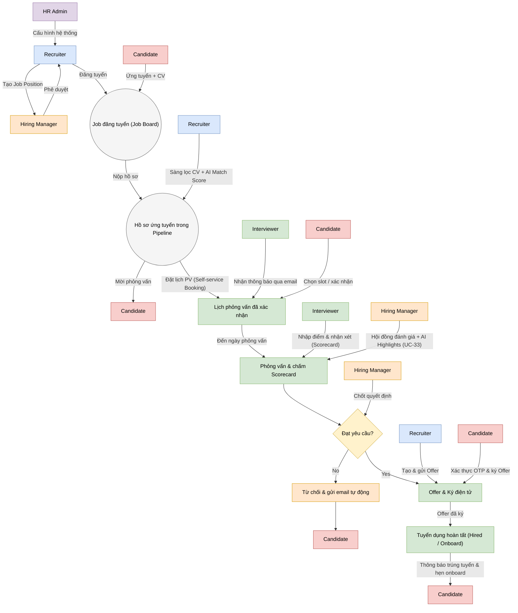
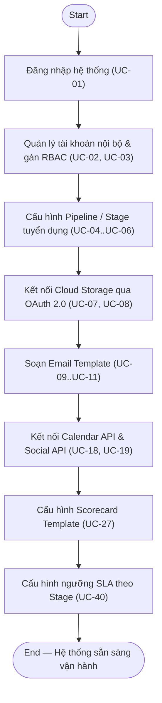
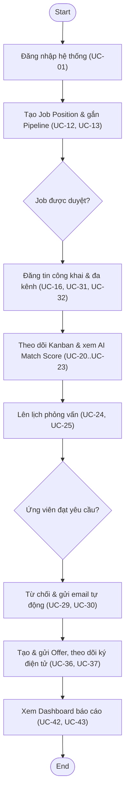
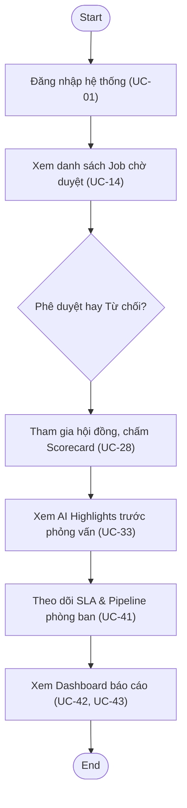
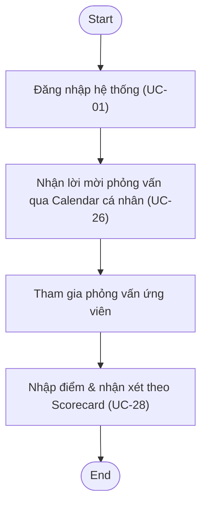
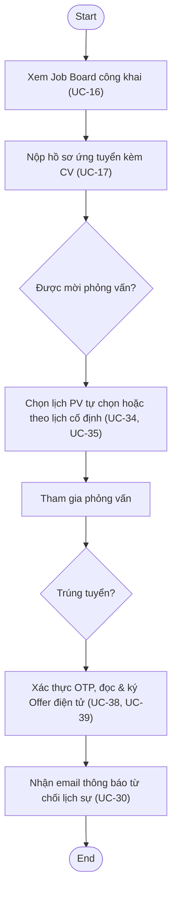

# SOFTWARE REQUIREMENTS SPECIFICATION (SRS)
## HỆ THỐNG TUYỂN DỤNG & QUẢN LÝ ỨNG VIÊN

## 0. Tổng quan – Luồng nghiệp vụ chính (Main Business Flow Overview)

> Sơ đồ dưới đây tổng hợp luồng nghiệp vụ tuyển dụng xuyên suốt toàn hệ thống — từ khi HR Admin cấu hình hệ thống, Recruiter đăng Job, Candidate ứng tuyển, cho tới khi phỏng vấn, chấm Scorecard, ra quyết định, gửi Offer và Hired/Onboard. Sơ đồ được chuyển thể từ trang "overview" trong file gốc `04-deliverables/hirewise-flow.drawio.html` sang dạng diagram-as-code (Mermaid) để tuân thủ quy ước không dùng ảnh tĩnh (D03) của dự án; luồng chi tiết theo từng vai trò được trình bày riêng ở mục I ngay bên dưới (I.1 → I.5).

> **Nguồn:** chuyển thể trực tiếp từ trang "overview" (trang 1/6) của `04-deliverables/hirewise-flow.drawio.html`, giữ nguyên toàn bộ nhãn hành động và thứ tự luồng gốc, không chỉnh sửa logic nghiệp vụ. Màu actor giữ đúng theo sơ đồ gốc: tím = HR Admin, xanh dương = Recruiter, cam = Hiring Manager, xanh lá = Interviewer, đỏ = Candidate.

## I. High Level Business Process (Quy trình nghiệp vụ tổng thể)

### 1.1 Flowchart for HR Admin

### 1.2 Flowchart for Recruiter

### 1.3 Flowchart for Hiring Manager

### 1.4 Flowchart for Interviewer

### 1.5 Flowchart for Candidate

## II. Detailed Functional Requirements (Yêu cầu chức năng chi tiết)

### 2.1 Module: Authentication & Account Management; RBAC & Access Scope

#### 2.1.1 FR-01 [US-ADM-01] - Đăng nhập / Đăng xuất hệ thống (Login/Logout)
- **Requirement:** Hệ thống phải có chức năng cho phép HR Admin thực hiện: đăng nhập / Đăng xuất hệ thống (Login/Logout).
- **Objective:**
  - *Func:* Đảm bảo bảo mật dữ liệu, mỗi người dùng chỉ nhìn thấy và thực hiện thao tác đúng phạm vi trách nhiệm..
- **Acceptance criteria:**
    - Tính năng "Đăng nhập / Đăng xuất hệ thống (Login/Logout)" hoạt động đúng theo mô tả, không phá vỡ luồng nghiệp vụ hiện có của Authentication & Account Management; RBAC & Access Scope.\n- API xử lý đúng logic nghiệp vụ, validate input và trả về lỗi rõ ràng khi dữ liệu không hợp lệ.\n- Giao diện hiển thị đúng dữ liệu, có trạng thái loading/lỗi rõ ràng và thao tác được trên các trình duyệt phổ biến.\n- SRS và Low-Level Design được cập nhật phản ánh đúng thay đổi của tính năng này.

#### 2.1.2 FR-02 [US-ADM-02] - Quản lý danh sách tài khoản nội bộ (thêm mới, tìm kiếm, khóa/mở khóa)
- **Requirement:** Hệ thống phải có chức năng cho phép HR Admin thực hiện: quản lý danh sách tài khoản nội bộ (thêm mới, tìm kiếm, khóa/mở khóa).
- **Objective:**
  - *Func:* Đảm bảo bảo mật dữ liệu, mỗi người dùng chỉ nhìn thấy và thực hiện thao tác đúng phạm vi trách nhiệm..
- **Acceptance criteria:**
    - Tính năng "Quản lý danh sách tài khoản nội bộ (thêm mới, tìm kiếm, khóa/mở khóa)" hoạt động đúng theo mô tả, không phá vỡ luồng nghiệp vụ hiện có của Authentication & Account Management; RBAC & Access Scope.\n- API xử lý đúng logic nghiệp vụ, validate input và trả về lỗi rõ ràng khi dữ liệu không hợp lệ.\n- Giao diện hiển thị đúng dữ liệu, có trạng thái loading/lỗi rõ ràng và thao tác được trên các trình duyệt phổ biến.\n- SRS và Low-Level Design được cập nhật phản ánh đúng thay đổi của tính năng này.

#### 2.1.3 FR-03 [US-ADM-03] - Cấu hình và gán vai trò (RBAC) theo phòng ban
- **Requirement:** Hệ thống phải có chức năng cho phép HR Admin thực hiện: cấu hình và gán vai trò (RBAC) theo phòng ban.
- **Objective:**
  - *Func:* Đảm bảo bảo mật dữ liệu, mỗi người dùng chỉ nhìn thấy và thực hiện thao tác đúng phạm vi trách nhiệm..
- **Acceptance criteria:**
    - Tính năng "Cấu hình và gán vai trò (RBAC) theo phòng ban" hoạt động đúng theo mô tả, không phá vỡ luồng nghiệp vụ hiện có của Authentication & Account Management; RBAC & Access Scope.\n- Kết nối với hệ thống/API bên thứ 3 thành công, có xử lý lỗi khi timeout hoặc token hết hạn.\n- API xử lý đúng logic nghiệp vụ, validate input và trả về lỗi rõ ràng khi dữ liệu không hợp lệ.\n- SRS và Low-Level Design được cập nhật phản ánh đúng thay đổi của tính năng này.

### 2.2 Module: Pipeline & Stage Configuration

#### 2.2.1 FR-04 [US-ADM-04] - Tạo mới Stage cho Pipeline tuyển dụng
- **Requirement:** Hệ thống phải có chức năng cho phép HR Admin thực hiện: tạo mới Stage cho Pipeline tuyển dụng.
- **Objective:**
  - *Func:* Mỗi phòng ban/job position có quy trình sàng lọc phù hợp nhất với đặc thù nghiệp vụ..
- **Acceptance criteria:**
    - Tính năng "Tạo mới Stage cho Pipeline tuyển dụng" hoạt động đúng theo mô tả, không phá vỡ luồng nghiệp vụ hiện có của Pipeline & Stage Configuration.\n- API xử lý đúng logic nghiệp vụ, validate input và trả về lỗi rõ ràng khi dữ liệu không hợp lệ.\n- Giao diện hiển thị đúng dữ liệu, có trạng thái loading/lỗi rõ ràng và thao tác được trên các trình duyệt phổ biến.\n- SRS và Low-Level Design được cập nhật phản ánh đúng thay đổi của tính năng này.

#### 2.2.2 FR-05 [US-ADM-05] - Sắp xếp thứ tự các Stage (kéo-thả)
- **Requirement:** Hệ thống phải có chức năng cho phép HR Admin thực hiện: sắp xếp thứ tự các Stage (kéo-thả).
- **Objective:**
  - *Func:* Mỗi phòng ban/job position có quy trình sàng lọc phù hợp nhất với đặc thù nghiệp vụ..
- **Acceptance criteria:**
    - Tính năng "Sắp xếp thứ tự các Stage (kéo-thả)" hoạt động đúng theo mô tả, không phá vỡ luồng nghiệp vụ hiện có của Pipeline & Stage Configuration.\n- API xử lý đúng logic nghiệp vụ, validate input và trả về lỗi rõ ràng khi dữ liệu không hợp lệ.\n- Giao diện hiển thị đúng dữ liệu, có trạng thái loading/lỗi rõ ràng và thao tác được trên các trình duyệt phổ biến.\n- SRS và Low-Level Design được cập nhật phản ánh đúng thay đổi của tính năng này.

#### 2.2.3 FR-06 [US-ADM-06] - Xóa Stage (cảnh báo & chặn xóa nếu đang có ứng viên)
- **Requirement:** Hệ thống phải có chức năng cho phép HR Admin thực hiện: xóa Stage (cảnh báo & chặn xóa nếu đang có ứng viên).
- **Objective:**
  - *Func:* Mỗi phòng ban/job position có quy trình sàng lọc phù hợp nhất với đặc thù nghiệp vụ..
- **Acceptance criteria:**
    - Tính năng "Xóa Stage (cảnh báo & chặn xóa nếu đang có ứng viên)" hoạt động đúng theo mô tả, không phá vỡ luồng nghiệp vụ hiện có của Pipeline & Stage Configuration.\n- API xử lý đúng logic nghiệp vụ, validate input và trả về lỗi rõ ràng khi dữ liệu không hợp lệ.\n- Giao diện hiển thị đúng dữ liệu, có trạng thái loading/lỗi rõ ràng và thao tác được trên các trình duyệt phổ biến.\n- SRS và Low-Level Design được cập nhật phản ánh đúng thay đổi của tính năng này.

### 2.3 Module: Cloud Storage Integration (OAuth)

#### 2.3.1 FR-07 [US-ADM-07] - Cấu hình xác thực OAuth 2.0 với Google Drive/Dropbox
- **Requirement:** Hệ thống phải có chức năng cho phép HR Admin thực hiện: cấu hình xác thực OAuth 2.0 với Google Drive/Dropbox.
- **Objective:**
  - *Func:* Toàn bộ CV, hồ sơ, hợp đồng được lưu trữ tập trung, bảo mật an toàn trên cloud, không giới hạn dung lượng server nội bộ..
- **Acceptance criteria:**
    - Tính năng "Cấu hình xác thực OAuth 2.0 với Google Drive/Dropbox" hoạt động đúng theo mô tả, không phá vỡ luồng nghiệp vụ hiện có của Cloud Storage Integration (OAuth).\n- Kết nối với hệ thống/API bên thứ 3 thành công, có xử lý lỗi khi timeout hoặc token hết hạn.\n- API xử lý đúng logic nghiệp vụ, validate input và trả về lỗi rõ ràng khi dữ liệu không hợp lệ.\n- SRS và Low-Level Design được cập nhật phản ánh đúng thay đổi của tính năng này.

#### 2.3.2 FR-08 [US-ADM-08] - Quản lý token kết nối Cloud Storage (kiểm tra/ngắt/gia hạn)
- **Requirement:** Hệ thống phải có chức năng cho phép HR Admin thực hiện: quản lý token kết nối Cloud Storage (kiểm tra/ngắt/gia hạn).
- **Objective:**
  - *Func:* Toàn bộ CV, hồ sơ, hợp đồng được lưu trữ tập trung, bảo mật an toàn trên cloud, không giới hạn dung lượng server nội bộ..
- **Acceptance criteria:**
    - Tính năng "Quản lý token kết nối Cloud Storage (kiểm tra/ngắt/gia hạn)" hoạt động đúng theo mô tả, không phá vỡ luồng nghiệp vụ hiện có của Cloud Storage Integration (OAuth).\n- API xử lý đúng logic nghiệp vụ, validate input và trả về lỗi rõ ràng khi dữ liệu không hợp lệ.\n- Giao diện hiển thị đúng dữ liệu, có trạng thái loading/lỗi rõ ràng và thao tác được trên các trình duyệt phổ biến.\n- SRS và Low-Level Design được cập nhật phản ánh đúng thay đổi của tính năng này.

### 2.4 Module: Email Template Management

#### 2.4.1 FR-09 [US-ADM-09] - Quản lý danh sách Email Template (tạo/sửa/xóa)
- **Requirement:** Hệ thống phải có chức năng cho phép HR Admin thực hiện: quản lý danh sách Email Template (tạo/sửa/xóa).
- **Objective:**
  - *Func:* Hệ thống có thể tự động hóa gửi thông báo chuẩn xác, tiết kiệm thời gian cho recruiter và nhất quán thương hiệu..
- **Acceptance criteria:**
    - Tính năng "Quản lý danh sách Email Template (tạo/sửa/xóa)" hoạt động đúng theo mô tả, không phá vỡ luồng nghiệp vụ hiện có của Email Template Management.\n- API xử lý đúng logic nghiệp vụ, validate input và trả về lỗi rõ ràng khi dữ liệu không hợp lệ.\n- Giao diện hiển thị đúng dữ liệu, có trạng thái loading/lỗi rõ ràng và thao tác được trên các trình duyệt phổ biến.\n- SRS và Low-Level Design được cập nhật phản ánh đúng thay đổi của tính năng này.

#### 2.4.2 FR-10 [US-ADM-10] - Soạn thảo nội dung Email Template với biến động (dynamic variables)
- **Requirement:** Hệ thống phải có chức năng cho phép HR Admin thực hiện: soạn thảo nội dung Email Template với biến động (dynamic variables).
- **Objective:**
  - *Func:* Hệ thống có thể tự động hóa gửi thông báo chuẩn xác, tiết kiệm thời gian cho recruiter và nhất quán thương hiệu..
- **Acceptance criteria:**
    - Tính năng "Soạn thảo nội dung Email Template với biến động (dynamic variables)" hoạt động đúng theo mô tả, không phá vỡ luồng nghiệp vụ hiện có của Email Template Management.\n- API xử lý đúng logic nghiệp vụ, validate input và trả về lỗi rõ ràng khi dữ liệu không hợp lệ.\n- Giao diện hiển thị đúng dữ liệu, có trạng thái loading/lỗi rõ ràng và thao tác được trên các trình duyệt phổ biến.\n- SRS và Low-Level Design được cập nhật phản ánh đúng thay đổi của tính năng này.

#### 2.4.3 FR-11 [US-ADM-11] - Xem trước (Preview) định dạng Email Template
- **Requirement:** Hệ thống phải có chức năng cho phép HR Admin thực hiện: xem trước (Preview) định dạng Email Template.
- **Objective:**
  - *Func:* Hệ thống có thể tự động hóa gửi thông báo chuẩn xác, tiết kiệm thời gian cho recruiter và nhất quán thương hiệu..
- **Acceptance criteria:**
    - Tính năng "Xem trước (Preview) định dạng Email Template" hoạt động đúng theo mô tả, không phá vỡ luồng nghiệp vụ hiện có của Email Template Management.\n- Giao diện hiển thị đúng dữ liệu, có trạng thái loading/lỗi rõ ràng và thao tác được trên các trình duyệt phổ biến.\n- API xử lý đúng logic nghiệp vụ, validate input và trả về lỗi rõ ràng khi dữ liệu không hợp lệ.\n- SRS và Low-Level Design được cập nhật phản ánh đúng thay đổi của tính năng này.

### 2.5 Module: Job Position Management

#### 2.5.1 FR-12 [US-REC-01] - Soạn thảo và tạo yêu cầu tuyển dụng (Job Position) mới
- **Requirement:** Hệ thống phải có chức năng cho phép Recruiter thực hiện: soạn thảo và tạo yêu cầu tuyển dụng (Job Position) mới.
- **Objective:**
  - *Func:* Bắt đầu mở chiến dịch tuyển dụng cho vị trí mới một cách chuẩn hóa..
- **Acceptance criteria:**
    - Tính năng "Soạn thảo và tạo yêu cầu tuyển dụng (Job Position) mới" hoạt động đúng theo mô tả, không phá vỡ luồng nghiệp vụ hiện có của Job Position Management.\n- API xử lý đúng logic nghiệp vụ, validate input và trả về lỗi rõ ràng khi dữ liệu không hợp lệ.\n- Giao diện hiển thị đúng dữ liệu, có trạng thái loading/lỗi rõ ràng và thao tác được trên các trình duyệt phổ biến.\n- SRS và Low-Level Design được cập nhật phản ánh đúng thay đổi của tính năng này.

#### 2.5.2 FR-13 [US-REC-02] - Gắn Pipeline Template cho vị trí tuyển dụng
- **Requirement:** Hệ thống phải có chức năng cho phép Recruiter thực hiện: gắn Pipeline Template cho vị trí tuyển dụng.
- **Objective:**
  - *Func:* Bắt đầu mở chiến dịch tuyển dụng cho vị trí mới một cách chuẩn hóa..
- **Acceptance criteria:**
    - Tính năng "Gắn Pipeline Template cho vị trí tuyển dụng" hoạt động đúng theo mô tả, không phá vỡ luồng nghiệp vụ hiện có của Job Position Management.\n- API xử lý đúng logic nghiệp vụ, validate input và trả về lỗi rõ ràng khi dữ liệu không hợp lệ.\n- Giao diện hiển thị đúng dữ liệu, có trạng thái loading/lỗi rõ ràng và thao tác được trên các trình duyệt phổ biến.\n- SRS và Low-Level Design được cập nhật phản ánh đúng thay đổi của tính năng này.

### 2.6 Module: Job Approval

#### 2.6.1 FR-14 [US-MGR-01] - Xem danh sách yêu cầu tuyển dụng đang chờ duyệt
- **Requirement:** Hệ thống phải có chức năng cho phép Hiring Manager thực hiện: xem danh sách yêu cầu tuyển dụng đang chờ duyệt.
- **Objective:**
  - *Func:* Kiểm soát ngân sách nhân sự (Headcount), đảm bảo JD và chỉ tiêu tuyển dụng đúng nhu cầu thực tế..
- **Acceptance criteria:**
    - Tính năng "Xem danh sách yêu cầu tuyển dụng đang chờ duyệt" hoạt động đúng theo mô tả, không phá vỡ luồng nghiệp vụ hiện có của Job Approval.\n- Giao diện hiển thị đúng dữ liệu, có trạng thái loading/lỗi rõ ràng và thao tác được trên các trình duyệt phổ biến.\n- API xử lý đúng logic nghiệp vụ, validate input và trả về lỗi rõ ràng khi dữ liệu không hợp lệ.\n- SRS và Low-Level Design được cập nhật phản ánh đúng thay đổi của tính năng này.

#### 2.6.2 FR-15 [US-MGR-02] - Phê duyệt / Từ chối yêu cầu tuyển dụng
- **Requirement:** Hệ thống phải có chức năng cho phép Hiring Manager thực hiện: phê duyệt / Từ chối yêu cầu tuyển dụng.
- **Objective:**
  - *Func:* Kiểm soát ngân sách nhân sự (Headcount), đảm bảo JD và chỉ tiêu tuyển dụng đúng nhu cầu thực tế..
- **Acceptance criteria:**
    - Tính năng "Phê duyệt / Từ chối yêu cầu tuyển dụng" hoạt động đúng theo mô tả, không phá vỡ luồng nghiệp vụ hiện có của Job Approval.\n- API xử lý đúng logic nghiệp vụ, validate input và trả về lỗi rõ ràng khi dữ liệu không hợp lệ.\n- Giao diện hiển thị đúng dữ liệu, có trạng thái loading/lỗi rõ ràng và thao tác được trên các trình duyệt phổ biến.\n- SRS và Low-Level Design được cập nhật phản ánh đúng thay đổi của tính năng này.

### 2.7 Module: Public Job Board & Applicant Intake

#### 2.7.1 FR-16 [US-CAN-01] - Xem danh sách việc làm & chi tiết JD công khai (Public Job Board)
- **Requirement:** Hệ thống phải có chức năng cho phép Candidate thực hiện: xem danh sách việc làm & chi tiết JD công khai (Public Job Board).
- **Objective:**
  - *Func:* Ứng tuyển nhanh chóng, tiện lợi, không cần soạn email thủ công..
- **Acceptance criteria:**
    - Tính năng "Xem danh sách việc làm & chi tiết JD công khai (Public Job Board)" hoạt động đúng theo mô tả, không phá vỡ luồng nghiệp vụ hiện có của Public Job Board & Applicant Intake.\n- Kết nối với hệ thống/API bên thứ 3 thành công, có xử lý lỗi khi timeout hoặc token hết hạn.\n- API xử lý đúng logic nghiệp vụ, validate input và trả về lỗi rõ ràng khi dữ liệu không hợp lệ.\n- SRS và Low-Level Design được cập nhật phản ánh đúng thay đổi của tính năng này.

#### 2.7.2 FR-17 [US-CAN-02] - Điền form ứng tuyển và đính kèm CV
- **Requirement:** Hệ thống phải có chức năng cho phép Candidate thực hiện: điền form ứng tuyển và đính kèm CV.
- **Objective:**
  - *Func:* Ứng tuyển nhanh chóng, tiện lợi, không cần soạn email thủ công..
- **Acceptance criteria:**
    - Tính năng "Điền form ứng tuyển và đính kèm CV" hoạt động đúng theo mô tả, không phá vỡ luồng nghiệp vụ hiện có của Public Job Board & Applicant Intake.\n- API xử lý đúng logic nghiệp vụ, validate input và trả về lỗi rõ ràng khi dữ liệu không hợp lệ.\n- Giao diện hiển thị đúng dữ liệu, có trạng thái loading/lỗi rõ ràng và thao tác được trên các trình duyệt phổ biến.\n- SRS và Low-Level Design được cập nhật phản ánh đúng thay đổi của tính năng này.

### 2.8 Module: Calendar & Social Integration Config

#### 2.8.1 FR-18 [US-ADM-12] - Cấu hình và đồng bộ Calendar API
- **Requirement:** Hệ thống phải có chức năng cho phép HR Admin thực hiện: cấu hình và đồng bộ Calendar API.
- **Objective:**
  - *Func:* Sẵn sàng nền tảng hạ tầng để Recruiter đặt lịch tự động và đăng tin đa kênh..
- **Acceptance criteria:**
    - Tính năng "Cấu hình và đồng bộ Calendar API" hoạt động đúng theo mô tả, không phá vỡ luồng nghiệp vụ hiện có của Calendar & Social Integration Config.\n- Kết nối với hệ thống/API bên thứ 3 thành công, có xử lý lỗi khi timeout hoặc token hết hạn.\n- API xử lý đúng logic nghiệp vụ, validate input và trả về lỗi rõ ràng khi dữ liệu không hợp lệ.\n- SRS và Low-Level Design được cập nhật phản ánh đúng thay đổi của tính năng này.

#### 2.8.2 FR-19 [US-ADM-13] - Cấu hình và tích hợp Social API
- **Requirement:** Hệ thống phải có chức năng cho phép HR Admin thực hiện: cấu hình và tích hợp Social API.
- **Objective:**
  - *Func:* Sẵn sàng nền tảng hạ tầng để Recruiter đặt lịch tự động và đăng tin đa kênh..
- **Acceptance criteria:**
    - Tính năng "Cấu hình và tích hợp Social API" hoạt động đúng theo mô tả, không phá vỡ luồng nghiệp vụ hiện có của Calendar & Social Integration Config.\n- Kết nối với hệ thống/API bên thứ 3 thành công, có xử lý lỗi khi timeout hoặc token hết hạn.\n- API xử lý đúng logic nghiệp vụ, validate input và trả về lỗi rõ ràng khi dữ liệu không hợp lệ.\n- SRS và Low-Level Design được cập nhật phản ánh đúng thay đổi của tính năng này.

### 2.9 Module: Applicant Card & AI Matching

#### 2.9.1 FR-20 [US-REC-03] - Xem chi tiết Applicant Card (hồ sơ ứng viên)
- **Requirement:** Hệ thống phải có chức năng cho phép Recruiter thực hiện: xem chi tiết Applicant Card (hồ sơ ứng viên).
- **Objective:**
  - *Func:* Ưu tiên xem xét và sàng lọc hồ sơ phù hợp nhất trước, tiết kiệm tới 70% thời gian lọc CV thủ công..
- **Acceptance criteria:**
    - Tính năng "Xem chi tiết Applicant Card (hồ sơ ứng viên)" hoạt động đúng theo mô tả, không phá vỡ luồng nghiệp vụ hiện có của Applicant Card & AI Matching.\n- Giao diện hiển thị đúng dữ liệu, có trạng thái loading/lỗi rõ ràng và thao tác được trên các trình duyệt phổ biến.\n- API xử lý đúng logic nghiệp vụ, validate input và trả về lỗi rõ ràng khi dữ liệu không hợp lệ.\n- SRS và Low-Level Design được cập nhật phản ánh đúng thay đổi của tính năng này.

#### 2.9.2 FR-21 [US-REC-04] - Xem phân tích AI (Match Score, điểm mạnh/điểm yếu)
- **Requirement:** Hệ thống phải có chức năng cho phép Recruiter thực hiện: xem phân tích AI (Match Score, điểm mạnh/điểm yếu).
- **Objective:**
  - *Func:* Ưu tiên xem xét và sàng lọc hồ sơ phù hợp nhất trước, tiết kiệm tới 70% thời gian lọc CV thủ công..
- **Acceptance criteria:**
    - Tính năng "Xem phân tích AI (Match Score, điểm mạnh/điểm yếu)" hoạt động đúng theo mô tả, không phá vỡ luồng nghiệp vụ hiện có của Applicant Card & AI Matching.\n- Kết nối với hệ thống/API bên thứ 3 thành công, có xử lý lỗi khi timeout hoặc token hết hạn.\n- API xử lý đúng logic nghiệp vụ, validate input và trả về lỗi rõ ràng khi dữ liệu không hợp lệ.\n- SRS và Low-Level Design được cập nhật phản ánh đúng thay đổi của tính năng này.

### 2.10 Module: Kanban Pipeline

#### 2.10.1 FR-22 [US-REC-05] - Hiển thị danh sách ứng viên dạng Kanban Board
- **Requirement:** Hệ thống phải có chức năng cho phép Recruiter thực hiện: hiển thị danh sách ứng viên dạng Kanban Board.
- **Objective:**
  - *Func:* Quản lý pipeline trực quan, sinh động theo thời gian thực mà không cần theo dõi qua file Excel..
- **Acceptance criteria:**
    - Tính năng "Hiển thị danh sách ứng viên dạng Kanban Board" hoạt động đúng theo mô tả, không phá vỡ luồng nghiệp vụ hiện có của Kanban Pipeline.\n- Giao diện hiển thị đúng dữ liệu, có trạng thái loading/lỗi rõ ràng và thao tác được trên các trình duyệt phổ biến.\n- API xử lý đúng logic nghiệp vụ, validate input và trả về lỗi rõ ràng khi dữ liệu không hợp lệ.\n- SRS và Low-Level Design được cập nhật phản ánh đúng thay đổi của tính năng này.

#### 2.10.2 FR-23 [US-REC-06] - Chuyển trạng thái Stage ứng viên (kéo-thả, ghi timestamp)
- **Requirement:** Hệ thống phải có chức năng cho phép Recruiter thực hiện: chuyển trạng thái Stage ứng viên (kéo-thả, ghi timestamp).
- **Objective:**
  - *Func:* Quản lý pipeline trực quan, sinh động theo thời gian thực mà không cần theo dõi qua file Excel..
- **Acceptance criteria:**
    - Tính năng "Chuyển trạng thái Stage ứng viên (kéo-thả, ghi timestamp)" hoạt động đúng theo mô tả, không phá vỡ luồng nghiệp vụ hiện có của Kanban Pipeline.\n- API xử lý đúng logic nghiệp vụ, validate input và trả về lỗi rõ ràng khi dữ liệu không hợp lệ.\n- Giao diện hiển thị đúng dữ liệu, có trạng thái loading/lỗi rõ ràng và thao tác được trên các trình duyệt phổ biến.\n- SRS và Low-Level Design được cập nhật phản ánh đúng thay đổi của tính năng này.

### 2.11 Module: Interview Scheduling

#### 2.11.1 FR-24 [US-REC-07] - Gửi thư mời phỏng vấn định trước (set lịch cứng)
- **Requirement:** Hệ thống phải có chức năng cho phép Recruiter thực hiện: gửi thư mời phỏng vấn định trước (set lịch cứng).
- **Objective:**
  - *Func:* Tự động hóa quá trình sắp xếp lịch, check lịch trống của interviewer để tránh trùng lịch hoàn toàn..
- **Acceptance criteria:**
    - Tính năng "Gửi thư mời phỏng vấn định trước (set lịch cứng)" hoạt động đúng theo mô tả, không phá vỡ luồng nghiệp vụ hiện có của Interview Scheduling.\n- API xử lý đúng logic nghiệp vụ, validate input và trả về lỗi rõ ràng khi dữ liệu không hợp lệ.\n- Giao diện hiển thị đúng dữ liệu, có trạng thái loading/lỗi rõ ràng và thao tác được trên các trình duyệt phổ biến.\n- SRS và Low-Level Design được cập nhật phản ánh đúng thay đổi của tính năng này.

#### 2.11.2 FR-25 [US-REC-08] - Gửi liên kết Self-service Booking cho ứng viên
- **Requirement:** Recruiter chọn 1 Interviewer, tự liệt kê thủ công danh sách khung giờ rảnh (ngày + giờ + thời lượng, mặc định 45 phút) trong 1 khoảng ngày cho phép, hệ thống sinh 1 liên kết công khai (không cần đăng nhập) gửi qua email cho Candidate tự chọn 1 khung giờ. Liên kết hết hạn sau 7 ngày kể từ lúc gửi; gửi liên kết mới sẽ tự huỷ liên kết cũ đang còn hiệu lực của cùng hồ sơ ứng tuyển.
- **Objective:**
  - *Func:* Giảm số lượt trao đổi qua lại giữa Recruiter và Candidate để chốt được 1 khung giờ phỏng vấn phù hợp cả hai bên.
- **Acceptance criteria:**
    - Không cho gửi liên kết nếu Stage hiện tại của hồ sơ đã là Stage kết thúc (Hired/Refused), hoặc Interviewer được chọn không ở trạng thái hoạt động (`ACTIVE`).
    - Nếu chỉ định Stage đích kèm theo, Stage đó phải thuộc cùng Pipeline Template của Job, đang hoạt động (`is_active=true`) và có loại `INTERVIEW`.
    - Mọi khung giờ trong danh sách không được ở quá khứ và phải nằm trong khoảng ngày đã chọn.
    - Gửi liên kết mới cho cùng 1 hồ sơ tự động chuyển liên kết cũ (nếu còn hiệu lực) sang trạng thái đã huỷ — tại một thời điểm chỉ có tối đa 1 liên kết còn hoạt động cho mỗi hồ sơ.
    - Candidate nhận được email chứa liên kết hợp lệ trong vòng vài giây sau khi Recruiter gửi (qua hàng đợi email bất đồng bộ).
    - SRS và Low-Level Design (`common/LLD.md` mục 3.10) đã phản ánh đúng luồng thật.

#### 2.11.3 FR-26 [US-INT-01] - Tự động sinh link họp trực tuyến khi xác nhận lịch qua Calendar đã kết nối
- **Requirement:** Khi Candidate xác nhận 1 khung giờ phỏng vấn trực tuyến (`mode=ONLINE`) qua Self-service Booking (FR-33/34) mà chưa có sẵn địa điểm/link họp, hệ thống tự gọi kết nối Calendar (Google Calendar) đã cấu hình sẵn ở cấp công ty (US-ADM-12) để sinh 1 sự kiện kèm link Google Meet, ghi lại vào buổi phỏng vấn vừa tạo.
  - **Lưu ý phạm vi (đã xác nhận lại với mã nguồn):** đây KHÔNG phải đồng bộ 2 chiều tới tài khoản Calendar cá nhân riêng của từng Interviewer — hệ thống chỉ dùng đúng 1 kết nối OAuth Calendar chung cho cả công ty (đã có từ Sprint 3), không có bảng/cấu hình riêng theo từng Interviewer.
- **Objective:**
  - *Func:* Interviewer/Candidate có sẵn link họp trực tuyến ngay khi lịch được xác nhận mà Recruiter không phải tự tạo link thủ công.
- **Acceptance criteria:**
    - Khi buổi phỏng vấn `ONLINE` được xác nhận và chưa có link, hệ thống thử gọi Google Calendar API để tạo sự kiện + link Google Meet.
    - Nếu Calendar chưa được kết nối, hoặc lệnh gọi API lỗi/timeout, buổi phỏng vấn vẫn được tạo thành công bình thường (không rollback) — Recruiter có thể tự điền link thủ công sau.
    - Không có yêu cầu nào bắt Interviewer tự kết nối tài khoản Calendar cá nhân — việc kết nối chỉ thực hiện 1 lần ở cấp công ty (HR Admin, US-ADM-12).
    - SRS và Low-Level Design (`common/LLD.md` mục 3.2 phần ghi chú Sprint 4, mục 3.10) đã phản ánh đúng phạm vi thật của tính năng.

### 2.12 Module: Structured Scorecard

#### 2.12.1 FR-27 [US-MGR-03] - Cấu hình tiêu chí đánh giá (Scorecard Template)
- **Requirement:** HR Admin quản lý thư viện mẫu Scorecard Template dùng chung (tên, danh sách tiêu chí: tên, trọng số, điểm tối đa, thứ tự, bắt buộc/không bắt buộc). Recruiter/HR Admin gắn 1 bộ tiêu chí thật (có thể sao chép từ thư viện) cho từng cặp (Job, Stage phỏng vấn cụ thể) — đây mới là bộ tiêu chí Interviewer thật sự chấm vào, tách biệt khỏi thư viện mẫu.
- **Objective:**
  - *Func:* Đóng góp vào việc đánh giá ứng viên khách quan, có cấu trúc, giảm thiên vị (unconscious bias) khi tuyển dụng.
- **Acceptance criteria:**
    - Không lưu được cấu hình nếu tổng trọng số các tiêu chí bằng 0.
    - Chỉ gắn được Scorecard vào Stage có loại `INTERVIEW` và thuộc đúng Pipeline Template của Job.
    - Sửa lại bộ tiêu chí của 1 (Job, Stage) khi **chưa** có Interviewer nào chấm điểm sẽ cập nhật trực tiếp (không tạo bản ghi mới).
    - Sửa lại bộ tiêu chí của 1 (Job, Stage) khi **đã có** ít nhất 1 lượt chấm điểm sẽ tạo ra 1 phiên bản (version) mới, giữ nguyên phiên bản cũ để các lượt chấm điểm trước đó không bị diễn giải lại theo tiêu chí mới.
    - Sửa nội dung thư viện mẫu (Scorecard Template gốc) không làm thay đổi các bộ tiêu chí đã được sao chép ra cho từng Job/Stage trước đó.
    - SRS và Low-Level Design (`common/LLD.md` mục 3.9, `DatabaseDesign_v4.md` mục 13) đã phản ánh đúng cơ chế 2 tầng (thư viện mẫu / bản gắn thật) và cơ chế version hoá.

#### 2.12.2 FR-28 [US-INT-02] - Nhập điểm và nhận xét ứng viên theo Scorecard
- **Requirement:** Interviewer đã được phân công cho 1 buổi phỏng vấn (hoặc người giữ vai trò Hiring Manager của Job đó) mở form chấm điểm theo đúng bộ tiêu chí đã cố định tại thời điểm buổi phỏng vấn được lên lịch, nhập điểm từng tiêu chí + nhận xét tổng quan, lưu tạm nhiều lần trước khi Submit chính thức. Sau khi Submit, hệ thống tự tính điểm tổng theo trung bình có trọng số. Submission tự động bị khoá khoảng 24 giờ sau khi buổi phỏng vấn diễn ra; chỉ HR Admin mở khoá lại được.
- **Objective:**
  - *Func:* Đánh giá ứng viên một cách có cấu trúc, đồng nhất giữa các thành viên hội đồng, có dấu vết để đối chiếu lại sau này.
- **Acceptance criteria:**
    - Chỉ Interviewer được phân công cho đúng buổi phỏng vấn đó, hoặc người giữ role Hiring Manager của Job, mới mở được form và nộp điểm.
    - 1 Interviewer chỉ nộp được đúng 1 bộ điểm cho 1 buổi phỏng vấn (không tạo trùng).
    - Không cho Submit nếu còn thiếu điểm ở 1 tiêu chí bắt buộc, hoặc chưa nhập nhận xét tổng quan.
    - Điểm nhập cho 1 tiêu chí không được vượt quá điểm tối đa của tiêu chí đó.
    - Sau khi Submit, hệ thống hiển thị đúng điểm tổng = trung bình có trọng số trên các tiêu chí đã chấm.
    - Sau khoảng 24 giờ kể từ giờ phỏng vấn, Submission (dù đã Submit hay còn nháp) tự động bị khoá, không sửa/nộp lại được cho tới khi HR Admin mở khoá — mọi lần mở khoá đều được ghi vết.
    - Người khác (Recruiter, HR Admin, Interviewer khác trong hội đồng) có quyền xem hồ sơ có thể xem lại điểm đã chấm ở chế độ chỉ đọc, không cần là người chấm.
    - SRS và Low-Level Design (`common/LLD.md` mục 3.9) đã phản ánh đúng luồng khoá tự động và quyền xem/chấm tách biệt.

### 2.13 Module: Candidate Rejection

#### 2.13.1 FR-29 [US-REC-09] - Chuyển trạng thái ứng viên sang Refused & chọn lý do từ chối
- **Requirement:** Hệ thống phải có chức năng cho phép Recruiter thực hiện: chuyển trạng thái ứng viên sang Refused & chọn lý do từ chối.
- **Objective:**
  - *Func:* Duy trì trải nghiệm ứng viên (Candidate Experience) tốt và lưu dữ liệu lý do từ chối vào Talent Pool..
- **Acceptance criteria:**
    - Tính năng "Chuyển trạng thái ứng viên sang Refused & chọn lý do từ chối" hoạt động đúng theo mô tả, không phá vỡ luồng nghiệp vụ hiện có của Candidate Rejection.\n- API xử lý đúng logic nghiệp vụ, validate input và trả về lỗi rõ ràng khi dữ liệu không hợp lệ.\n- Giao diện hiển thị đúng dữ liệu, có trạng thái loading/lỗi rõ ràng và thao tác được trên các trình duyệt phổ biến.\n- SRS và Low-Level Design được cập nhật phản ánh đúng thay đổi của tính năng này.

#### 2.13.2 FR-30 [US-REC-10] - Gửi Email thông báo từ chối tự động
- **Requirement:** Hệ thống phải có chức năng cho phép Recruiter thực hiện: gửi Email thông báo từ chối tự động.
- **Objective:**
  - *Func:* Duy trì trải nghiệm ứng viên (Candidate Experience) tốt và lưu dữ liệu lý do từ chối vào Talent Pool..
- **Acceptance criteria:**
    - Tính năng "Gửi Email thông báo từ chối tự động" hoạt động đúng theo mô tả, không phá vỡ luồng nghiệp vụ hiện có của Candidate Rejection.\n- API xử lý đúng logic nghiệp vụ, validate input và trả về lỗi rõ ràng khi dữ liệu không hợp lệ.\n- Giao diện hiển thị đúng dữ liệu, có trạng thái loading/lỗi rõ ràng và thao tác được trên các trình duyệt phổ biến.\n- SRS và Low-Level Design được cập nhật phản ánh đúng thay đổi của tính năng này.

### 2.14 Module: Multi-channel Job Posting

#### 2.14.1 FR-31 [US-REC-11] - Chọn đa nền tảng để phân phối tin tuyển dụng
- **Requirement:** Với 1 Job Position đã ở trạng thái `PUBLISHED`, Recruiter có thể lấy nhanh 1 liên kết chia sẻ riêng cho từng kênh đã được HR Admin bật (LinkedIn, Facebook, X, hoặc Sao chép link trực tiếp). Bấm chọn 1 kênh sẽ mở đúng cửa sổ chia sẻ có sẵn của nền tảng đó (share-intent) để Recruiter tự hoàn tất việc đăng — **hệ thống không tự động đăng bài hộ và không kết nối tài khoản mạng xã hội nào (không OAuth)**.
- **Objective:**
  - *Func:* Mở rộng nguồn ứng viên tiếp cận mà không phải soạn lại nội dung/đăng thủ công lặp đi lặp lại từng nơi, đồng thời vẫn theo dõi được hiệu quả từng kênh.
- **Acceptance criteria:**
    - Chỉ Job đang `PUBLISHED` mới lấy được liên kết chia sẻ; Job Draft/chờ duyệt/Paused/Closed không chia sẻ được.
    - Danh sách kênh hiển thị đúng những kênh HR Admin đang bật; kênh đã tắt không hiển thị được và bị chặn ở cả tầng máy chủ nếu có request trực tiếp.
    - Mỗi lần Recruiter bấm chia sẻ 1 kênh, hệ thống ghi nhận lại số lượt chia sẻ cho đúng cặp (Job, Kênh) đó, không tạo bản ghi trùng.
    - Liên kết được chia sẻ khi hiển thị lại (ví dụ Facebook/LinkedIn quét preview) phải cho ra đúng tiêu đề/mô tả Job dưới dạng Open Graph.
    - SRS và Low-Level Design (`common/LLD.md` mục 3.12) đã phản ánh đúng mô hình share-intent (không OAuth) thay cho giả định tích hợp API mạng xã hội ban đầu.

#### 2.14.2 FR-32 [US-REC-12] - Theo dõi trạng thái đăng tin trên các kênh
- **Requirement:** Recruiter xem lại được, theo từng kênh đã chia sẻ: số lượt bấm chia sẻ, số lượt người thật bấm vào liên kết (đã lọc bot của các trình quét preview mạng xã hội), và số hồ sơ ứng tuyển được quy về đúng kênh đó (theo tham số nguồn gắn trên liên kết chia sẻ).
  - **Lưu ý phạm vi:** vì không tích hợp API thật với từng nền tảng, hệ thống **không biết được** Recruiter có thật sự hoàn tất đăng bài trên nền tảng hay đã đóng cửa sổ giữa chừng — số liệu "trạng thái đăng tin" ở đây là số liệu tương tác (chia sẻ/click/ứng tuyển), không phải trạng thái Processing/Success/Failed của 1 lệnh đăng bài.
- **Objective:**
  - *Func:* Có căn cứ số liệu để biết kênh nào đang mang lại nhiều ứng viên nhất, tránh phải đăng thủ công dò từng nơi.
- **Acceptance criteria:**
    - Với mỗi Job, số liệu chia sẻ/click/ứng tuyển được hiển thị tách riêng theo từng kênh.
    - Số lượt click không bị tính tăng bởi các trình quét/bot preview của mạng xã hội.
    - Số ứng viên quy về 1 kênh không tính vượt quá tổng số ứng viên thật của Job đó (không ra số âm/số ảo khi dữ liệu nguồn không khớp kênh nào).
    - Đổi lại tham số nguồn (utm) của 1 kênh sau này không làm thay đổi số liệu ứng tuyển đã ghi nhận trước đó cho kênh cũ.
    - SRS và Low-Level Design (`common/LLD.md` mục 3.12, `DatabaseDesign_v4.md` mục 15) đã phản ánh đúng: đây là bảng đếm số liệu tương tác, không phải bảng trạng thái đăng bài như đặc tả ban đầu dự tính.

### 2.15 Module: Self-service Interview Booking

#### 2.15.1 FR-33 [US-CAN-03] - Xem giao diện đặt lịch phỏng vấn với các slot trống (Candidate)
- **Requirement:** Candidate mở liên kết đặt lịch (không cần đăng nhập) nhận được qua email, xem danh sách khung giờ Recruiter đã đề xuất kèm trạng thái còn trống/đã kín/Interviewer đang bận lịch khác.
- **Objective:**
  - *Func:* Chủ động lịch trình cá nhân mà không phải gửi email/tin nhắn trao đổi qua lại nhiều lần với Recruiter.
- **Acceptance criteria:**
    - Liên kết không hợp lệ (sai/không tồn tại) hiển thị thông báo khác với liên kết đã hết hạn/đã dùng xong — 2 tình huống không gộp chung 1 thông báo.
    - Liên kết đã quá 7 ngày kể từ lúc gửi, hoặc đã có 1 khung giờ được chốt trước đó, hiển thị đúng trạng thái "không còn hiệu lực", không cho chọn tiếp.
    - Trạng thái từng khung giờ được tính lại đúng theo thời điểm truy cập (không hiển thị nhầm 1 khung giờ Interviewer đã có buổi phỏng vấn khác trùng giờ là còn trống).
    - Không yêu cầu Candidate đăng nhập hay có tài khoản trong hệ thống ở bất kỳ bước nào.
    - SRS và Low-Level Design (`common/LLD.md` mục 3.10) đã phản ánh đúng luồng công khai này.

#### 2.15.2 FR-34 [US-CAN-04] - Xác nhận và chốt khung giờ phỏng vấn (Confirm Booking)
- **Requirement:** Candidate chọn 1 khung giờ còn trống và xác nhận; hệ thống khoá khung giờ đó lại ngay lập tức (không cho người khác chọn trùng), tạo buổi phỏng vấn chính thức, tự sinh link họp trực tuyến nếu cần (FR-26), và gửi email xác nhận cho cả Candidate lẫn Interviewer.
- **Objective:**
  - *Func:* Chủ động chốt lịch trình cá nhân mà không phải trao đổi qua lại nhiều lần, đồng thời đảm bảo không xảy ra tình huống 2 người cùng chốt trùng 1 khung giờ.
- **Acceptance criteria:**
    - Nếu 2 yêu cầu xác nhận cùng 1 khung giờ gửi tới gần như đồng thời, chỉ đúng 1 yêu cầu thành công — yêu cầu còn lại nhận thông báo khung giờ không còn khả dụng.
    - Trước khi xác nhận thành công, hệ thống kiểm tra lại lần cuối xem Interviewer có bị trùng lịch với 1 buổi phỏng vấn khác đã có sẵn hay không.
    - Xác nhận thành công tạo ra đúng 1 buổi phỏng vấn chính thức, gắn đúng Interviewer đã chọn ban đầu.
    - Nếu buổi phỏng vấn là trực tuyến và chưa có link, hệ thống tự cố gắng sinh link họp (không bắt buộc phải thành công mới cho xác nhận).
    - Candidate và Interviewer đều nhận được email xác nhận sau khi chốt thành công.
    - SRS và Low-Level Design (`common/LLD.md` mục 3.10) đã phản ánh đúng cơ chế chống trùng lặp (race condition).

### 2.16 Module: Offer & e-Signature

#### 2.16.1 FR-35 [US-REC-13] - Sinh thư mời làm việc (Offer Letter) từ Template
- **Requirement:** Hệ thống phải có chức năng cho phép Recruiter thực hiện: sinh thư mời làm việc (Offer Letter) từ Template.
- **Objective:**
  - *Func:* Rút ngắn tối đa thời gian chốt ứng viên, chuyên nghiệp hóa thủ tục onboard..
- **Acceptance criteria:**
    - Tính năng "Sinh thư mời làm việc (Offer Letter) từ Template" hoạt động đúng theo mô tả, không phá vỡ luồng nghiệp vụ hiện có của Offer & e-Signature.\n- API xử lý đúng logic nghiệp vụ, validate input và trả về lỗi rõ ràng khi dữ liệu không hợp lệ.\n- Giao diện hiển thị đúng dữ liệu, có trạng thái loading/lỗi rõ ràng và thao tác được trên các trình duyệt phổ biến.\n- SRS và Low-Level Design được cập nhật phản ánh đúng thay đổi của tính năng này.

#### 2.16.2 FR-36 [US-REC-14] - Gửi liên kết Offer kèm yêu cầu chữ ký điện tử
- **Requirement:** Hệ thống phải có chức năng cho phép Recruiter thực hiện: gửi liên kết Offer kèm yêu cầu chữ ký điện tử.
- **Objective:**
  - *Func:* Rút ngắn tối đa thời gian chốt ứng viên, chuyên nghiệp hóa thủ tục onboard..
- **Acceptance criteria:**
    - Tính năng "Gửi liên kết Offer kèm yêu cầu chữ ký điện tử" hoạt động đúng theo mô tả, không phá vỡ luồng nghiệp vụ hiện có của Offer & e-Signature.\n- API xử lý đúng logic nghiệp vụ, validate input và trả về lỗi rõ ràng khi dữ liệu không hợp lệ.\n- Giao diện hiển thị đúng dữ liệu, có trạng thái loading/lỗi rõ ràng và thao tác được trên các trình duyệt phổ biến.\n- SRS và Low-Level Design được cập nhật phản ánh đúng thay đổi của tính năng này.

#### 2.16.3 FR-37 [US-CAN-05] - Truy cập liên kết bảo mật để đọc hợp đồng/thư mời
- **Requirement:** Hệ thống phải có chức năng cho phép Candidate thực hiện: truy cập liên kết bảo mật để đọc hợp đồng/thư mời.
- **Objective:**
  - *Func:* Hoàn tất thủ tục tiếp nhận công việc nhanh gọn, an toàn, không cần in ấn giấy tờ..
- **Acceptance criteria:**
    - Tính năng "Truy cập liên kết bảo mật để đọc hợp đồng/thư mời" hoạt động đúng theo mô tả, không phá vỡ luồng nghiệp vụ hiện có của Offer & e-Signature.\n- API xử lý đúng logic nghiệp vụ, validate input và trả về lỗi rõ ràng khi dữ liệu không hợp lệ.\n- Giao diện hiển thị đúng dữ liệu, có trạng thái loading/lỗi rõ ràng và thao tác được trên các trình duyệt phổ biến.\n- SRS và Low-Level Design được cập nhật phản ánh đúng thay đổi của tính năng này.

#### 2.16.4 FR-38 [US-CAN-06] - Thực hiện thao tác ký điện tử (e-Signature)
- **Requirement:** Hệ thống phải có chức năng cho phép Candidate thực hiện: thực hiện thao tác ký điện tử (e-Signature).
- **Objective:**
  - *Func:* Hoàn tất thủ tục tiếp nhận công việc nhanh gọn, an toàn, không cần in ấn giấy tờ..
- **Acceptance criteria:**
    - Tính năng "Thực hiện thao tác ký điện tử (e-Signature)" hoạt động đúng theo mô tả, không phá vỡ luồng nghiệp vụ hiện có của Offer & e-Signature.\n- API xử lý đúng logic nghiệp vụ, validate input và trả về lỗi rõ ràng khi dữ liệu không hợp lệ.\n- Giao diện hiển thị đúng dữ liệu, có trạng thái loading/lỗi rõ ràng và thao tác được trên các trình duyệt phổ biến.\n- SRS và Low-Level Design được cập nhật phản ánh đúng thay đổi của tính năng này.

### 2.17 Module: SLA Monitoring

#### 2.17.1 FR-39 [US-MGR-04] - Cấu hình thời gian SLA cho từng Stage tuyển dụng
- **Requirement:** HR Admin cấu hình số giờ tối đa cho phép 1 hồ sơ ở lại từng Stage của Pipeline Template trước khi bị coi là vi phạm SLA. Ngưỡng này áp dụng chung cho mọi Job đang dùng Pipeline Template đó, không cấu hình riêng theo từng Job.
  - **Lưu ý phạm vi đã xác nhận lại (`V47`):** quyền cấu hình SLA hiện chỉ thuộc về HR Admin — Hiring Manager đã được thu hồi quyền này ở Sprint 4 (trước đó có ở thiết kế ban đầu) để gộp chung vào nhóm quyền quản lý Pipeline vốn chỉ HR Admin nắm giữ.
- **Objective:**
  - *Func:* Phát hiện kịp thời vị trí đang bị nghẽn (ứng viên ngâm ở 1 Stage quá lâu) để can thiệp.
- **Acceptance criteria:**
    - Chỉ HR Admin cấu hình được ngưỡng SLA theo Stage; Hiring Manager/Recruiter không có quyền này.
    - Ngưỡng SLA áp dụng ngay cho mọi hồ sơ đang ở Stage đó, không cần chờ hồ sơ mới.
    - Không bắt buộc phải đặt ngưỡng cho mọi Stage — Stage chưa cấu hình sẽ không phát sinh cảnh báo vi phạm.
    - SRS và Low-Level Design (`common/LLD.md` mục 3.11, `DatabaseDesign_v4.md` mục 14) đã phản ánh đúng lịch sử thay đổi quyền cấu hình.

#### 2.17.2 FR-40 [US-MGR-05] - Nhận cảnh báo (Notification/Email) khi hồ sơ vi phạm SLA
- **Requirement:** Hệ thống định kỳ quét toàn bộ hồ sơ đang vi phạm ngưỡng SLA của Stage hiện tại, gửi 1 email cảnh báo gộp theo từng cặp (Job, Stage) cho Recruiter phụ trách Job đó, liệt kê danh sách ứng viên vi phạm kèm số giờ quá hạn. Mỗi lượt "ngâm" ở 1 Stage chỉ được cảnh báo đúng 1 lần, tránh gửi lặp lại liên tục. Hiring Manager xem lại danh sách vi phạm qua widget trên Dashboard (phạm vi theo phòng ban mình phụ trách).
- **Objective:**
  - *Func:* Phát hiện kịp thời vị trí đang bị nghẽn để can thiệp, không bỏ sót nhưng cũng không làm phiền bằng cảnh báo lặp lại.
- **Acceptance criteria:**
    - Hồ sơ vượt ngưỡng SLA của Stage hiện tại được phát hiện trong vòng vài phút kể từ khi vượt ngưỡng.
    - Nhiều hồ sơ cùng vi phạm ở cùng 1 (Job, Stage) được gộp vào đúng 1 email, không gửi rời từng hồ sơ.
    - Cùng 1 lượt "ngâm" ở 1 Stage không bị cảnh báo lặp lại nhiều lần liên tiếp; khi hồ sơ chuyển sang Stage khác rồi quay lại vi phạm tiếp, vẫn được cảnh báo lại bình thường cho lượt mới.
    - Email cảnh báo gửi tới đúng Recruiter phụ trách Job.
    - Hiring Manager xem được widget cảnh báo trên Dashboard, chỉ trong phạm vi phòng ban mình phụ trách; HR Admin xem được toàn hệ thống.
    - SRS và Low-Level Design (`common/LLD.md` mục 3.11) đã phản ánh đúng cơ chế chống trùng lặp và người nhận cảnh báo.

### 2.18 Module: AI Candidate Summary

#### 2.18.1 FR-41 [US-MGR-06] - Trích xuất và xem tóm tắt hồ sơ bằng AI (AI Highlights)
- **Requirement:** Hiring Manager/Recruiter xem đoạn tóm tắt hồ sơ do AI tạo ra (kèm danh sách kỹ năng khớp/thiếu so với JD) ngay trên Applicant Card.
  - **Lưu ý đối chiếu mã nguồn:** đây tái sử dụng đúng kết quả của tính năng AI Screening đã có từ Sprint 3 (Match Score/tóm tắt/kỹ năng), không phải một lượt phân tích/bảng dữ liệu riêng — Sprint 4 chỉ đổi cách gọi tên hiển thị ("AI Highlights") và đổi thời điểm kích hoạt: **không còn tự động phân tích ngay khi Candidate nộp hồ sơ**, chỉ chạy khi Recruiter/Hiring Manager chủ động bấm phân tích 1 hồ sơ hoặc quét cả 1 cột Kanban.
- **Objective:**
  - *Func:* Rút ngắn thời gian review chuyên môn trước buổi phỏng vấn mà không cần đọc từng dòng CV thô.
- **Acceptance criteria:**
    - Hồ sơ chưa từng được phân tích hiển thị đúng trạng thái "chưa phân tích", không báo lỗi.
    - Bấm phân tích 1 hồ sơ hoặc quét cả cột không chặn (block) thao tác khác trên giao diện trong lúc chờ kết quả.
    - Quét cả cột bỏ qua các hồ sơ đã có kết quả phân tích thành công trước đó, không phân tích lại trùng.
    - Nếu phân tích thất bại (ví dụ CV không đúng định dạng hỗ trợ), hồ sơ hiển thị rõ lý do lỗi, không hiển thị nhầm là "chưa phân tích".
    - Lịch sử các lần phân tích trước đó của cùng 1 hồ sơ vẫn được giữ lại đầy đủ, không bị ghi đè khi phân tích lại.
    - SRS và Low-Level Design (`common/HLD.md` Ghi chú Sprint 4 mục 4, `DatabaseDesign_v4.md` mục 19) đã ghi rõ đây là tái sử dụng tính năng AI Screening có sẵn, không phải bảng/service mới.

### 2.19 Module: Reporting & Analytics

#### 2.19.1 FR-42 [US-REC-15] - Xem Dashboard báo cáo hiệu quả nguồn tuyển dụng (Source ROI)
- **Requirement:** Recruiter/Hiring Manager/HR Admin xem báo cáo tổng hợp theo từng nguồn/kênh ứng viên trong 1 khoảng thời gian tuỳ chọn (mặc định 90 ngày gần nhất, có thể lọc theo phòng ban/Job): số hồ sơ, tỷ lệ trúng tuyển, số lượt chia sẻ/click (tính trọn đời, không theo khoảng ngày đã chọn), tỷ lệ click chuyển thành ứng tuyển, thời gian tuyển trung bình. Có thể xuất báo cáo ra file Excel.
- **Objective:**
  - *Func:* Có căn cứ số liệu thực tế (Data-driven) để đánh giá kênh đăng tin nào hiệu quả nhất.
- **Acceptance criteria:**
    - Khoảng ngày lọc không hợp lệ (ngày bắt đầu sau ngày kết thúc) vẫn trả về kết quả hợp lý (tự động hoán đổi lại), không báo lỗi cho người dùng.
    - Không có dữ liệu khớp bộ lọc vẫn trả về báo cáo rỗng bình thường, không báo lỗi.
    - Tỷ lệ có mẫu số bằng 0 (ví dụ chưa có ứng viên nào từ 1 kênh) hiển thị là "chưa có dữ liệu", không hiển thị nhầm thành 0%.
    - Người dùng chỉ thấy số liệu trong phạm vi mình được phép xem theo vai trò (Recruiter: Job mình phụ trách; Hiring Manager: phòng ban mình; HR Admin: toàn hệ thống).
    - File Excel xuất ra chứa đúng dữ liệu đang hiển thị trên màn hình tại thời điểm xuất, có ghi rõ khoảng thời gian báo cáo.
    - SRS và Low-Level Design (`DatabaseDesign_v4.md` mục 16) đã phản ánh đúng: đây là báo cáo tổng hợp lại dữ liệu có sẵn, không có bảng lưu trữ báo cáo riêng.

#### 2.19.2 FR-43 [US-REC-16] - Xem Dashboard báo cáo tốc độ chuyển đổi giữa các Stage (Pipeline Velocity)
- **Requirement:** Recruiter/Hiring Manager/HR Admin xem thời gian trung bình, trung vị và P90 mà hồ sơ dừng lại ở mỗi Stage, so sánh với ngưỡng SLA đã cấu hình (FR-39), cùng số hồ sơ đang chờ ở từng Stage tại thời điểm xem và Stage nào đang chờ lâu nhất — giúp xác định điểm nghẽn (bottleneck) trong quy trình. Có thể xuất báo cáo ra file Excel.
- **Objective:**
  - *Func:* Có căn cứ số liệu thực tế để phát hiện điểm nghẽn pipeline và rút ngắn thời gian tuyển dụng tổng thể.
- **Acceptance criteria:**
    - Số liệu mỗi Stage phản ánh cả hồ sơ đã đi qua (hoàn tất) lẫn hồ sơ hiện đang chờ ở Stage đó tại thời điểm xem, có tách bạch 2 nhóm này rõ ràng.
    - Stage vượt ngưỡng SLA đã cấu hình được đánh dấu rõ trên báo cáo.
    - Không có dữ liệu khớp bộ lọc vẫn trả về báo cáo rỗng bình thường, không báo lỗi.
    - Người dùng chỉ thấy số liệu trong phạm vi mình được phép xem theo vai trò, giống FR-42.
    - File Excel xuất ra chứa đúng dữ liệu đang hiển thị, có ghi rõ khoảng thời gian báo cáo.
    - SRS và Low-Level Design (`DatabaseDesign_v4.md` mục 16) đã phản ánh đúng cơ chế tính toán dựa trên lịch sử chuyển Stage có sẵn.
