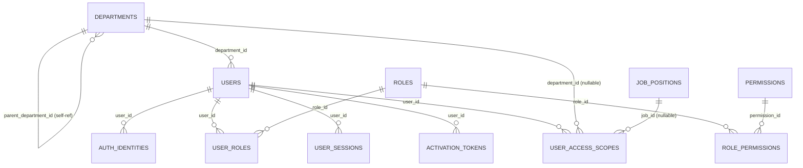
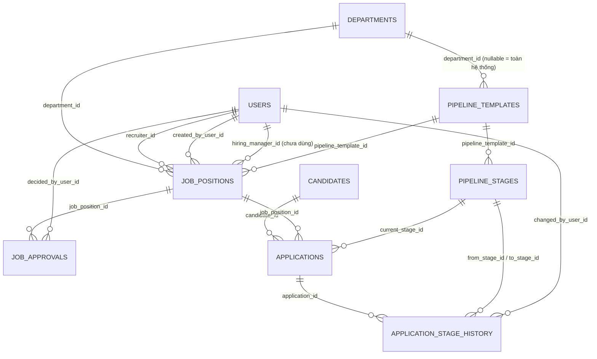
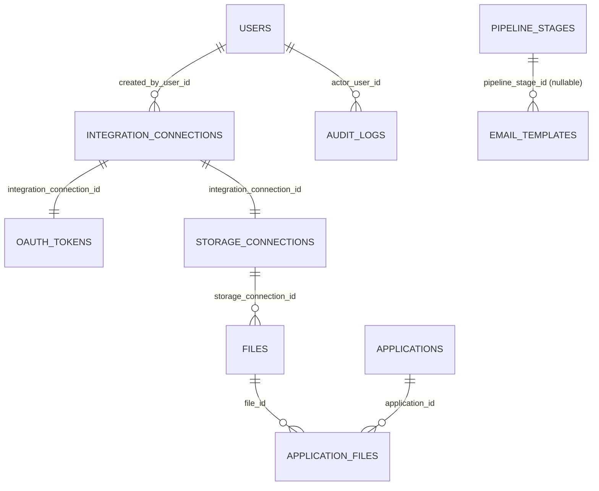

# Database Design — HireWise-BE

Tài liệu này mô tả **schema database hiện tại đã implement thật** (không
phải bản kế hoạch), đọc trực tiếp từ 27 migration Flyway
(`src/main/resources/db/migration/V1__*.sql` → `V27__*.sql`) và các JPA
entity tương ứng trong `src/main/java/com/hirewise/be/domain/`, đối chiếu
với cách frontend (`hirewise/src/features/`) tiêu thụ dữ liệu qua API.

> Tài liệu quy hoạch gốc (toàn bộ roadmap, bao gồm cả phần **chưa xây**)
> nằm ở `Planning/document SRS and diagram/README_ERD.md` (5 file
> `.drawio`, không push Git). Doc này là bản **as-built** tính tới
> migration `V27`, hẹp hơn bản quy hoạch gốc — xem mục 8 để biết phần nào
> còn thiếu so với kế hoạch.

## Mục lục

1. [Quy ước thiết kế chung](#1-quy-ước-thiết-kế-chung)
2. [Sơ đồ ERD tổng quan](#2-sơ-đồ-erd-tổng-quan)
3. [Auth & RBAC](#3-auth--rbac)
4. [Pipeline Configuration](#4-pipeline-configuration)
5. [Job Position & Approval](#5-job-position--approval)
6. [Candidate & Kanban (Application)](#6-candidate--kanban-application)
7. [Cloud Storage Integration & Files](#7-cloud-storage-integration--files)
8. [Email Template](#8-email-template)
9. [Cross-cutting: Audit & Outbox](#9-cross-cutting-audit--outbox)
10. [Bảng enum tổng hợp](#10-bảng-enum-tổng-hợp)
11. [Business Rule đã encode vào schema](#11-business-rule-đã-encode-vào-schema)
12. [Mapping sang Frontend feature](#12-mapping-sang-frontend-feature)
13. [Ghi chú thiết kế / điều cần biết khi sửa](#13-ghi-chú-thiết-kế--điều-cần-biết-khi-sửa)
14. [Cách xem/cập nhật tài liệu này](#14-cách-xemcập-nhật-tài-liệu-này)

---

## 1. Quy ước thiết kế chung

| Quy ước | Áp dụng |
|---|---|
| **Khóa chính** | `BIGINT GENERATED ALWAYS AS IDENTITY` cho bảng cấu hình/quản trị nội bộ (department, user, role, pipeline...); `UUID` (do ứng dụng tự sinh qua `UUID.randomUUID()`, không có DB default) cho bảng nghiệp vụ tuyển dụng có thể lộ ra public API (`job_positions`, `candidates`, `applications`) — tránh lộ số thứ tự tăng dần ra ngoài |
| **Timestamp** | `created_at`/`updated_at` kiểu `TIMESTAMPTZ NOT NULL DEFAULT now()` trên hầu hết bảng nghiệp vụ; bảng thuần lịch sử/log (`application_stage_history`, `audit_logs`, `job_approvals`) chỉ có 1 mốc thời gian (`changed_at`/`created_at`) vì bản ghi bất biến, không update |
| **Enum** | Lưu dạng `VARCHAR` + `CHECK (... IN (...))` ở hầu hết bảng mới hơn (`pipeline_templates.status`, `applications.status`...); một số bảng cũ hơn (`users.status`, `job_positions.status`) chỉ có `DEFAULT` mà **không có** `CHECK` — validate hoàn toàn ở tầng Java enum, xem mục 10 |
| **Soft-delete** | Không `DELETE` cứng bản ghi nghiệp vụ đã có tham chiếu — dùng cờ `is_active` (`departments`, `pipeline_stages`) hoặc đổi `status` sang giá trị "đã tắt" (`files.status = 'DELETED'`, `email_templates.status = 'INACTIVE'`, `integration_connections.status = 'REVOKED'`) |
| **Junction table** | Composite PK, không có surrogate id riêng (`role_permissions (role_id, permission_id)`) |
| **Migration** | Additive-only sau khi đã "ship" — `V14`/`V24` chỉ `ALTER TABLE ... ADD COLUMN` vào `job_positions` (tạo ở `V8`), không sửa lại migration cũ |

---

## 2. Sơ đồ ERD tổng quan

Chia 3 sơ đồ theo domain (khớp cách chia của bản quy hoạch gốc
`01_Core_Recruitment` / `05_Auth_RBAC_Integrations`) để dễ đọc, thay vì 1
sơ đồ khổng lồ 25 bảng.

### 2.1. Auth & RBAC



`JOB_POSITIONS` chỉ xuất hiện ở đây như 1 tham chiếu ngoài domain — chi
tiết đầy đủ ở mục 2.2.

### 2.2. Recruitment Core (Pipeline / Job / Candidate / Kanban)



### 2.3. Supporting / Cross-cutting



`OUTBOX_EVENTS` không có FK nào (bảng hàng đợi generic, payload là JSON
tự do) nên không vẽ trong sơ đồ — xem mục 9.

---

## 3. Auth & RBAC

### `departments` (V1)

| Cột | Kiểu | Ghi chú |
|---|---|---|
| `department_id` | BIGINT PK | |
| `name` | VARCHAR(255) NOT NULL | |
| `parent_department_id` | BIGINT FK → `departments` | tự tham chiếu — cây phòng ban (BR-RBAC-06), đọc đệ quy qua CTE trong `DepartmentRepository` |
| `is_active` | BOOLEAN DEFAULT true | soft-delete |
| `created_at`/`updated_at` | TIMESTAMPTZ | |

### `roles` / `permissions` / `role_permissions` (V2)

Mô hình RBAC layer 2 — **không hard-code permission theo role trong
Java**, toàn bộ nằm ở dữ liệu.

| Bảng | Cột đáng chú ý |
|---|---|
| `roles` | `code` UNIQUE (`HR_ADMIN`, `RECRUITER`, `HIRING_MANAGER`, `INTERVIEWER`, `CANDIDATE`) |
| `permissions` | `code` UNIQUE (28 permission, vd `JOB_CREATE`, `JOB_APPROVE`...); `is_write` phân biệt hành động đọc/ghi — dùng cùng với `user_access_scopes.can_write` (layer 3) |
| `role_permissions` | composite PK `(role_id, permission_id)`, `ON DELETE CASCADE` cả 2 chiều |

### `users` (V3)

| Cột | Kiểu | Ghi chú |
|---|---|---|
| `user_id` | BIGINT PK | |
| `email` | VARCHAR(255) NOT NULL | không có `UNIQUE` constraint ở DB — enforce ở tầng Service (`UserService`) trước khi insert |
| `department_id` | BIGINT FK → `departments`, nullable | phòng ban **tổ chức chính** (báo cáo/org chart) — **KHÔNG** phải phạm vi truy cập dữ liệu, xem `user_access_scopes` |
| `status` | VARCHAR(20) DEFAULT `'INVITED'` | `INVITED`\|`ACTIVE`\|`BLOCKED`\|`DISABLED` (Java enum `UserStatus`, không có DB `CHECK`) |
| `last_authenticated_at` | TIMESTAMPTZ nullable | |

### `auth_identities` (V4)

1 dòng = 1 phương thức đăng nhập (`LOCAL` email/password hoặc `GOOGLE` SSO) — 1 user có thể có nhiều dòng cùng lúc.

| Cột | Ghi chú |
|---|---|
| `provider` | CHECK `IN ('LOCAL','GOOGLE')` |
| `provider_subject` | với `LOCAL` = chính email; với `GOOGLE` = Google `sub` claim |
| `password_hash` | nullable — `NULL` với provider `GOOGLE` |
| `failed_login_attempts`, `locked_until` | BR-AUTH: khóa 15 phút sau 5 lần sai |
| UNIQUE | `(provider, provider_subject)` |

### `user_roles` (V5)

Gán role có lịch sử hiệu lực (`valid_from`/`valid_to`), **không** phải 1
cột role cố định trên `users` — vì 1 user có thể giữ nhiều role đồng
thời (vd vừa Recruiter vừa Interviewer). `valid_to IS NULL` = đang hiệu
lực (dùng trong `findActiveUserIdsByRoleCode`, xem
[US-REC-02_Submit-Job-Approval-Backend-Integration.md](../../Planning/explain/US-REC-02_Submit-Job-Approval-Backend-Integration.md)).

### `user_sessions` (V6)

Registry session/refresh-token, PK là `UUID` (khớp claim `sid` trong JWT).
`revoked_at IS NULL` = session còn hiệu lực (index có điều kiện
`WHERE revoked_at IS NULL`) — dùng để logout / thu hồi hàng loạt khi tài
khoản bị khóa (BR-AUTH-04).

### `activation_tokens` (V7)

One-time token cho link kích hoạt (EM-01) và đặt lại mật khẩu — dùng
chung 1 bảng, phân biệt qua `purpose` (CHECK `'ACTIVATION'`\|`'PASSWORD_RESET'`).
`used_at` đánh dấu đã dùng (chống dùng lại link cũ).

### `user_access_scopes` (V9)

RBAC **layer 3** — phạm vi dữ liệu 1 user được truy cập, tách khỏi role
(layer 2 chỉ trả lời "được làm hành động gì", không trả lời "trên dữ
liệu nào").

| Cột | Ghi chú |
|---|---|
| `scope_type` | CHECK `'SYSTEM'`\|`'DEPARTMENT'`\|`'JOB'` |
| `department_id` | chỉ có giá trị khi `scope_type='DEPARTMENT'` |
| `job_id` | FK → `job_positions`, chỉ có giá trị khi `scope_type='JOB'` — **hiện chưa có UI nào gán loại scope này**, chỉ dùng được qua API admin trực tiếp |
| `include_sub_departments` | true = tính đệ quy cả phòng ban con (CTE) |
| `can_write` | false = chỉ đọc; true = được ghi — hành động nào cần ghi do `permissions.is_write` quyết định, scope này chỉ xác nhận "có được ghi ở phạm vi này không" |
| `valid_from`/`valid_to` | cùng mô hình lịch sử hiệu lực như `user_roles` |

---

## 4. Pipeline Configuration

### `pipeline_templates` (V13)

| Cột | Ghi chú |
|---|---|
| `department_id` | nullable — `NULL` = dùng chung toàn hệ thống (UC-04 AF-01) |
| `status` | CHECK `'DRAFT'`\|`'ACTIVE'` — `DRAFT→ACTIVE` là điều kiện tiên quyết của UC-13, xem [US-REC-02_Submit-Job-Approval-Backend-Integration.md](../../Planning/explain/US-REC-02_Submit-Job-Approval-Backend-Integration.md) mục 3.1 |

### `pipeline_stages` (V13)

| Cột | Ghi chú |
|---|---|
| `pipeline_template_id` | FK NOT NULL |
| `code` | UNIQUE **trong cùng template** (`uk_pipeline_stages_template_code`), không phải unique toàn hệ thống — khác `email_templates.code` (BR-PIPE-02) |
| `stage_type` | CHECK 6 giá trị: `INTAKE`\|`SCREENING`\|`INTERVIEW`\|`OFFER`\|`TERMINAL_SUCCESS`\|`TERMINAL_REJECTED` |
| `position` | thứ tự hiển thị/chạy Kanban, backend tự re-index khi thêm/xóa/sắp xếp lại (BR-PIPE-04) |
| `is_terminal` | cờ đánh dấu bước kết thúc — độc lập với `stage_type`, nhưng service luôn ép `true` nếu `stage_type` là 1 trong 2 loại `TERMINAL_*` |
| `is_active` | soft-delete (UC-06) — xóa Stage không xóa cứng vì có thể đã có `applications.current_stage_id` trỏ tới |

Index `(pipeline_template_id, position)` phục vụ load đúng thứ tự hiển
thị mỗi khi mở 1 Template.

---

## 5. Job Position & Approval

### `job_positions` (V8, đổi tên từ `job_postings` ở V11, mở rộng ở V14/V24)

| Cột | Ghi chú |
|---|---|
| `id` | UUID PK, app tự sinh |
| `status` | `DRAFT`\|`PENDING_APPROVAL`\|`APPROVED`\|`REJECTED`\|`PUBLISHED`\|`PAUSED`\|`CLOSED` (Java enum `JobStatus`, không có DB `CHECK`) |
| `department_id`, `recruiter_id`, `created_by_user_id` | từ V8 gốc |
| `hiring_manager_id` | FK → `users`, thêm ở V14 — **hiện KHÔNG được set ở bất kỳ đâu trong codebase** (dead field), xem mục 13 |
| `pipeline_template_id` | FK → `pipeline_templates`, gán khi Submit (UC-13) |
| `employment_type` | CHECK `'FULL_TIME'`\|`'PART_TIME'`\|`'INTERNSHIP'`\|`'CONTRACT'`, nullable (bắt buộc khi Submit, không bắt buộc khi Lưu nháp — BR-JOB-01) |
| `salary_min`/`salary_max` | `NUMERIC(14,2)`, CHECK `salary_min <= salary_max` khi cả 2 có giá trị (BR-JOB-02); cả 2 `NULL` = "Thỏa thuận" |
| `openings` | `INT NOT NULL DEFAULT 1` — BR-JOB-01: bắt buộc ≥ 1 |
| `application_deadline` | `DATE` nullable |
| `location` | thêm ở V24, phục vụ UC-16 Job Board |

### `job_approvals` (V15)

Lịch sử phê duyệt tách riêng bảng (không phải 1 cột trên `job_positions`)
để **không mất lịch sử resubmit** khi 1 Job bị từ chối rồi gửi lại nhiều
lần.

| Cột | Ghi chú |
|---|---|
| `decision` | CHECK `'APPROVED'`\|`'REJECTED'`, `NULL` khi đang chờ (UC-13 tạo 1 dòng `decision=NULL` lúc Submit) |
| `reason` | CHECK bắt buộc NOT NULL khi `decision='REJECTED'` (BR-APR-02) |
| `decided_by_user_id`, `decided_at` | `NULL` cho tới khi Hiring Manager xử lý (UC-15) |

Index `(job_position_id, created_at)` phục vụ lấy đúng lần submit mới
nhất.

---

## 6. Candidate & Kanban (Application)

### `candidates` (V19)

Hồ sơ ứng viên **độc lập với từng Job** — 1 candidate có thể ứng tuyển
nhiều Job khác nhau theo thời gian.

| Cột | Ghi chú |
|---|---|
| `primary_email` | UNIQUE — ứng viên nộp lại (BR-APPLY-02) tái sử dụng đúng dòng này thay vì tạo trùng |
| `status` | CHECK `'ACTIVE'`\|`'BLACKLISTED'` |

### `applications` (V20)

Chính là "thẻ Kanban" — 1 dòng = 1 cặp `(candidate, job)`.

| Cột | Ghi chú |
|---|---|
| UNIQUE | `(candidate_id, job_position_id)` — 1 candidate chỉ ứng tuyển 1 lần cho cùng 1 Job (BR-APPLY-02) |
| `current_stage_id` | FK → `pipeline_stages`, **giá trị đọc nhanh** cho UI Kanban — không phải nguồn sự thật cho lịch sử/SLA (xem `application_stage_history`) |
| `status` | CHECK 6 giá trị: `NEW`\|`IN_PROGRESS`\|`OFFER_SENT`\|`HIRED`\|`REFUSED`\|`WITHDRAWN` |
| `last_stage_changed_at` | dùng tính SLA theo Stage hiện tại |

Index `(job_position_id, current_stage_id, last_stage_changed_at)` phục
vụ trực tiếp truy vấn load Kanban board theo cột.

### `application_stage_history` (V20)

Log **bất biến**, không update — nguồn sự thật chuẩn để tính SLA/audit,
khác với `applications.current_stage_id` chỉ là cache tiện tra cứu
nhanh.

| Cột | Ghi chú |
|---|---|
| `from_stage_id` | nullable — `NULL` cho sự kiện đầu tiên (lúc tạo Application, UC-17) |
| `to_stage_id` | NOT NULL |
| `transition_type` | CHECK `'MANUAL'`\|`'SYSTEM'`\|`'ROLLBACK'` — phân biệt do người kéo-thả tay, hệ thống tự chuyển, hay Restore ngược |

---

## 7. Cloud Storage Integration & Files

### `integration_connections` (V16)

Metadata kết nối OAuth 3rd-party generic — dùng chung khung cho cả
Calendar/Social sau này (UC-18/UC-19), hiện chỉ có `purpose='CLOUD_STORAGE'`.

| Cột | Ghi chú |
|---|---|
| `provider` | text tự do (hiện tại thực tế chỉ `GOOGLE_DRIVE`/`DROPBOX`, enum Java `IntegrationProvider`) |
| `purpose` | text tự do, chưa có CHECK vì sẽ mở rộng thêm giá trị khi UC-18/19 được xây |
| `status` | CHECK `'CONNECTED'`\|`'EXPIRED'`\|`'REVOKED'` |

### `oauth_tokens` (V16)

Tách riêng khỏi `integration_connections` để code thường (không cần
token) không có lý do gì `SELECT` tới cột token.

| Cột | Ghi chú |
|---|---|
| `access_token_encrypted`, `refresh_token_encrypted` | mã hóa tại tầng ứng dụng trước khi lưu (BR-STORAGE-01) — **không API nào trả các cột này ra ngoài** |
| UNIQUE | `(integration_connection_id)` — quan hệ 1-1, Reconnect (UC-08 AF-01) thay thế tại chỗ chứ không thêm dòng mới |

### `storage_connections` (V17)

1-1 với `integration_connections` (không lặp lại cột `status` — luôn đọc
qua quan hệ để 2 bảng không bao giờ lệch nhau).

| Cột | Ghi chú |
|---|---|
| `root_folder_id` | thư mục gốc tạo lúc connect; mỗi Application có subfolder riêng bên dưới lúc upload CV (BR-STORAGE-03) |

### `files` / `application_files` (V21)

Chỉ lưu **metadata** — nội dung file nhị phân nằm trên Cloud Storage
thật (Google Drive/Dropbox), khớp giả định #5 trong `README_ERD.md`.

| Bảng | Cột đáng chú ý |
|---|---|
| `files` | `external_file_id` (id file trên storage ngoài), UNIQUE `(storage_connection_id, external_file_id)`, `status` CHECK `'ACTIVE'`\|`'ARCHIVED'`\|`'DELETED'` |
| `application_files` | `file_role` CHECK `'CV'`\|`'COVER_LETTER'`\|`'PORTFOLIO'`, `is_primary` — 1 Application có thể có nhiều file cùng role, đánh dấu file chính |

---

## 8. Email Template

### `email_templates` (V18, seed 13+1 template mẫu ở V23/V27)

| Cột | Ghi chú |
|---|---|
| `code` | UNIQUE **toàn hệ thống** (khác `pipeline_stages.code` — chỉ unique trong template) — BR-EMAILTPL-01 |
| `pipeline_stage_id` | FK nullable — liên kết Stage nào tự động gửi template này khi Application chuyển tới (chưa bắt buộc mọi template phải gắn Stage) |
| `subject_template`/`body_template` | chứa placeholder dạng `{{Tag}}`, render lúc gửi thật |
| `version` | tăng dần mỗi lần sửa nội dung (chưa thấy logic tăng version trong code hiện tại — cột đã có sẵn cho UC-11 lịch sử phiên bản) |
| `status` | CHECK `'ACTIVE'`\|`'INACTIVE'` |

13 template mẫu EM-01→EM-13 (kích hoạt tài khoản, thông báo duyệt Job,
mời phỏng vấn, offer, SLA...) + `EM-SEC` (cảnh báo khóa tài khoản) được
seed sẵn ở V23/V27 — xem nội dung đầy đủ trong chính 2 file migration
này.

---

## 9. Cross-cutting: Audit & Outbox

### `audit_logs` (V22)

Log chung, dùng cho mọi hành động cần lưu vết thay đổi (hiện tại chủ yếu
UC-07/UC-08 Connect/Disconnect Cloud Storage).

| Cột | Ghi chú |
|---|---|
| `before_json`/`after_json` | snapshot trạng thái trước/sau dạng JSON text — không ràng buộc schema cứng, cho phép entity khác nhau ghi vào cùng 1 bảng |
| Index | `(entity_type, entity_id, created_at)` và `(actor_user_id, created_at)` |

### `outbox_events` (V10)

**Transactional Outbox pattern** — ghi 1 dòng trong **cùng transaction**
với hành động nghiệp vụ gây ra nó (vd tạo user → cần gửi email kích
hoạt), 1 poller riêng (`event.OutboxDispatcher`, `@Scheduled`) nhặt dòng
`PENDING` và gửi thật bất đồng bộ — tách khỏi transaction chính để lỗi
SMTP không làm rollback nghiệp vụ.

| Cột | Ghi chú |
|---|---|
| `event_type` | vd `JOB_SUBMITTED_FOR_APPROVAL_EMAIL` — enum Java `OutboxEventType`, không có DB CHECK vì danh sách event type mở rộng thường xuyên |
| `payload` | JSON text tự do (`OutboxPayloads` factory), shape khác nhau theo `event_type` |
| `status` | CHECK `'PENDING'`\|`'SENT'`\|`'FAILED'` |
| `attempts`, `error_message` | phục vụ retry/debug khi gửi thất bại |

Không có bảng nào FK tới `outbox_events` — đây là hàng đợi 1 chiều, đọc
xong thì cập nhật `status`/`processed_at`, không tham chiếu ngược.

---

## 10. Bảng enum tổng hợp

| Enum (Java, `domain/`) | Giá trị | DB column | Có `CHECK` constraint? |
|---|---|---|---|
| `UserStatus` | `INVITED, ACTIVE, BLOCKED, DISABLED` | `users.status` | Không |
| `AuthProvider` | `LOCAL, GOOGLE` | `auth_identities.provider` | Có |
| `ScopeType` | `SYSTEM, DEPARTMENT, JOB` | `user_access_scopes.scope_type` | Có |
| `PipelineTemplateStatus` | `DRAFT, ACTIVE` | `pipeline_templates.status` | Có |
| `StageType` | `INTAKE, SCREENING, INTERVIEW, OFFER, TERMINAL_SUCCESS, TERMINAL_REJECTED` | `pipeline_stages.stage_type` | Có |
| `JobStatus` | `DRAFT, PENDING_APPROVAL, APPROVED, REJECTED, PUBLISHED, PAUSED, CLOSED` | `job_positions.status` | Không |
| `EmploymentType` | `FULL_TIME, PART_TIME, INTERNSHIP, CONTRACT` | `job_positions.employment_type` | Có |
| `ApprovalDecision` | `APPROVED, REJECTED` | `job_approvals.decision` | Có |
| `CandidateStatus` | `ACTIVE, BLACKLISTED` | `candidates.status` | Có |
| `ApplicationStatus` | `NEW, IN_PROGRESS, OFFER_SENT, HIRED, REFUSED, WITHDRAWN` | `applications.status` | Có |
| `StageTransitionType` | `MANUAL, SYSTEM, ROLLBACK` | `application_stage_history.transition_type` | Có |
| `IntegrationProvider` | `GOOGLE_DRIVE, DROPBOX` | `integration_connections.provider`, `storage_connections.provider` | Chỉ `storage_connections` có `CHECK` |
| `ConnectionStatus` | `CONNECTED, EXPIRED, REVOKED` | `integration_connections.status` | Có |
| `FileStatus` | `ACTIVE, ARCHIVED, DELETED` | `files.status` | Có |
| `ApplicationFileRole` | `CV, COVER_LETTER, PORTFOLIO` | `application_files.file_role` | Có |
| `EmailTemplateStatus` | `ACTIVE, INACTIVE` | `email_templates.status` | Có |

**Vì sao `UserStatus`/`JobStatus` không có `CHECK`**: đây là 2 bảng tạo
sớm nhất (`V3`, `V8`), thời điểm đó chưa thiết lập quy ước "enum luôn có
CHECK" — các bảng tạo sau (`V13` trở đi) đều nhất quán có `CHECK`. Không
có rủi ro thực tế vì mọi `INSERT`/`UPDATE` đều đi qua đúng Java enum,
nhưng nếu sửa dữ liệu tay (SQL trực tiếp) ở 2 cột này sẽ không bị chặn.

---

## 11. Business Rule đã encode vào schema

| Business Rule | Constraint | Bảng.Cột |
|---|---|---|
| BR-JOB-02 (lương min ≤ max) | `CHECK (salary_min IS NULL OR salary_max IS NULL OR salary_min <= salary_max)` | `job_positions` |
| BR-JOB-01 (openings ≥ 1) | `NOT NULL DEFAULT 1` (ràng buộc `>= 1` thật sự nằm ở Bean Validation `@Positive`, DB chỉ đảm bảo NOT NULL) | `job_positions.openings` |
| BR-PIPE-02 (code Stage unique trong Template, không toàn hệ thống) | `UNIQUE (pipeline_template_id, code)` | `pipeline_stages` |
| BR-EMAILTPL-01 (code Email Template unique toàn hệ thống) | `UNIQUE (code)` | `email_templates` |
| BR-APPLY-02 (1 candidate chỉ ứng tuyển 1 lần / job) | `UNIQUE (candidate_id, job_position_id)` | `applications` |
| BR-APR-02 (Reject luôn kèm lý do) | `CHECK (decision <> 'REJECTED' OR reason IS NOT NULL)` | `job_approvals` |
| BR-STORAGE (1 connection chỉ có 1 token/1 storage_connection đang hiệu lực) | `UNIQUE (integration_connection_id)` | `oauth_tokens`, `storage_connections` |
| Repeat applicant tái dùng candidate cũ | `UNIQUE (primary_email)` | `candidates` |
| 1 file external không lưu trùng | `UNIQUE (storage_connection_id, external_file_id)` | `files` |
| 1 login method không gán trùng 2 user | `UNIQUE (provider, provider_subject)` | `auth_identities` |

Các Business Rule còn lại (BR-PIPE-01 điều kiện Activate Template,
BR-JOB-04 chỉ Draft/Rejected mới sửa/submit được...) là rule **runtime**
theo trạng thái, không diễn tả được bằng `CHECK` tĩnh — enforce ở tầng
Service (xem `guides/03-ERROR_HANDLING.md`).

---

## 12. Mapping sang Frontend feature

`hirewise/src/features/<feature>/` ↔ bảng DB chủ yếu thao tác qua API:

| Frontend feature | Bảng DB chính | Ghi chú |
|---|---|---|
| `auth/` | `users`, `auth_identities`, `user_sessions`, `activation_tokens` | login, refresh, activate |
| `users/` (quản trị) | `users`, `user_roles`, `user_access_scopes`, `departments`, `roles` | UC-02/03, gán role + scope |
| `pipelines/` | `pipeline_templates`, `pipeline_stages` | UC-04/05/06 + Activate Template (UC-13 tiên quyết) |
| `jobs/` | `job_positions`, `job_approvals`, `pipeline_templates` (chỉ đọc), `pipeline_stages` (preview) | UC-12/13 (draft/submit), UC-14/15 (approve/reject), UC-16/17 (Job Board công khai + apply → tạo `candidates`/`applications`) |
| `kanban/` | `applications`, `application_stage_history`, `pipeline_stages` | UC-22/23 (xem board, move stage) |
| `email-templates/` | `email_templates`, `pipeline_stages` (chọn Stage trigger) | UC-09/10/11 |
| `integrations/` | `integration_connections`, `storage_connections`, `oauth_tokens` (không lộ ra FE) | UC-07/08 |
| `dashboard/` | tổng hợp nhiều bảng (đọc số liệu), chưa có bảng snapshot/report riêng | xem giả định #7 `README_ERD.md` — chỉ thêm materialized view khi volume đủ lớn |

---

## 13. Ghi chú thiết kế / điều cần biết khi sửa

- **`job_positions.hiring_manager_id` là field chết**: cột tồn tại từ
  `V14` nhưng không có bất kỳ đoạn code Java nào gọi
  `.setHiringManager(...)` — thiết kế thông báo Hiring Manager ở UC-13
  cố tình dùng Access Scope (`user_access_scopes` + role) thay vì cột
  này, xem [US-REC-02_Cach-code-Fullstack.md](../../Planning/explain/US-REC-02_Cach-code-Fullstack.md)
  bước 3. Đừng dựa vào cột này để đọc dữ liệu cho tới khi có 1 luồng
  nghiệp vụ thật sự gán giá trị cho nó.
- **`job_positions` từng tên là `job_postings`**: `V8` tạo bảng tên
  `job_postings`, `V11` mới đổi tên sang `job_positions` khớp tên entity
  `JobPosition` — nếu thấy tài liệu/log cũ nhắc `job_postings`, đó là
  cùng 1 bảng, chỉ khác tên ở thời điểm trước `V11`.
  `status DEFAULT 'OPEN'` sót lại từ thời `job_postings` không khớp
  `JobStatus` enum hiện tại, nhưng vô hại vì mọi `INSERT` (kể cả code
  mới) đều set `status` tường minh.
  `job_positions.status` chưa CHECK.
- **`user_access_scopes.scope_type = 'JOB'`** đã có sẵn hạ tầng DB
  nhưng **chưa có UI nào** để HR Admin gán loại scope này qua trang Quản
  trị người dùng (chỉ gán được `SYSTEM`/`DEPARTMENT` qua UI hiện tại) —
  cần thêm nếu có UC yêu cầu "cấp quyền theo đúng 1 Job cụ thể" (vd
  Interviewer chỉ được thấy 1 Job họ được mời phỏng vấn).
- **Không có bảng `interviews`, `scorecards`, `offers`, hay bất kỳ bảng
  nào cho Chatbot/SLA config/Reporting snapshot** — đây là phần nằm
  trong `README_ERD.md` (Sprint 2 phần sau + Sprint 3) nhưng **chưa được
  code**. `rejection_reasons`/`application_rejections` (UC-29, `V28`) và
  `ai_screening_runs`/`ai_skill_matches` (UC-21 AI Matching, `V29` —
  schema tối giản, không theo đầy đủ ERD gốc, xem
  [US-REC-04_AI-Match-Analysis-Backend-Integration.md](../../Planning/explain/US-REC-04_AI-Match-Analysis-Backend-Integration.md))
  đã được code, chưa cập nhật đầy đủ vào tài liệu này (mục 3-9 ở trên vẫn
  dừng ở `V27`). Khi implement Interview & Scorecard/Offer & e-Signature/
  Chatbot/SLA/Analytics, tạo migration mới tiếp theo `V30` trở đi, tham
  khảo file `.drawio` tương ứng trong `Planning/document SRS and diagram/`
  làm điểm khởi đầu.
- **`department_id` trên `pipeline_templates`/`user_access_scopes` đều
  nullable với ý nghĩa khác nhau**: ở `pipeline_templates`, `NULL` =
  "dùng chung toàn hệ thống"; ở `user_access_scopes`, `NULL` chỉ hợp lệ
  khi `scope_type` không phải `DEPARTMENT` (không có CHECK ràng buộc
  chéo cột này ở DB, enforce ở Service khi tạo scope).
- **`applications.current_stage_id` là cache, không phải nguồn sự
  thật**: khi cần biết "candidate đã ở Stage nào bao lâu" hoặc dựng lại
  toàn bộ lịch sử di chuyển, luôn query `application_stage_history`,
  không suy luận từ `current_stage_id` + `last_stage_changed_at` một
  mình (2 cột này chỉ tối ưu cho hiển thị Kanban board, không phải audit).

---

## 14. Cách xem/cập nhật tài liệu này

```bash
# Xem toàn bộ migration theo đúng thứ tự áp dụng
ls FR-HireWise-BE/src/main/resources/db/migration/*.sql | sort -V

# Xem schema thật đang chạy trên DB local (sau khi Flyway đã chạy migrate)
docker exec -it hirewise-postgres psql -U postgres -d hirewise -c '\d+ job_positions'
```

Khi thêm 1 migration mới (`V30__*.sql` trở đi) làm thay đổi bảng đã mô
tả ở đây, cập nhật lại đúng mục tương ứng trong file này — tránh để tài
liệu lệch so với schema thật, giống tinh thần
`guides/00-SOURCE_CODE_OVERVIEW_GUIDE.md`.

---

*Tài liệu này tổng hợp từ 27 migration Flyway (`V1`→`V27`) + JPA entity
tại thời điểm 2026-08-27 (sau US-REC-02/UC-13). Khi schema thay đổi, cập
nhật lại file này tương ứng.*
